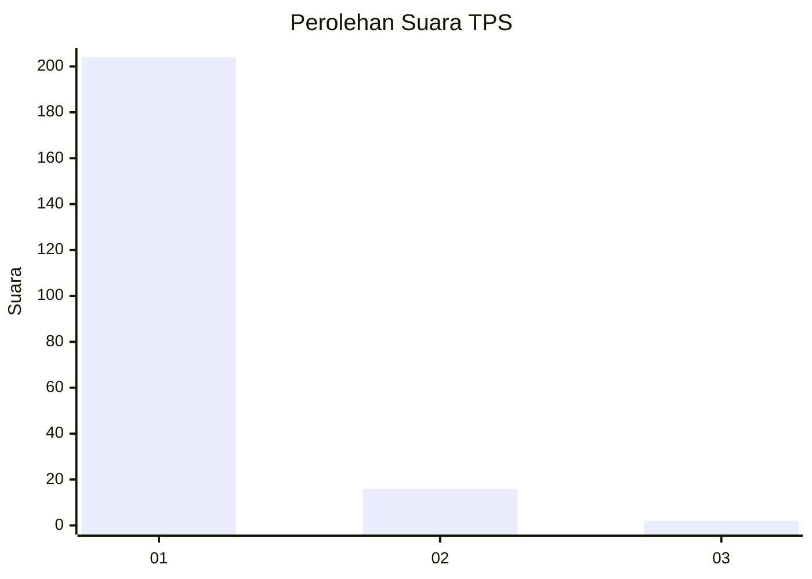
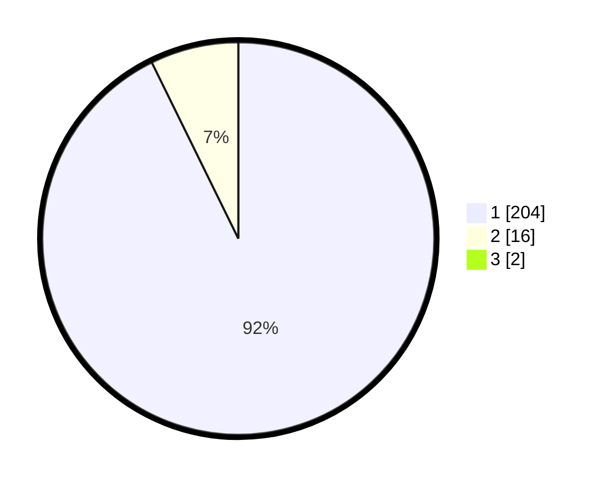

# Hasil

## Grafik

## Tabel

| No. | Nama Paslon    | Suara | Suara (raw) | Persentase |
|:--- |:-------------- | -----:| -----------:| ----------:|
| 1   | ANIES MUHAIMIN | 204   | [204][p-1]  | 91,89      |
| 2   | PRABOWO GIBRAN | 16    | [16][p-2]   | 7,21       |
| 3   | GANJAR MAHFUD  | 2     | [2][p-3]    | 0,90       |

[p-1]: https://github.com/gigit-pemilu/pemilu-2024-11-aceh/blob/main/pilpres/hitung-suara/sub/11-aceh/sub/01-aceh-selatan/sub/07-sawang/sub/2008-trieng-meuduro-tunong/sub/002-tps/sub/paslon-1.txt
[p-2]: https://github.com/gigit-pemilu/pemilu-2024-11-aceh/blob/main/pilpres/hitung-suara/sub/11-aceh/sub/01-aceh-selatan/sub/07-sawang/sub/2008-trieng-meuduro-tunong/sub/002-tps/sub/paslon-2.txt
[p-3]: https://github.com/gigit-pemilu/pemilu-2024-11-aceh/blob/main/pilpres/hitung-suara/sub/11-aceh/sub/01-aceh-selatan/sub/07-sawang/sub/2008-trieng-meuduro-tunong/sub/002-tps/sub/paslon-3.txt

## Foto C Plano

https://sirekap-obj-formc.kpu.go.id/a6bc/pemilu/ppwp/11/01/07/20/08/1101072008002-20240222-153650--1c14feb9-e5ef-4e96-94af-6dd6d426565a.jpg

https://sirekap-obj-formc.kpu.go.id/a6bc/pemilu/ppwp/11/01/07/20/08/1101072008002-20240222-153740--12c24380-9f1a-4792-a314-96d782e1ed54.jpg

https://sirekap-obj-formc.kpu.go.id/a6bc/pemilu/ppwp/11/01/07/20/08/1101072008002-20240222-153831--f54fda5a-d8cd-4429-acfb-bf29f4c114fd.jpg

## Metadata

| Key        | Value               |
| ---------- | ------------------- |
| Time Stamp | 2024-02-24 22:31:28 |

## DATA PEMILIH TETAP

Jumlah pemilih dalam DPT: **274**.
 * L: **127**.
 * P: **147**.

## DATA PENGGUNA HAK PILIH

Jumlah pengguna hak pilih dalam DPT: **223**.
 * L: **99**.
 * P: **124**.

Jumlah pengguna hak pilih dalam DPTb: **3**.
 * L: **2**.
 * P: **1**.

Jumlah pengguna hak pilih dalam DPK: **6**.
 * L: **1**.
 * P: **5**.

Jumlah pengguna hak pilih: **232**.
 * L: **102**.
 * P: **130**.

## JUMLAH SUARA SAH DAN TIDAK SAH

JUMLAH SELURUH SUARA SAH: **222**.

JUMLAH SUARA TIDAK SAH: **10**.

JUMLAH SELURUH SUARA SAH DAN SUARA TIDAK SAH: **232**.

