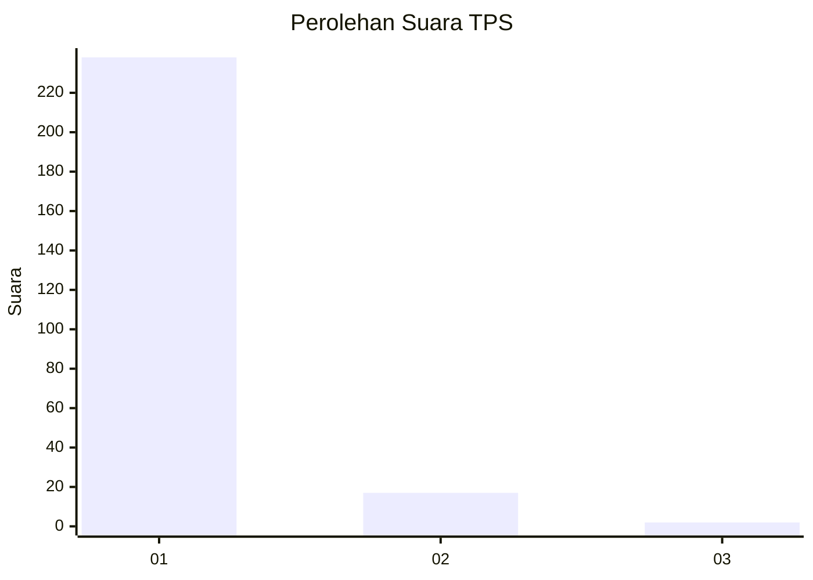
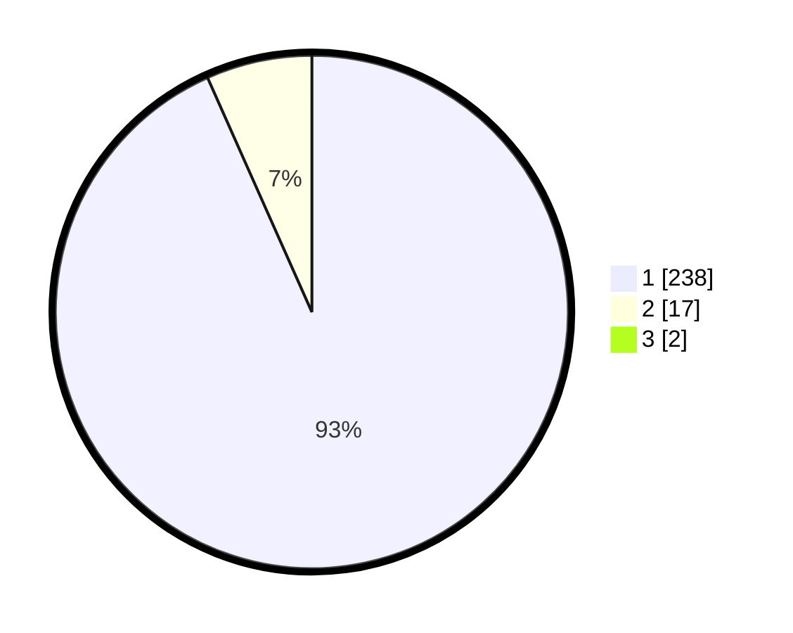

# Hasil

## Grafik

## Tabel

| No. | Nama Paslon    | Suara | Suara (raw) | Persentase |
|:--- |:-------------- | -----:| -----------:| ----------:|
| 1   | ANIES MUHAIMIN | 238   | [238][p-1]  | 92,61      |
| 2   | PRABOWO GIBRAN | 17    | [17][p-2]   | 6,61       |
| 3   | GANJAR MAHFUD  | 2     | [2][p-3]    | 0,78       |

[p-1]: https://github.com/gigit-pemilu/pemilu-2024-11-aceh/blob/main/pilpres/hitung-suara/sub/11-aceh/sub/01-aceh-selatan/sub/07-sawang/sub/2008-trieng-meuduro-tunong/sub/003-tps/sub/paslon-1.txt
[p-2]: https://github.com/gigit-pemilu/pemilu-2024-11-aceh/blob/main/pilpres/hitung-suara/sub/11-aceh/sub/01-aceh-selatan/sub/07-sawang/sub/2008-trieng-meuduro-tunong/sub/003-tps/sub/paslon-2.txt
[p-3]: https://github.com/gigit-pemilu/pemilu-2024-11-aceh/blob/main/pilpres/hitung-suara/sub/11-aceh/sub/01-aceh-selatan/sub/07-sawang/sub/2008-trieng-meuduro-tunong/sub/003-tps/sub/paslon-3.txt

## Foto C Plano

https://sirekap-obj-formc.kpu.go.id/e5aa/pemilu/ppwp/11/01/07/20/08/1101072008003-20240222-170446--54d72cbc-fa92-4b2b-976d-7cc0b01b7afa.jpg

https://sirekap-obj-formc.kpu.go.id/e5aa/pemilu/ppwp/11/01/07/20/08/1101072008003-20240222-170513--6cfc804f-34ae-425b-a00b-0b2c92b03f34.jpg

https://sirekap-obj-formc.kpu.go.id/e5aa/pemilu/ppwp/11/01/07/20/08/1101072008003-20240222-170558--27ca5513-b3ee-4fe3-a138-9e7945e7ba9b.jpg

## Metadata

| Key        | Value               |
| ---------- | ------------------- |
| Time Stamp | 2024-02-24 22:31:28 |

## DATA PEMILIH TETAP

Jumlah pemilih dalam DPT: **296**.
 * L: **156**.
 * P: **140**.

## DATA PENGGUNA HAK PILIH

Jumlah pengguna hak pilih dalam DPT: **259**.
 * L: **136**.
 * P: **123**.

Jumlah pengguna hak pilih dalam DPTb: **1**.
 * L: **1**.
 * P: **0**.

Jumlah pengguna hak pilih dalam DPK: **0**.
 * L: **0**.
 * P: **0**.

Jumlah pengguna hak pilih: **260**.
 * L: **137**.
 * P: **123**.

## JUMLAH SUARA SAH DAN TIDAK SAH

JUMLAH SELURUH SUARA SAH: **257**.

JUMLAH SUARA TIDAK SAH: **3**.

JUMLAH SELURUH SUARA SAH DAN SUARA TIDAK SAH: **260**.

