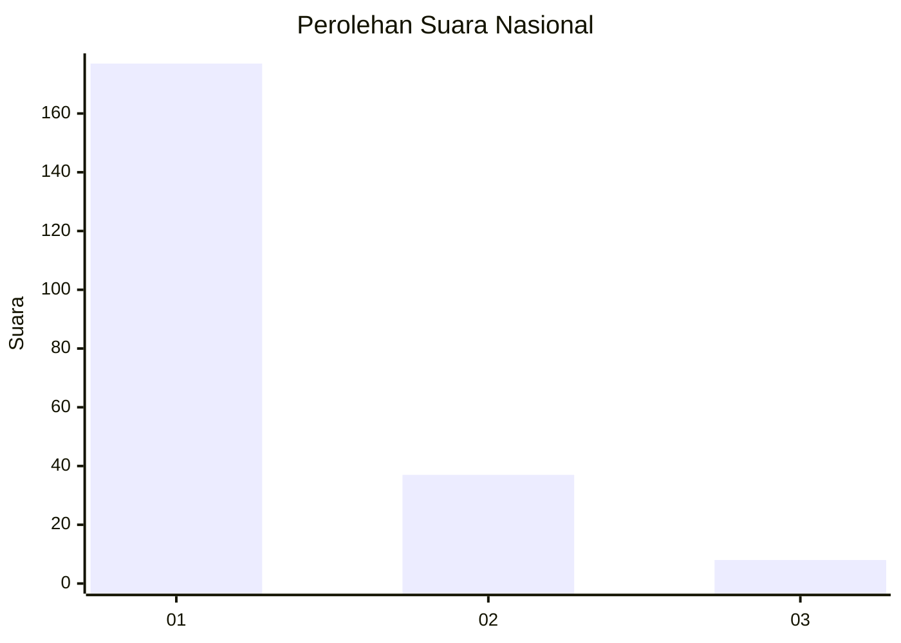
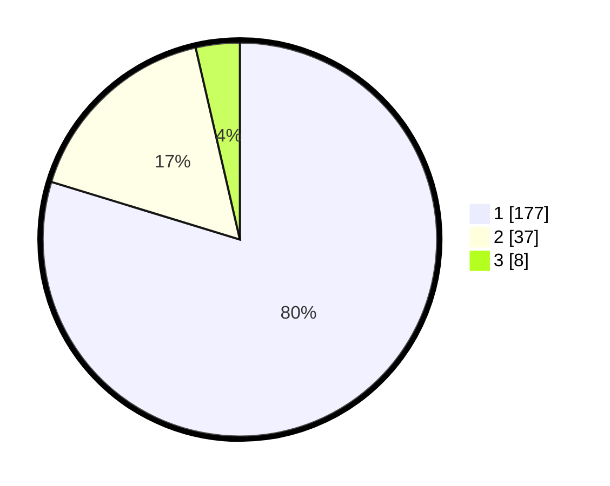

# Hasil

## Grafik

## Tabel

| No. | Nama Paslon    | Suara | Suara (raw) | Persentase |
|:--- |:-------------- | -----:| -----------:| ----------:|
| 1   | ANIES MUHAIMIN | 177   | [177][p-1]  | 79,73      |
| 2   | PRABOWO GIBRAN | 37    | [37][p-2]   | 16,67      |
| 3   | GANJAR MAHFUD  | 8     | [8][p-3]    | 3,60       |

[p-1]: https://github.com/gigit-pemilu/pemilu-2024/blob/main/pilpres/hitung-suara/sub/11-aceh/sub/01-aceh-selatan/sub/07-sawang/sub/2010-simpang-tiga/sub/002-tps/sub/paslon-1.txt
[p-2]: https://github.com/gigit-pemilu/pemilu-2024/blob/main/pilpres/hitung-suara/sub/11-aceh/sub/01-aceh-selatan/sub/07-sawang/sub/2010-simpang-tiga/sub/002-tps/sub/paslon-2.txt
[p-3]: https://github.com/gigit-pemilu/pemilu-2024/blob/main/pilpres/hitung-suara/sub/11-aceh/sub/01-aceh-selatan/sub/07-sawang/sub/2010-simpang-tiga/sub/002-tps/sub/paslon-3.txt

## Foto C Plano

https://sirekap-obj-formc.kpu.go.id/0aaf/pemilu/ppwp/11/01/07/20/10/1101072010002-20240215-055655--136cda9e-102b-4d36-a9f4-f1b3e1582241.jpg

https://sirekap-obj-formc.kpu.go.id/0aaf/pemilu/ppwp/11/01/07/20/10/1101072010002-20240215-055849--963bfce8-417f-4fbe-a892-140e7973205f.jpg

https://sirekap-obj-formc.kpu.go.id/0aaf/pemilu/ppwp/11/01/07/20/10/1101072010002-20240215-060017--1196df35-e2f3-4c4f-85c5-d4f581020cfc.jpg

## Metadata

| Key        | Value               |
| ---------- | ------------------- |
| Time Stamp | 2024-02-16 21:01:00 |

