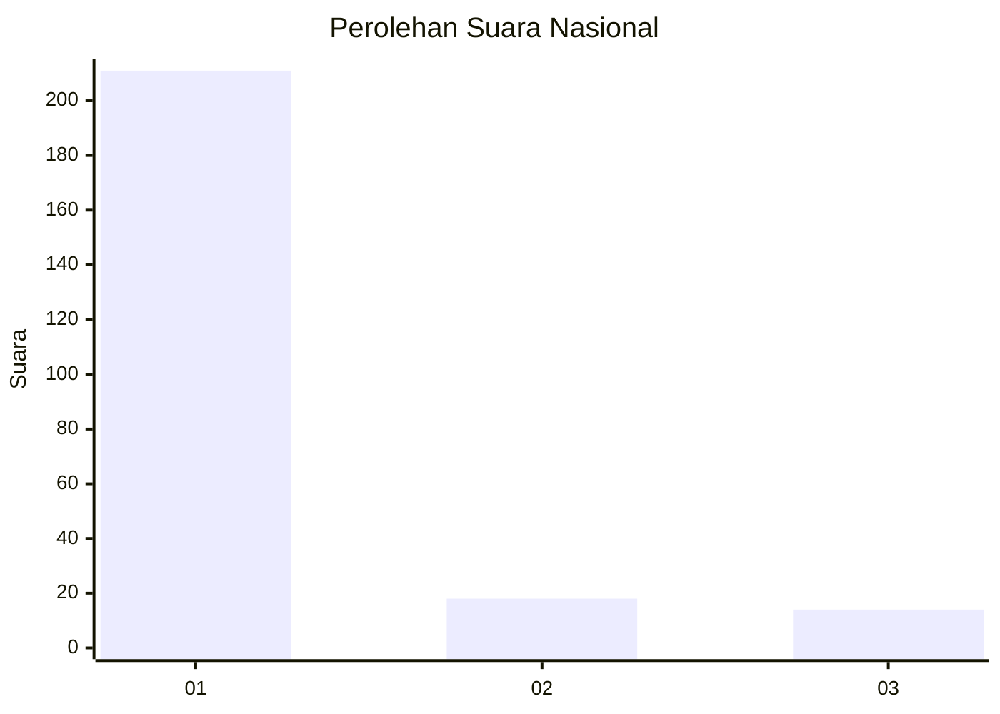
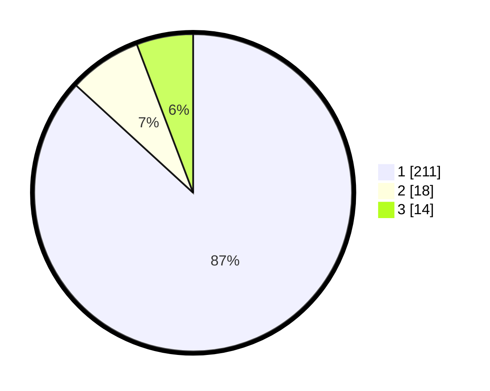

# Hasil

## Grafik

## Tabel

| No. | Nama Paslon    | Suara | Suara (raw) | Persentase |
|:--- |:-------------- | -----:| -----------:| ----------:|
| 1   | ANIES MUHAIMIN | 211   | [211][p-1]  | 86,83      |
| 2   | PRABOWO GIBRAN | 18    | [18][p-2]   | 7,41       |
| 3   | GANJAR MAHFUD  | 14    | [14][p-3]   | 5,76       |

[p-1]: https://github.com/gigit-pemilu/pemilu-2024/blob/main/pilpres/hitung-suara/sub/11-aceh/sub/01-aceh-selatan/sub/07-sawang/sub/2011-kuta-baro/sub/001-tps/sub/paslon-1.txt
[p-2]: https://github.com/gigit-pemilu/pemilu-2024/blob/main/pilpres/hitung-suara/sub/11-aceh/sub/01-aceh-selatan/sub/07-sawang/sub/2011-kuta-baro/sub/001-tps/sub/paslon-2.txt
[p-3]: https://github.com/gigit-pemilu/pemilu-2024/blob/main/pilpres/hitung-suara/sub/11-aceh/sub/01-aceh-selatan/sub/07-sawang/sub/2011-kuta-baro/sub/001-tps/sub/paslon-3.txt

## Foto C Plano

https://sirekap-obj-formc.kpu.go.id/895f/pemilu/ppwp/11/01/07/20/11/1101072011001-20240214-231334--0e93e4ce-c0ec-46be-9006-eb188a4dc473.jpg

https://sirekap-obj-formc.kpu.go.id/895f/pemilu/ppwp/11/01/07/20/11/1101072011001-20240214-211020--f500b625-1e54-47a7-93af-4170b229e566.jpg

https://sirekap-obj-formc.kpu.go.id/895f/pemilu/ppwp/11/01/07/20/11/1101072011001-20240214-211347--04e8dc43-1f36-4b17-9953-998068df159d.jpg

## Metadata

| Key        | Value               |
| ---------- | ------------------- |
| Time Stamp | 2024-02-17 09:30:03 |

## DATA PEMILIH TETAP

Jumlah pemilih dalam DPT: **266**.
 * L: **123**.
 * P: **143**.

## DATA PENGGUNA HAK PILIH

Jumlah pengguna hak pilih dalam DPT: **242**.
 * L: **110**.
 * P: **132**.

Jumlah pengguna hak pilih dalam DPTb: **4**.
 * L: **1**.
 * P: **3**.

Jumlah pengguna hak pilih dalam DPK: **0**.
 * L: **0**.
 * P: **0**.

Jumlah pengguna hak pilih: **246**.
 * L: **111**.
 * P: **135**.

## JUMLAH SUARA SAH DAN TIDAK SAH

JUMLAH SELURUH SUARA SAH: **243**.

JUMLAH SUARA TIDAK SAH: **3**.

JUMLAH SELURUH SUARA SAH DAN SUARA TIDAK SAH: **246**.

