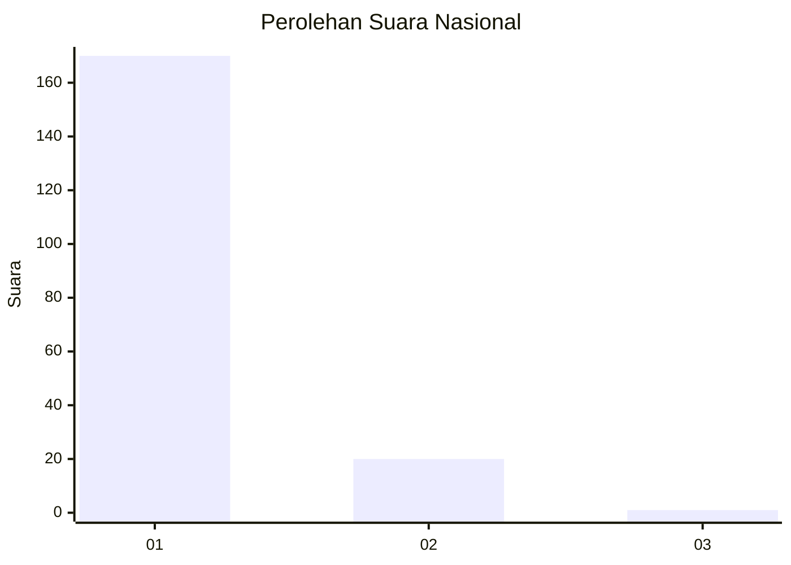
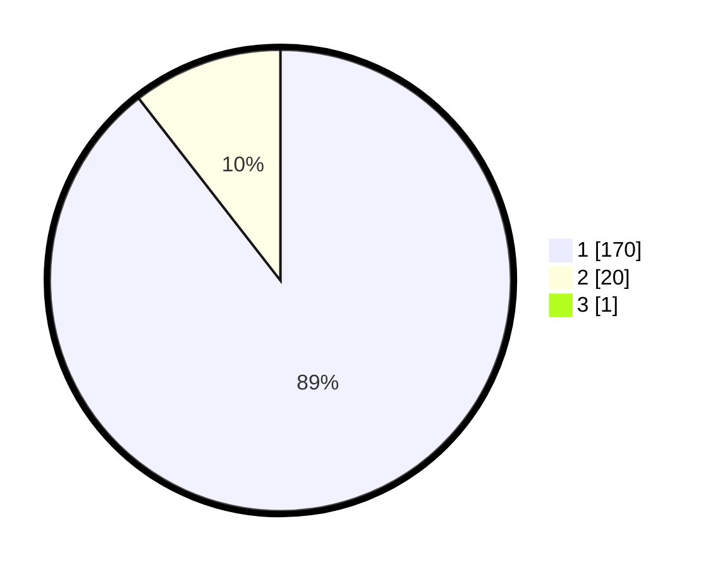

# Hasil

## Grafik

## Tabel

| No. | Nama Paslon    | Suara | Suara (raw) | Persentase |
|:--- |:-------------- | -----:| -----------:| ----------:|
| 1   | ANIES MUHAIMIN | 170   | [170][p-1]  | 89,01      |
| 2   | PRABOWO GIBRAN | 20    | [20][p-2]   | 10,47      |
| 3   | GANJAR MAHFUD  | 1     | [1][p-3]    | 0,52       |

[p-1]: https://github.com/gigit-pemilu/pemilu-2024/blob/main/pilpres/hitung-suara/sub/11-aceh/sub/01-aceh-selatan/sub/07-sawang/sub/2015-sawang-ba'u/sub/003-tps/sub/paslon-1.txt
[p-2]: https://github.com/gigit-pemilu/pemilu-2024/blob/main/pilpres/hitung-suara/sub/11-aceh/sub/01-aceh-selatan/sub/07-sawang/sub/2015-sawang-ba'u/sub/003-tps/sub/paslon-2.txt
[p-3]: https://github.com/gigit-pemilu/pemilu-2024/blob/main/pilpres/hitung-suara/sub/11-aceh/sub/01-aceh-selatan/sub/07-sawang/sub/2015-sawang-ba'u/sub/003-tps/sub/paslon-3.txt

## Foto C Plano

https://sirekap-obj-formc.kpu.go.id/b4e5/pemilu/ppwp/11/01/07/20/15/1101072015003-20240219-153448--a141d576-db5f-440a-8555-006f4abc1cca.jpg

https://sirekap-obj-formc.kpu.go.id/b4e5/pemilu/ppwp/11/01/07/20/15/1101072015003-20240219-153531--8e21ea43-31d2-4e15-97ce-2be83aa54151.jpg

https://sirekap-obj-formc.kpu.go.id/b4e5/pemilu/ppwp/11/01/07/20/15/1101072015003-20240219-153613--072bbd27-64f0-4b55-a7d9-3eb6e531e391.jpg

## Metadata

| Key        | Value               |
| ---------- | ------------------- |
| Time Stamp | 2024-02-24 22:31:28 |

## DATA PEMILIH TETAP

Jumlah pemilih dalam DPT: **206**.
 * L: **92**.
 * P: **114**.

## DATA PENGGUNA HAK PILIH

Jumlah pengguna hak pilih dalam DPT: **194**.
 * L: **87**.
 * P: **107**.

Jumlah pengguna hak pilih dalam DPTb: **0**.
 * L: **0**.
 * P: **0**.

Jumlah pengguna hak pilih dalam DPK: **0**.
 * L: **0**.
 * P: **0**.

Jumlah pengguna hak pilih: **194**.
 * L: **87**.
 * P: **107**.

## JUMLAH SUARA SAH DAN TIDAK SAH

JUMLAH SELURUH SUARA SAH: **191**.

JUMLAH SUARA TIDAK SAH: **3**.

JUMLAH SELURUH SUARA SAH DAN SUARA TIDAK SAH: **194**.

