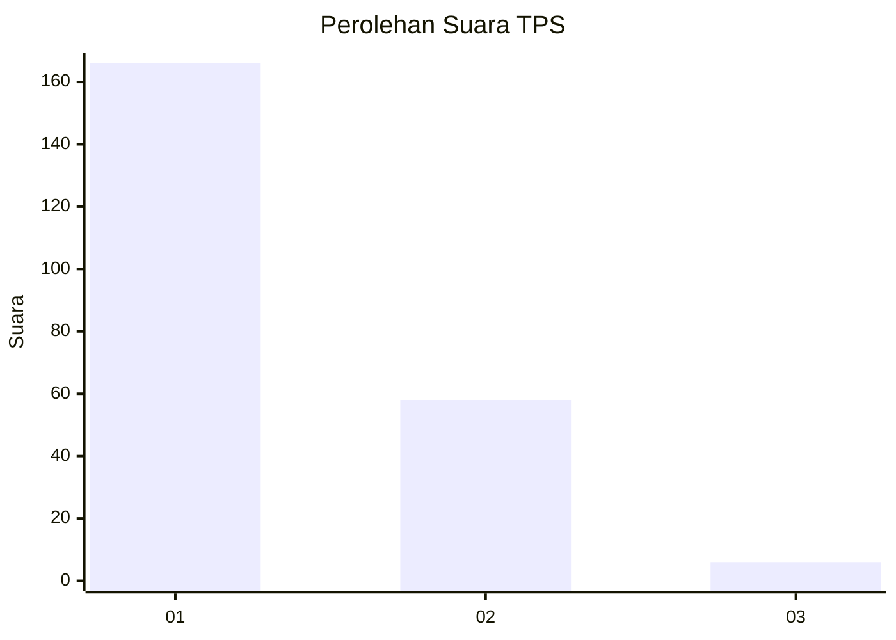
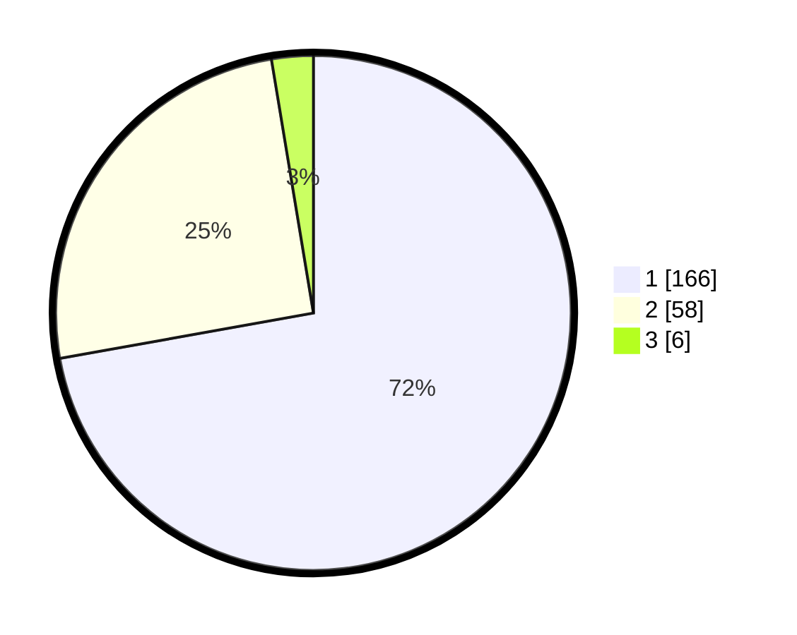

# Hasil

## Grafik

## Tabel

| No. | Nama Paslon    | Suara | Suara (raw) | Persentase |
|:--- |:-------------- | -----:| -----------:| ----------:|
| 1   | ANIES MUHAIMIN | 166   | [166][p-1]  | 72,17      |
| 2   | PRABOWO GIBRAN | 58    | [58][p-2]   | 25,22      |
| 3   | GANJAR MAHFUD  | 6     | [6][p-3]    | 2,61       |

[p-1]: https://github.com/gigit-pemilu/pemilu-2024-11-aceh/blob/main/pilpres/hitung-suara/sub/11-aceh/sub/01-aceh-selatan/sub/08-tapaktuan/sub/2001-lhok-keutapang/sub/001-tps/sub/paslon-1.txt
[p-2]: https://github.com/gigit-pemilu/pemilu-2024-11-aceh/blob/main/pilpres/hitung-suara/sub/11-aceh/sub/01-aceh-selatan/sub/08-tapaktuan/sub/2001-lhok-keutapang/sub/001-tps/sub/paslon-2.txt
[p-3]: https://github.com/gigit-pemilu/pemilu-2024-11-aceh/blob/main/pilpres/hitung-suara/sub/11-aceh/sub/01-aceh-selatan/sub/08-tapaktuan/sub/2001-lhok-keutapang/sub/001-tps/sub/paslon-3.txt

## Foto C Plano

https://sirekap-obj-formc.kpu.go.id/756b/pemilu/ppwp/11/01/08/20/01/1101082001001-20240216-180949--c3938d96-01e6-4822-b053-336cdd0b4309.jpg

https://sirekap-obj-formc.kpu.go.id/756b/pemilu/ppwp/11/01/08/20/01/1101082001001-20240216-180951--18d50d69-a086-44f3-9a01-61f2cfc1a12e.jpg

https://sirekap-obj-formc.kpu.go.id/756b/pemilu/ppwp/11/01/08/20/01/1101082001001-20240216-180950--45d13490-a9c6-46c5-a39e-c3d695ddea42.jpg

## Metadata

| Key        | Value               |
| ---------- | ------------------- |
| Time Stamp | 2024-02-16 21:01:00 |

## DATA PEMILIH TETAP

Jumlah pemilih dalam DPT: **260**.
 * L: **123**.
 * P: **137**.

## DATA PENGGUNA HAK PILIH

Jumlah pengguna hak pilih dalam DPT: **216**.
 * L: **96**.
 * P: **120**.

Jumlah pengguna hak pilih dalam DPTb: **16**.
 * L: **10**.
 * P: **6**.

Jumlah pengguna hak pilih dalam DPK: **0**.
 * L: **0**.
 * P: **0**.

Jumlah pengguna hak pilih: **232**.
 * L: **106**.
 * P: **126**.

## JUMLAH SUARA SAH DAN TIDAK SAH

JUMLAH SELURUH SUARA SAH: **230**.

JUMLAH SUARA TIDAK SAH: **2**.

JUMLAH SELURUH SUARA SAH DAN SUARA TIDAK SAH: **232**.

