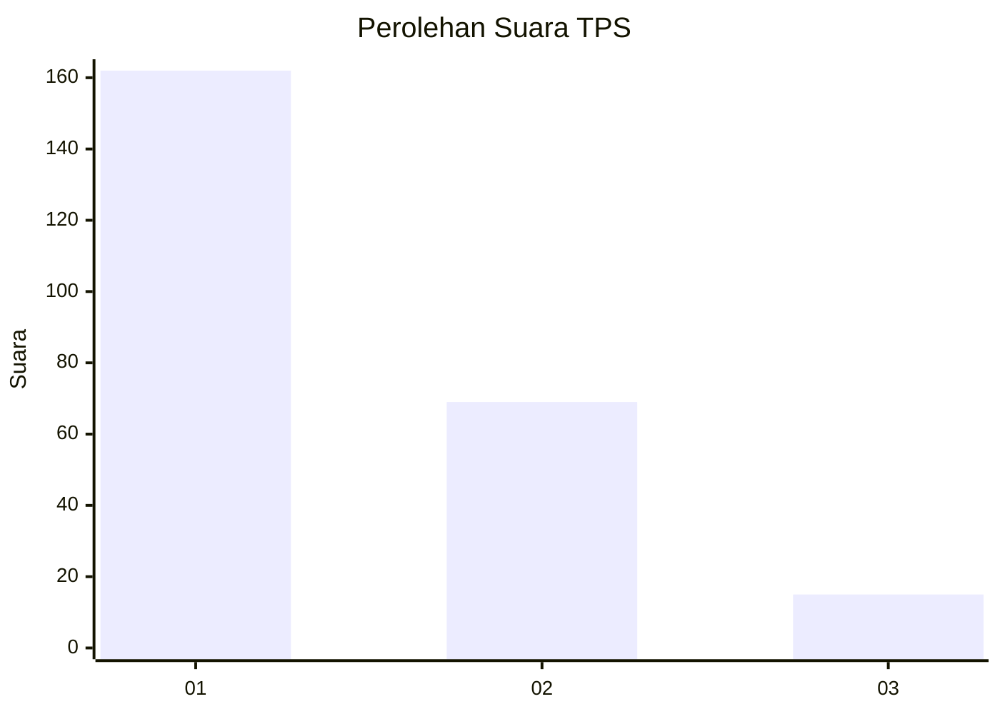
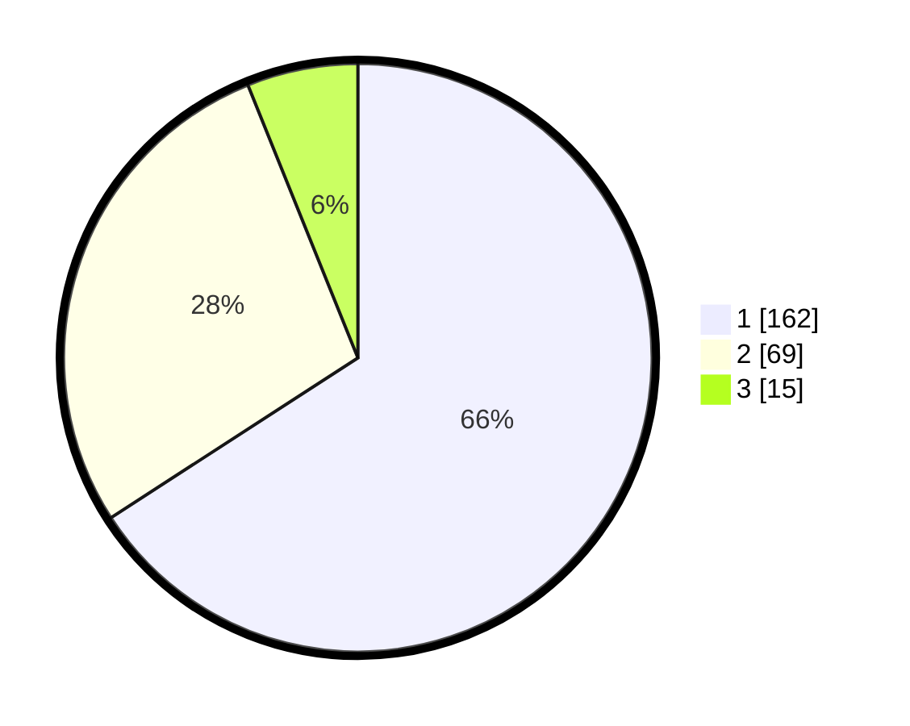

# Hasil

## Grafik

## Tabel

| No. | Nama Paslon    | Suara | Suara (raw) | Persentase |
|:--- |:-------------- | -----:| -----------:| ----------:|
| 1   | ANIES MUHAIMIN | 162   | [162][p-1]  | 65,85      |
| 2   | PRABOWO GIBRAN | 69    | [69][p-2]   | 28,05      |
| 3   | GANJAR MAHFUD  | 15    | [15][p-3]   | 6,10       |

[p-1]: https://github.com/gigit-pemilu/pemilu-2024-11-aceh/blob/main/pilpres/hitung-suara/sub/11-aceh/sub/01-aceh-selatan/sub/08-tapaktuan/sub/2001-lhok-keutapang/sub/002-tps/sub/paslon-1.txt
[p-2]: https://github.com/gigit-pemilu/pemilu-2024-11-aceh/blob/main/pilpres/hitung-suara/sub/11-aceh/sub/01-aceh-selatan/sub/08-tapaktuan/sub/2001-lhok-keutapang/sub/002-tps/sub/paslon-2.txt
[p-3]: https://github.com/gigit-pemilu/pemilu-2024-11-aceh/blob/main/pilpres/hitung-suara/sub/11-aceh/sub/01-aceh-selatan/sub/08-tapaktuan/sub/2001-lhok-keutapang/sub/002-tps/sub/paslon-3.txt

## Foto C Plano

https://sirekap-obj-formc.kpu.go.id/5774/pemilu/ppwp/11/01/08/20/01/1101082001002-20240222-000739--4e0e0c3b-8440-45e2-a93e-5042ab79ea54.jpg

https://sirekap-obj-formc.kpu.go.id/5774/pemilu/ppwp/11/01/08/20/01/1101082001002-20240222-000820--343f9176-f9af-4783-88df-048f46d312e5.jpg

https://sirekap-obj-formc.kpu.go.id/5774/pemilu/ppwp/11/01/08/20/01/1101082001002-20240222-000908--0326f0a0-d865-4480-a3b7-04f068354a3b.jpg

## Metadata

| Key        | Value               |
| ---------- | ------------------- |
| Time Stamp | 2024-02-22 01:00:00 |

## DATA PEMILIH TETAP

Jumlah pemilih dalam DPT: **276**.
 * L: **130**.
 * P: **146**.

## DATA PENGGUNA HAK PILIH

Jumlah pengguna hak pilih dalam DPT: **241**.
 * L: **116**.
 * P: **125**.

Jumlah pengguna hak pilih dalam DPTb: **8**.
 * L: **1**.
 * P: **7**.

Jumlah pengguna hak pilih dalam DPK: **3**.
 * L: **0**.
 * P: **3**.

Jumlah pengguna hak pilih: **252**.
 * L: **117**.
 * P: **135**.

## JUMLAH SUARA SAH DAN TIDAK SAH

JUMLAH SELURUH SUARA SAH: **246**.

JUMLAH SUARA TIDAK SAH: **6**.

JUMLAH SELURUH SUARA SAH DAN SUARA TIDAK SAH: **252**.

