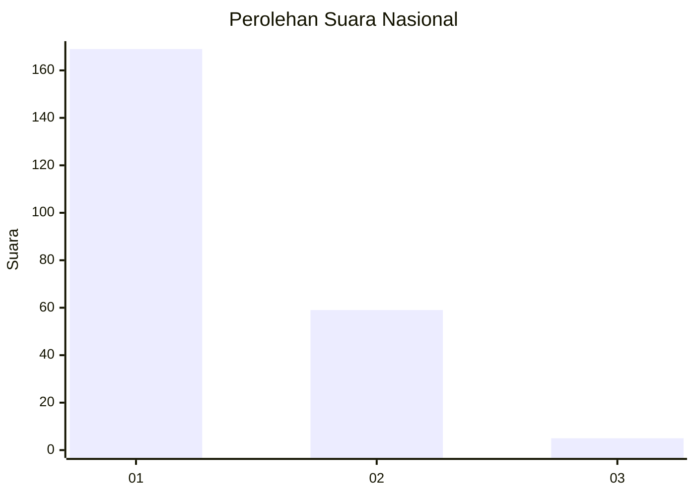
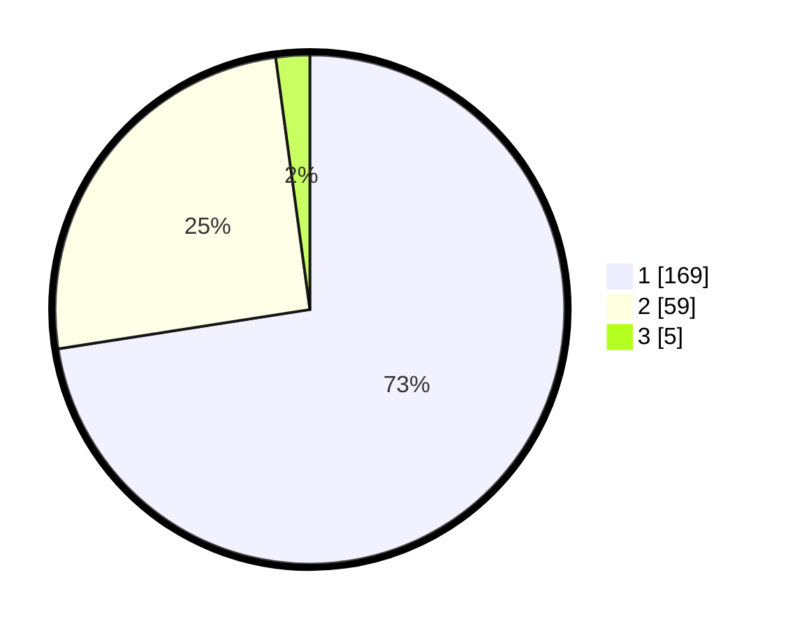

# Hasil

## Grafik

## Tabel

| No. | Nama Paslon    | Suara | Suara (raw) | Persentase |
|:--- |:-------------- | -----:| -----------:| ----------:|
| 1   | ANIES MUHAIMIN | 169   | [169][p-1]  | 72,53      |
| 2   | PRABOWO GIBRAN | 59    | [59][p-2]   | 25,32      |
| 3   | GANJAR MAHFUD  | 5     | [5][p-3]    | 2,15       |

[p-1]: https://github.com/gigit-pemilu/pemilu-2024/blob/main/pilpres/hitung-suara/sub/11-aceh/sub/01-aceh-selatan/sub/08-tapaktuan/sub/2001-lhok-keutapang/sub/003-tps/sub/paslon-1.txt
[p-2]: https://github.com/gigit-pemilu/pemilu-2024/blob/main/pilpres/hitung-suara/sub/11-aceh/sub/01-aceh-selatan/sub/08-tapaktuan/sub/2001-lhok-keutapang/sub/003-tps/sub/paslon-2.txt
[p-3]: https://github.com/gigit-pemilu/pemilu-2024/blob/main/pilpres/hitung-suara/sub/11-aceh/sub/01-aceh-selatan/sub/08-tapaktuan/sub/2001-lhok-keutapang/sub/003-tps/sub/paslon-3.txt

## Foto C Plano

https://sirekap-obj-formc.kpu.go.id/cffc/pemilu/ppwp/11/01/08/20/01/1101082001003-20240216-163706--53723c0b-e9ab-4cab-b890-5c8f82a57508.jpg

https://sirekap-obj-formc.kpu.go.id/cffc/pemilu/ppwp/11/01/08/20/01/1101082001003-20240216-163708--4f2f30b2-2d32-4037-bcae-fd83742cf332.jpg

https://sirekap-obj-formc.kpu.go.id/cffc/pemilu/ppwp/11/01/08/20/01/1101082001003-20240216-163707--a70923eb-0e72-4917-821f-cc40f4a8f3f6.jpg

## Metadata

| Key        | Value               |
| ---------- | ------------------- |
| Time Stamp | 2024-02-16 21:01:00 |

## DATA PEMILIH TETAP

Jumlah pemilih dalam DPT: **271**.
 * L: **120**.
 * P: **151**.

## DATA PENGGUNA HAK PILIH

Jumlah pengguna hak pilih dalam DPT: **231**.
 * L: **98**.
 * P: **133**.

Jumlah pengguna hak pilih dalam DPTb: **5**.
 * L: **4**.
 * P: **1**.

Jumlah pengguna hak pilih dalam DPK: **0**.
 * L: **0**.
 * P: **0**.

Jumlah pengguna hak pilih: **236**.
 * L: **102**.
 * P: **134**.

## JUMLAH SUARA SAH DAN TIDAK SAH

JUMLAH SELURUH SUARA SAH: **233**.

JUMLAH SUARA TIDAK SAH: **3**.

JUMLAH SELURUH SUARA SAH DAN SUARA TIDAK SAH: **236**.

