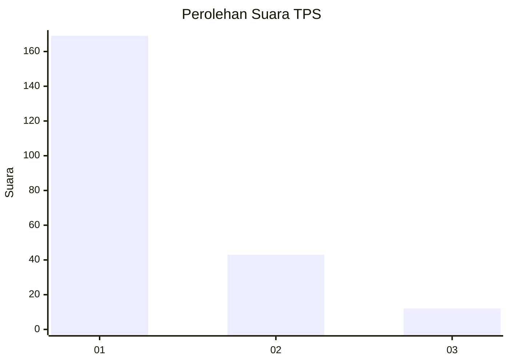
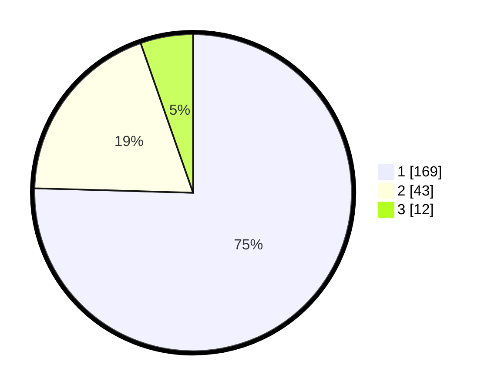

# Hasil

## Grafik

## Tabel

| No. | Nama Paslon    | Suara | Suara (raw) | Persentase |
|:--- |:-------------- | -----:| -----------:| ----------:|
| 1   | ANIES MUHAIMIN | 169   | [169][p-1]  | 75,45      |
| 2   | PRABOWO GIBRAN | 43    | [43][p-2]   | 19,20      |
| 3   | GANJAR MAHFUD  | 12    | [12][p-3]   | 5,36       |

[p-1]: https://github.com/gigit-pemilu/pemilu-2024-11-aceh/blob/main/pilpres/hitung-suara/sub/11-aceh/sub/01-aceh-selatan/sub/08-tapaktuan/sub/2001-lhok-keutapang/sub/004-tps/sub/paslon-1.txt
[p-2]: https://github.com/gigit-pemilu/pemilu-2024-11-aceh/blob/main/pilpres/hitung-suara/sub/11-aceh/sub/01-aceh-selatan/sub/08-tapaktuan/sub/2001-lhok-keutapang/sub/004-tps/sub/paslon-2.txt
[p-3]: https://github.com/gigit-pemilu/pemilu-2024-11-aceh/blob/main/pilpres/hitung-suara/sub/11-aceh/sub/01-aceh-selatan/sub/08-tapaktuan/sub/2001-lhok-keutapang/sub/004-tps/sub/paslon-3.txt

## Foto C Plano

https://sirekap-obj-formc.kpu.go.id/33e6/pemilu/ppwp/11/01/08/20/01/1101082001004-20240216-170626--23f94af3-e1d5-4676-9c62-807004cade3b.jpg

https://sirekap-obj-formc.kpu.go.id/33e6/pemilu/ppwp/11/01/08/20/01/1101082001004-20240216-170627--e7be8e3f-a24b-4483-b3ed-47af86b306f4.jpg

https://sirekap-obj-formc.kpu.go.id/33e6/pemilu/ppwp/11/01/08/20/01/1101082001004-20240216-170627--3f0e9153-a8f2-4b2d-822d-9577b4e72717.jpg

## Metadata

| Key        | Value               |
| ---------- | ------------------- |
| Time Stamp | 2024-02-16 21:01:00 |

## DATA PEMILIH TETAP

Jumlah pemilih dalam DPT: **248**.
 * L: **121**.
 * P: **127**.

## DATA PENGGUNA HAK PILIH

Jumlah pengguna hak pilih dalam DPT: **212**.
 * L: **102**.
 * P: **110**.

Jumlah pengguna hak pilih dalam DPTb: **8**.
 * L: **3**.
 * P: **5**.

Jumlah pengguna hak pilih dalam DPK: **6**.
 * L: **3**.
 * P: **3**.

Jumlah pengguna hak pilih: **226**.
 * L: **108**.
 * P: **118**.

## JUMLAH SUARA SAH DAN TIDAK SAH

JUMLAH SELURUH SUARA SAH: **224**.

JUMLAH SUARA TIDAK SAH: **2**.

JUMLAH SELURUH SUARA SAH DAN SUARA TIDAK SAH: **226**.

