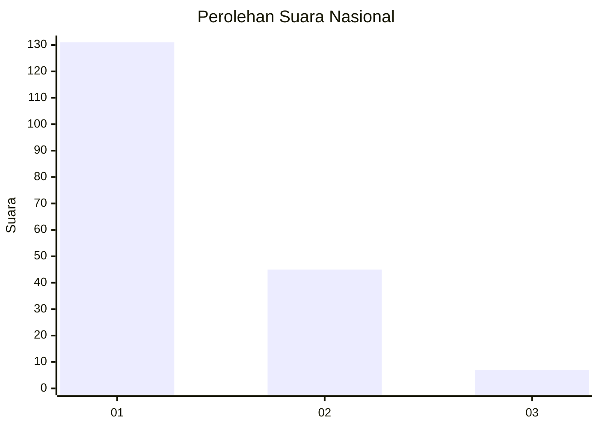
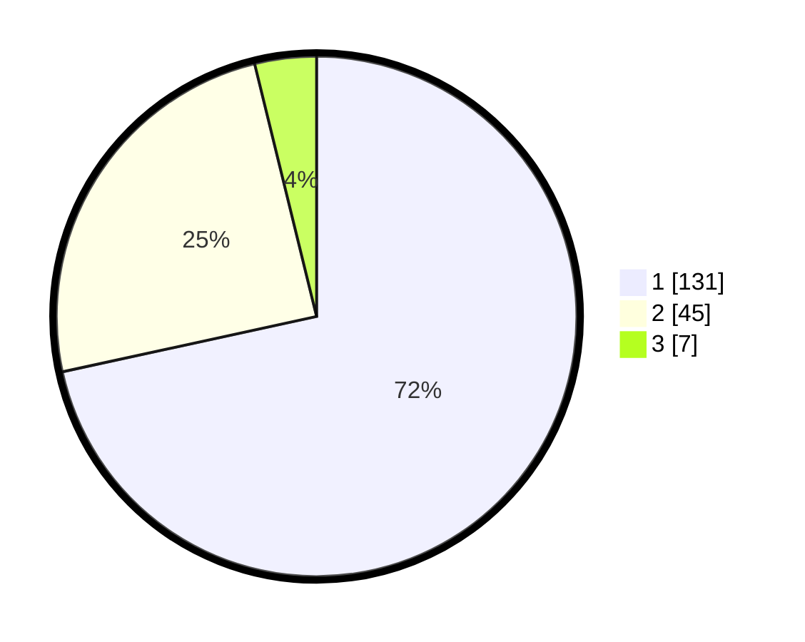

# Hasil

## Grafik

## Tabel

| No. | Nama Paslon    | Suara | Suara (raw) | Persentase |
|:--- |:-------------- | -----:| -----------:| ----------:|
| 1   | ANIES MUHAIMIN | 131   | [131][p-1]  | 71,58      |
| 2   | PRABOWO GIBRAN | 45    | [45][p-2]   | 24,59      |
| 3   | GANJAR MAHFUD  | 7     | [7][p-3]    | 3,83       |

[p-1]: https://github.com/gigit-pemilu/pemilu-2024/blob/main/pilpres/hitung-suara/sub/11-aceh/sub/01-aceh-selatan/sub/08-tapaktuan/sub/2001-lhok-keutapang/sub/005-tps/sub/paslon-1.txt
[p-2]: https://github.com/gigit-pemilu/pemilu-2024/blob/main/pilpres/hitung-suara/sub/11-aceh/sub/01-aceh-selatan/sub/08-tapaktuan/sub/2001-lhok-keutapang/sub/005-tps/sub/paslon-2.txt
[p-3]: https://github.com/gigit-pemilu/pemilu-2024/blob/main/pilpres/hitung-suara/sub/11-aceh/sub/01-aceh-selatan/sub/08-tapaktuan/sub/2001-lhok-keutapang/sub/005-tps/sub/paslon-3.txt

## Foto C Plano

https://sirekap-obj-formc.kpu.go.id/2894/pemilu/ppwp/11/01/08/20/01/1101082001005-20240216-180634--593a352e-b899-4179-88d5-f4ca5db77bb2.jpg

https://sirekap-obj-formc.kpu.go.id/2894/pemilu/ppwp/11/01/08/20/01/1101082001005-20240216-180635--c5b3b886-aa32-4449-8cfe-1660cde230a9.jpg

https://sirekap-obj-formc.kpu.go.id/2894/pemilu/ppwp/11/01/08/20/01/1101082001005-20240216-180635--6c77c3c8-4719-400b-aab9-cea76ce1d8fe.jpg

## Metadata

| Key        | Value               |
| ---------- | ------------------- |
| Time Stamp | 2024-02-16 21:01:00 |

## DATA PEMILIH TETAP

Jumlah pemilih dalam DPT: **223**.
 * L: **112**.
 * P: **111**.

## DATA PENGGUNA HAK PILIH

Jumlah pengguna hak pilih dalam DPT: **177**.
 * L: **84**.
 * P: **93**.

Jumlah pengguna hak pilih dalam DPTb: **9**.
 * L: **5**.
 * P: **4**.

Jumlah pengguna hak pilih dalam DPK: **0**.
 * L: **0**.
 * P: **0**.

Jumlah pengguna hak pilih: **186**.
 * L: **89**.
 * P: **97**.

## JUMLAH SUARA SAH DAN TIDAK SAH

JUMLAH SELURUH SUARA SAH: **183**.

JUMLAH SUARA TIDAK SAH: **3**.

JUMLAH SELURUH SUARA SAH DAN SUARA TIDAK SAH: **186**.

