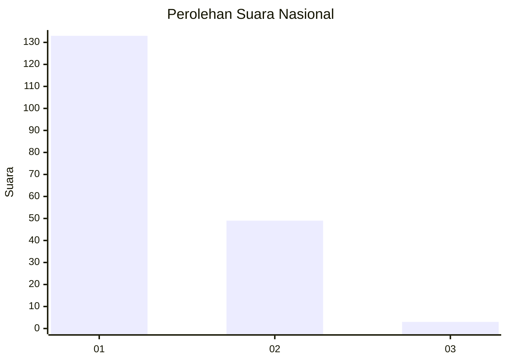
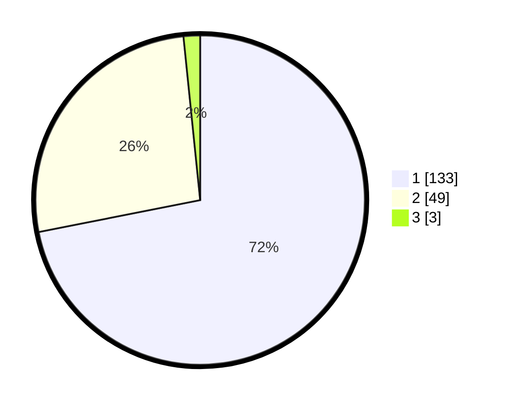

# Hasil

## Grafik

## Tabel

| No. | Nama Paslon    | Suara | Suara (raw) | Persentase |
|:--- |:-------------- | -----:| -----------:| ----------:|
| 1   | ANIES MUHAIMIN | 133   | [133][p-1]  | 71,89      |
| 2   | PRABOWO GIBRAN | 49    | [49][p-2]   | 26,49      |
| 3   | GANJAR MAHFUD  | 3     | [3][p-3]    | 1,62       |

[p-1]: https://github.com/gigit-pemilu/pemilu-2024/blob/main/pilpres/hitung-suara/sub/11-aceh/sub/01-aceh-selatan/sub/08-tapaktuan/sub/2005-jambo-apha/sub/001-tps/sub/paslon-1.txt
[p-2]: https://github.com/gigit-pemilu/pemilu-2024/blob/main/pilpres/hitung-suara/sub/11-aceh/sub/01-aceh-selatan/sub/08-tapaktuan/sub/2005-jambo-apha/sub/001-tps/sub/paslon-2.txt
[p-3]: https://github.com/gigit-pemilu/pemilu-2024/blob/main/pilpres/hitung-suara/sub/11-aceh/sub/01-aceh-selatan/sub/08-tapaktuan/sub/2005-jambo-apha/sub/001-tps/sub/paslon-3.txt

## Foto C Plano

https://sirekap-obj-formc.kpu.go.id/fbed/pemilu/ppwp/11/01/08/20/05/1101082005001-20240214-191505--45aa78b8-419c-44d9-a489-020b92b15ac0.jpg

https://sirekap-obj-formc.kpu.go.id/fbed/pemilu/ppwp/11/01/08/20/05/1101082005001-20240214-192106--baac0581-d454-477f-88f2-0188acc57bb8.jpg

https://sirekap-obj-formc.kpu.go.id/fbed/pemilu/ppwp/11/01/08/20/05/1101082005001-20240214-192445--772b7302-ca6c-42ca-84b8-6f86bdcb8c0f.jpg

## Metadata

| Key        | Value               |
| ---------- | ------------------- |
| Time Stamp | 2024-02-15 22:00:27 |

## DATA PEMILIH TETAP

Jumlah pemilih dalam DPT: **228**.
 * L: **103**.
 * P: **125**.

## DATA PENGGUNA HAK PILIH

Jumlah pengguna hak pilih dalam DPT: **178**.
 * L: **76**.
 * P: **102**.

Jumlah pengguna hak pilih dalam DPTb: **5**.
 * L: **2**.
 * P: **3**.

Jumlah pengguna hak pilih dalam DPK: **3**.
 * L: **1**.
 * P: **2**.

Jumlah pengguna hak pilih: **186**.
 * L: **79**.
 * P: **107**.

## JUMLAH SUARA SAH DAN TIDAK SAH

JUMLAH SELURUH SUARA SAH: **185**.

JUMLAH SUARA TIDAK SAH: **1**.

JUMLAH SELURUH SUARA SAH DAN SUARA TIDAK SAH: **186**.

