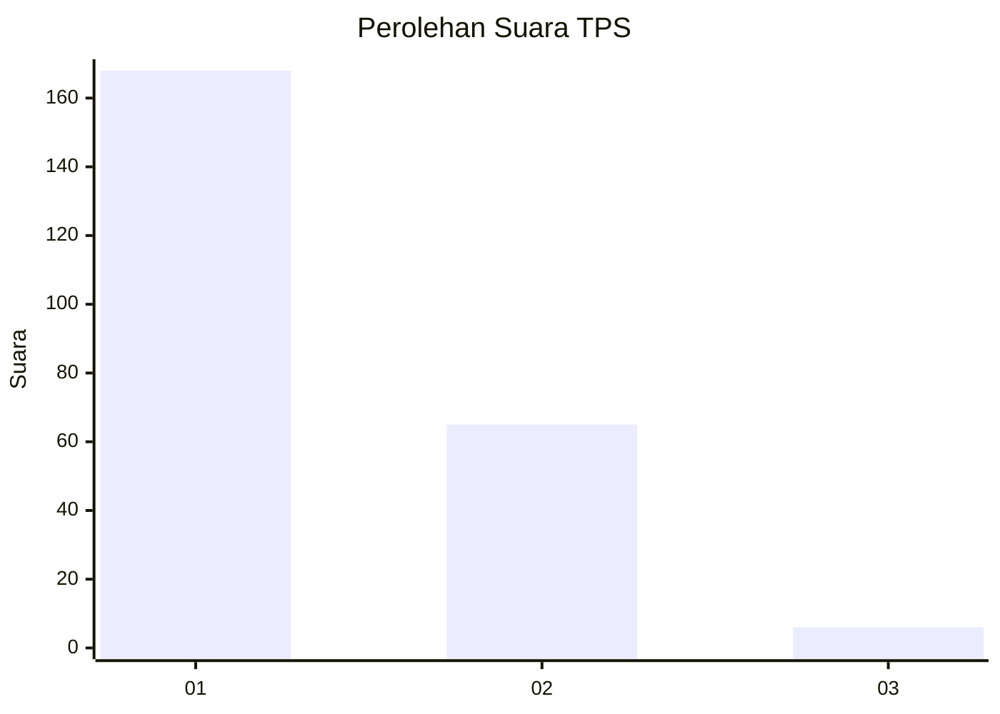
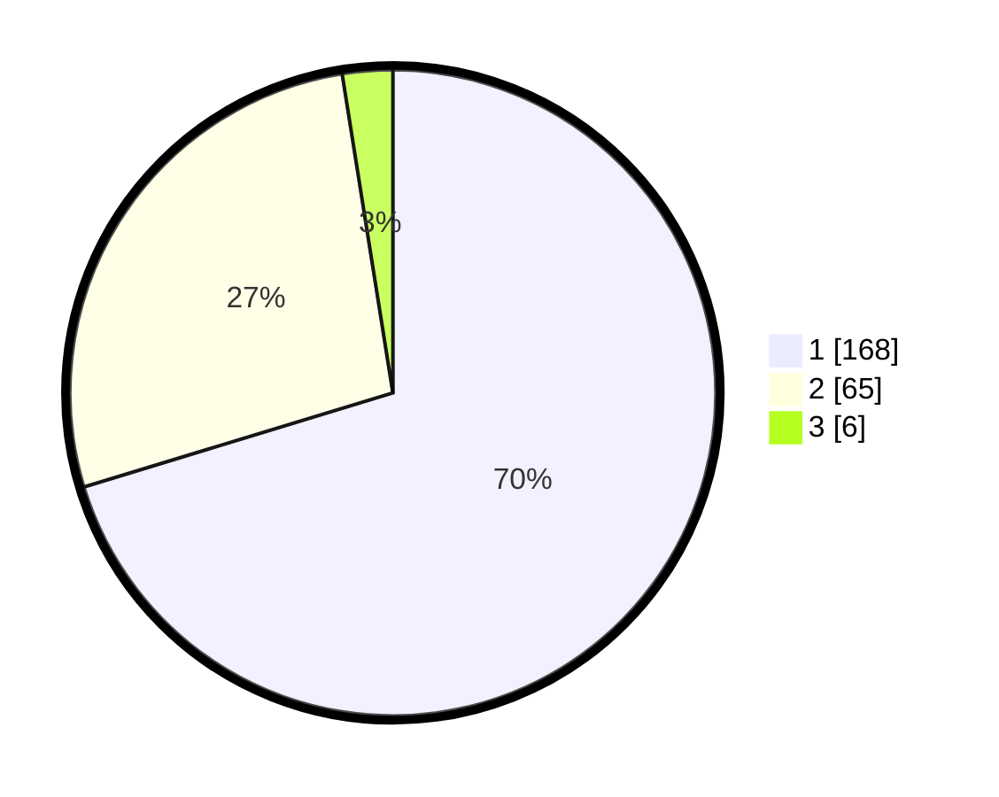

# Hasil

## Grafik

## Tabel

| No. | Nama Paslon    | Suara | Suara (raw) | Persentase |
|:--- |:-------------- | -----:| -----------:| ----------:|
| 1   | ANIES MUHAIMIN | 168   | [168][p-1]  | 70,29      |
| 2   | PRABOWO GIBRAN | 65    | [65][p-2]   | 27,20      |
| 3   | GANJAR MAHFUD  | 6     | [6][p-3]    | 2,51       |

[p-1]: https://github.com/gigit-pemilu/pemilu-2024-11-aceh/blob/main/pilpres/hitung-suara/sub/11-aceh/sub/01-aceh-selatan/sub/08-tapaktuan/sub/2005-jambo-apha/sub/003-tps/sub/paslon-1.txt
[p-2]: https://github.com/gigit-pemilu/pemilu-2024-11-aceh/blob/main/pilpres/hitung-suara/sub/11-aceh/sub/01-aceh-selatan/sub/08-tapaktuan/sub/2005-jambo-apha/sub/003-tps/sub/paslon-2.txt
[p-3]: https://github.com/gigit-pemilu/pemilu-2024-11-aceh/blob/main/pilpres/hitung-suara/sub/11-aceh/sub/01-aceh-selatan/sub/08-tapaktuan/sub/2005-jambo-apha/sub/003-tps/sub/paslon-3.txt

## Foto C Plano

https://sirekap-obj-formc.kpu.go.id/e1bb/pemilu/ppwp/11/01/08/20/05/1101082005003-20240214-234641--d6037e07-0c67-44d4-80c5-3974212ac3bd.jpg

https://sirekap-obj-formc.kpu.go.id/e1bb/pemilu/ppwp/11/01/08/20/05/1101082005003-20240214-234707--fb9c98d1-5846-4d18-9391-f92a956b0d9d.jpg

https://sirekap-obj-formc.kpu.go.id/e1bb/pemilu/ppwp/11/01/08/20/05/1101082005003-20240214-234726--4c67e180-e485-40ef-80bf-21b9b0d92f90.jpg

## Metadata

| Key        | Value               |
| ---------- | ------------------- |
| Time Stamp | 2024-02-15 17:00:25 |

## DATA PEMILIH TETAP

Jumlah pemilih dalam DPT: **284**.
 * L: **127**.
 * P: **157**.

## DATA PENGGUNA HAK PILIH

Jumlah pengguna hak pilih dalam DPT: **237**.
 * L: **106**.
 * P: **131**.

Jumlah pengguna hak pilih dalam DPTb: **3**.
 * L: **3**.
 * P: **0**.

Jumlah pengguna hak pilih dalam DPK: **1**.
 * L: **1**.
 * P: **0**.

Jumlah pengguna hak pilih: **241**.
 * L: **110**.
 * P: **131**.

## JUMLAH SUARA SAH DAN TIDAK SAH

JUMLAH SELURUH SUARA SAH: **239**.

JUMLAH SUARA TIDAK SAH: **2**.

JUMLAH SELURUH SUARA SAH DAN SUARA TIDAK SAH: **241**.

