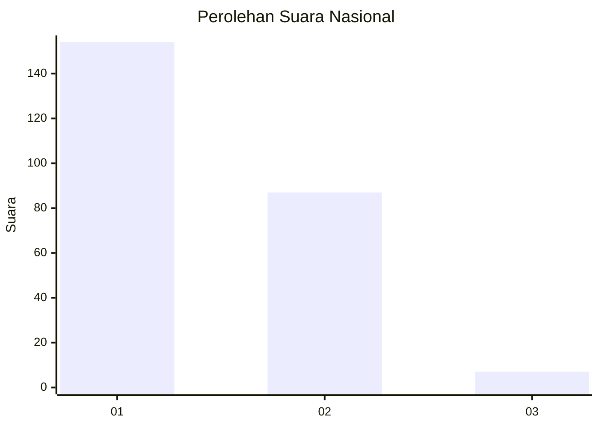
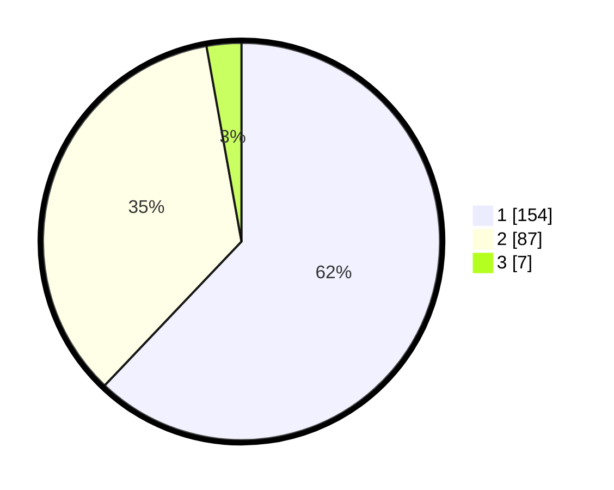

# Hasil

## Grafik

## Tabel

| No. | Nama Paslon    | Suara | Suara (raw) | Persentase |
|:--- |:-------------- | -----:| -----------:| ----------:|
| 1   | ANIES MUHAIMIN | 154   | [154][p-1]  | 62,10      |
| 2   | PRABOWO GIBRAN | 87    | [87][p-2]   | 35,08      |
| 3   | GANJAR MAHFUD  | 7     | [7][p-3]    | 2,82       |

[p-1]: https://github.com/gigit-pemilu/pemilu-2024/blob/main/pilpres/hitung-suara/sub/11-aceh/sub/01-aceh-selatan/sub/08-tapaktuan/sub/2007-pasar/sub/002-tps/sub/paslon-1.txt
[p-2]: https://github.com/gigit-pemilu/pemilu-2024/blob/main/pilpres/hitung-suara/sub/11-aceh/sub/01-aceh-selatan/sub/08-tapaktuan/sub/2007-pasar/sub/002-tps/sub/paslon-2.txt
[p-3]: https://github.com/gigit-pemilu/pemilu-2024/blob/main/pilpres/hitung-suara/sub/11-aceh/sub/01-aceh-selatan/sub/08-tapaktuan/sub/2007-pasar/sub/002-tps/sub/paslon-3.txt

## Foto C Plano

https://sirekap-obj-formc.kpu.go.id/f0c4/pemilu/ppwp/11/01/08/20/07/1101082007002-20240220-213049--d1ce56bb-6753-4dc6-8c02-f46393adcb4c.jpg

https://sirekap-obj-formc.kpu.go.id/f0c4/pemilu/ppwp/11/01/08/20/07/1101082007002-20240220-213051--54affc16-bf58-4dfb-97f6-94af5f16d5e0.jpg

https://sirekap-obj-formc.kpu.go.id/f0c4/pemilu/ppwp/11/01/08/20/07/1101082007002-20240220-213050--36ad0d61-c4b4-46a2-9c18-534388083ef4.jpg

## Metadata

| Key        | Value               |
| ---------- | ------------------- |
| Time Stamp | 2024-02-22 17:00:00 |

## DATA PEMILIH TETAP

Jumlah pemilih dalam DPT: **278**.
 * L: **120**.
 * P: **158**.

## DATA PENGGUNA HAK PILIH

Jumlah pengguna hak pilih dalam DPT: **200**.
 * L: **75**.
 * P: **125**.

Jumlah pengguna hak pilih dalam DPTb: **51**.
 * L: **45**.
 * P: **6**.

Jumlah pengguna hak pilih dalam DPK: **2**.
 * L: **1**.
 * P: **1**.

Jumlah pengguna hak pilih: **253**.
 * L: **121**.
 * P: **132**.

## JUMLAH SUARA SAH DAN TIDAK SAH

JUMLAH SELURUH SUARA SAH: **248**.

JUMLAH SUARA TIDAK SAH: **5**.

JUMLAH SELURUH SUARA SAH DAN SUARA TIDAK SAH: **253**.

