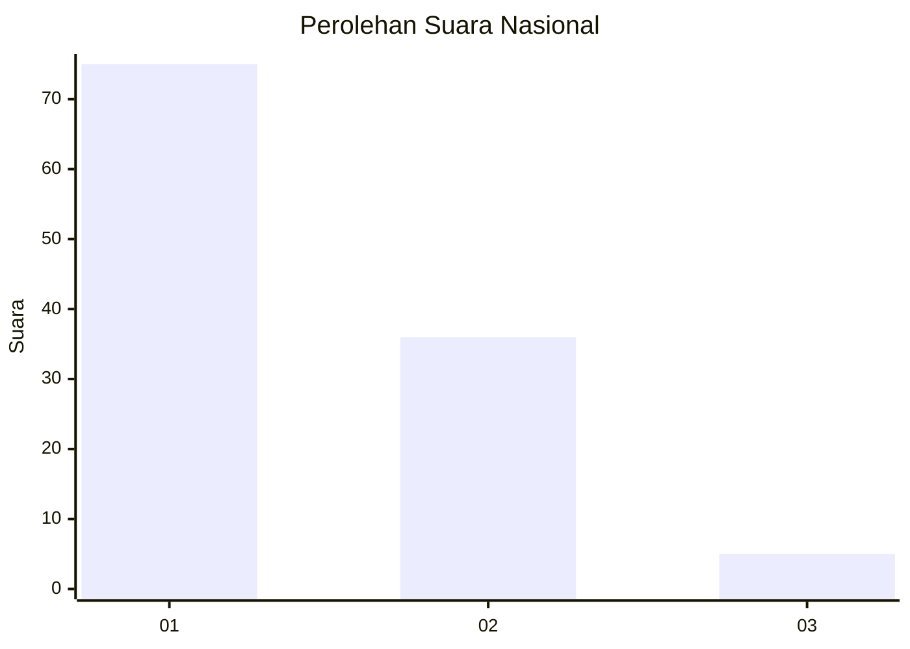
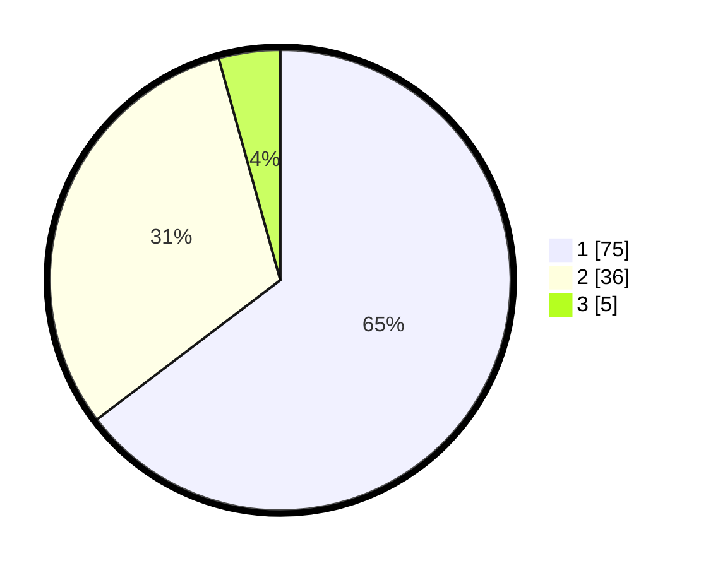

# Hasil

## Grafik

## Tabel

| No. | Nama Paslon    | Suara | Suara (raw) | Persentase |
|:--- |:-------------- | -----:| -----------:| ----------:|
| 1   | ANIES MUHAIMIN | 75    | [75][p-1]   | 64,66      |
| 2   | PRABOWO GIBRAN | 36    | [36][p-2]   | 31,03      |
| 3   | GANJAR MAHFUD  | 5     | [5][p-3]    | 4,31       |

[p-1]: https://github.com/gigit-pemilu/pemilu-2024/blob/main/pilpres/hitung-suara/sub/11-aceh/sub/01-aceh-selatan/sub/08-tapaktuan/sub/2007-pasar/sub/901-tps/sub/paslon-1.txt
[p-2]: https://github.com/gigit-pemilu/pemilu-2024/blob/main/pilpres/hitung-suara/sub/11-aceh/sub/01-aceh-selatan/sub/08-tapaktuan/sub/2007-pasar/sub/901-tps/sub/paslon-2.txt
[p-3]: https://github.com/gigit-pemilu/pemilu-2024/blob/main/pilpres/hitung-suara/sub/11-aceh/sub/01-aceh-selatan/sub/08-tapaktuan/sub/2007-pasar/sub/901-tps/sub/paslon-3.txt

## Foto C Plano

https://sirekap-obj-formc.kpu.go.id/91f1/pemilu/ppwp/11/01/08/20/07/1101082007901-20240214-185702--449cf3dd-c782-4ace-9c56-228d5a2b6d26.jpg

https://sirekap-obj-formc.kpu.go.id/91f1/pemilu/ppwp/11/01/08/20/07/1101082007901-20240214-191213--25e866bb-2f96-4208-b6b3-1b83c742ae55.jpg

https://sirekap-obj-formc.kpu.go.id/91f1/pemilu/ppwp/11/01/08/20/07/1101082007901-20240214-190311--5ac84c5e-e29d-4c94-8337-0b43bdbde36d.jpg

## Metadata

| Key        | Value               |
| ---------- | ------------------- |
| Time Stamp | 2024-02-14 21:46:01 |

## DATA PEMILIH TETAP

Jumlah pemilih dalam DPT: **93**.
 * L: **93**.
 * P: **0**.

## DATA PENGGUNA HAK PILIH

Jumlah pengguna hak pilih dalam DPT: **93**.
 * L: **93**.
 * P: **0**.

Jumlah pengguna hak pilih dalam DPTb: **24**.
 * L: **24**.
 * P: **0**.

Jumlah pengguna hak pilih dalam DPK: **0**.
 * L: **0**.
 * P: **0**.

Jumlah pengguna hak pilih: **117**.
 * L: **117**.
 * P: **0**.

## JUMLAH SUARA SAH DAN TIDAK SAH

JUMLAH SELURUH SUARA SAH: **116**.

JUMLAH SUARA TIDAK SAH: **1**.

JUMLAH SELURUH SUARA SAH DAN SUARA TIDAK SAH: **117**.

