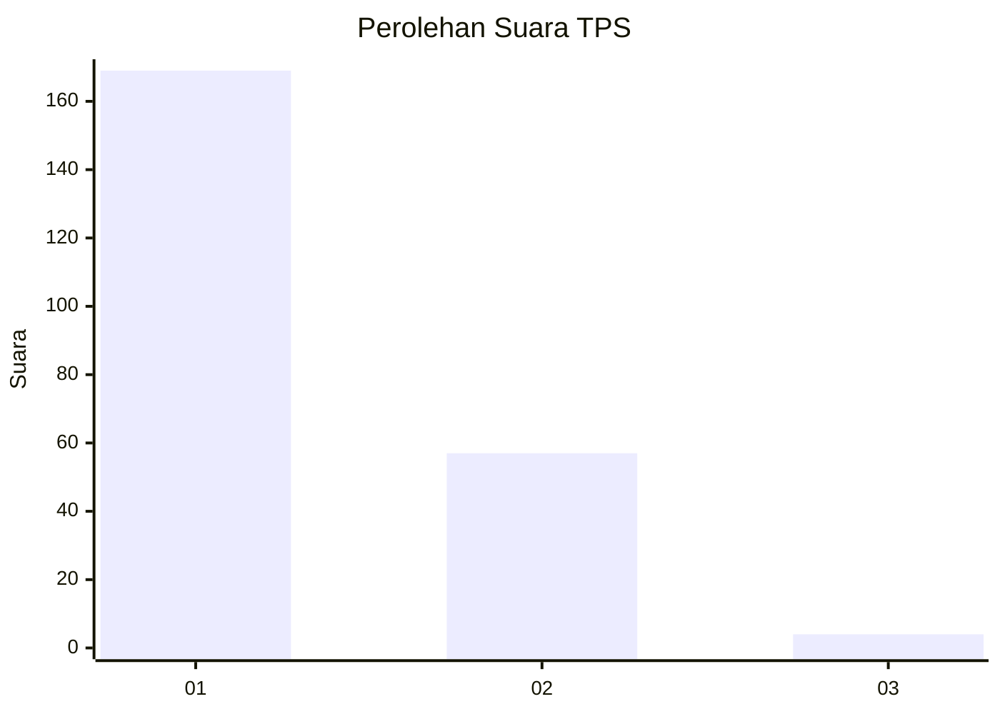
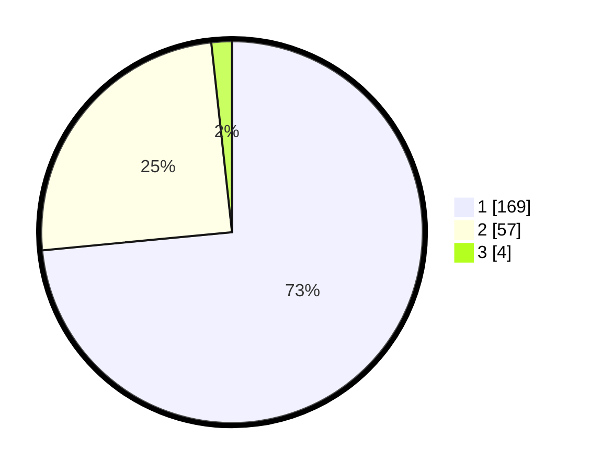

# Hasil

## Grafik

## Tabel

| No. | Nama Paslon    | Suara | Suara (raw) | Persentase |
|:--- |:-------------- | -----:| -----------:| ----------:|
| 1   | ANIES MUHAIMIN | 169   | [169][p-1]  | 73,48      |
| 2   | PRABOWO GIBRAN | 57    | [57][p-2]   | 24,78      |
| 3   | GANJAR MAHFUD  | 4     | [4][p-3]    | 1,74       |

[p-1]: https://github.com/gigit-pemilu/pemilu-2024-11-aceh/blob/main/pilpres/hitung-suara/sub/11-aceh/sub/01-aceh-selatan/sub/08-tapaktuan/sub/2008-lhok-bengkuang/sub/002-tps/sub/paslon-1.txt
[p-2]: https://github.com/gigit-pemilu/pemilu-2024-11-aceh/blob/main/pilpres/hitung-suara/sub/11-aceh/sub/01-aceh-selatan/sub/08-tapaktuan/sub/2008-lhok-bengkuang/sub/002-tps/sub/paslon-2.txt
[p-3]: https://github.com/gigit-pemilu/pemilu-2024-11-aceh/blob/main/pilpres/hitung-suara/sub/11-aceh/sub/01-aceh-selatan/sub/08-tapaktuan/sub/2008-lhok-bengkuang/sub/002-tps/sub/paslon-3.txt

## Foto C Plano

https://sirekap-obj-formc.kpu.go.id/40ce/pemilu/ppwp/11/01/08/20/08/1101082008002-20240216-174243--40bd52d3-6caf-42a1-a344-31b028ab8dfc.jpg

https://sirekap-obj-formc.kpu.go.id/40ce/pemilu/ppwp/11/01/08/20/08/1101082008002-20240216-174244--f8e626ed-7c99-460b-a730-142ac558ea96.jpg

https://sirekap-obj-formc.kpu.go.id/40ce/pemilu/ppwp/11/01/08/20/08/1101082008002-20240216-174243--9a2efc18-1c25-4da7-afba-c43f6b5ebe62.jpg

## Metadata

| Key        | Value               |
| ---------- | ------------------- |
| Time Stamp | 2024-02-16 21:01:00 |

## DATA PEMILIH TETAP

Jumlah pemilih dalam DPT: **286**.
 * L: **120**.
 * P: **166**.

## DATA PENGGUNA HAK PILIH

Jumlah pengguna hak pilih dalam DPT: **228**.
 * L: **93**.
 * P: **135**.

Jumlah pengguna hak pilih dalam DPTb: **4**.
 * L: **2**.
 * P: **2**.

Jumlah pengguna hak pilih dalam DPK: **0**.
 * L: **0**.
 * P: **0**.

Jumlah pengguna hak pilih: **232**.
 * L: **95**.
 * P: **137**.

## JUMLAH SUARA SAH DAN TIDAK SAH

JUMLAH SELURUH SUARA SAH: **230**.

JUMLAH SUARA TIDAK SAH: **2**.

JUMLAH SELURUH SUARA SAH DAN SUARA TIDAK SAH: **232**.

