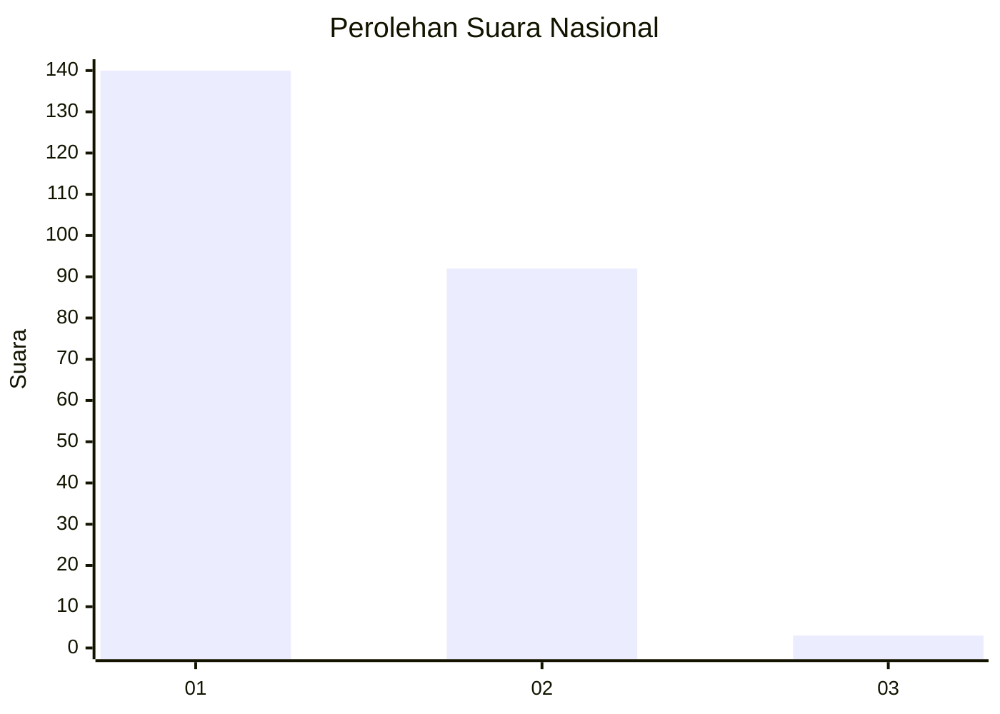
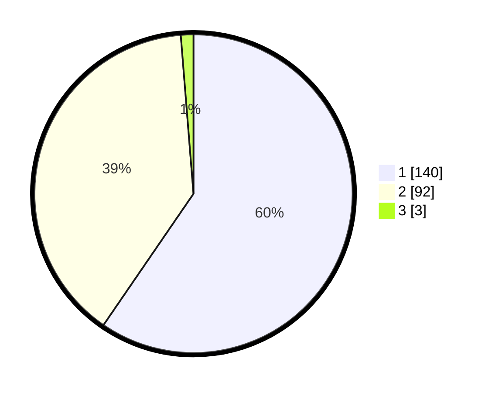

# Hasil

## Grafik

## Tabel

| No. | Nama Paslon    | Suara | Suara (raw) | Persentase |
|:--- |:-------------- | -----:| -----------:| ----------:|
| 1   | ANIES MUHAIMIN | 140   | [140][p-1]  | 59,57      |
| 2   | PRABOWO GIBRAN | 92    | [92][p-2]   | 39,15      |
| 3   | GANJAR MAHFUD  | 3     | [3][p-3]    | 1,28       |

[p-1]: https://github.com/gigit-pemilu/pemilu-2024/blob/main/pilpres/hitung-suara/sub/11-aceh/sub/01-aceh-selatan/sub/08-tapaktuan/sub/2012-batu-itam/sub/001-tps/sub/paslon-1.txt
[p-2]: https://github.com/gigit-pemilu/pemilu-2024/blob/main/pilpres/hitung-suara/sub/11-aceh/sub/01-aceh-selatan/sub/08-tapaktuan/sub/2012-batu-itam/sub/001-tps/sub/paslon-2.txt
[p-3]: https://github.com/gigit-pemilu/pemilu-2024/blob/main/pilpres/hitung-suara/sub/11-aceh/sub/01-aceh-selatan/sub/08-tapaktuan/sub/2012-batu-itam/sub/001-tps/sub/paslon-3.txt

## Foto C Plano

https://sirekap-obj-formc.kpu.go.id/d7d2/pemilu/ppwp/11/01/08/20/12/1101082012001-20240216-155502--abfaf00d-7e01-455b-aabf-64e77e5bc5d6.jpg

https://sirekap-obj-formc.kpu.go.id/d7d2/pemilu/ppwp/11/01/08/20/12/1101082012001-20240216-155504--29b061e7-f332-4dce-9092-871a12ec55f2.jpg

https://sirekap-obj-formc.kpu.go.id/d7d2/pemilu/ppwp/11/01/08/20/12/1101082012001-20240216-155503--b5be1c41-e060-4409-8b32-edb45424e4b7.jpg

## Metadata

| Key        | Value               |
| ---------- | ------------------- |
| Time Stamp | 2024-02-16 21:01:00 |

## DATA PEMILIH TETAP

Jumlah pemilih dalam DPT: **272**.
 * L: **120**.
 * P: **152**.

## DATA PENGGUNA HAK PILIH

Jumlah pengguna hak pilih dalam DPT: **241**.
 * L: **103**.
 * P: **138**.

Jumlah pengguna hak pilih dalam DPTb: **3**.
 * L: **1**.
 * P: **2**.

Jumlah pengguna hak pilih dalam DPK: **1**.
 * L: **0**.
 * P: **1**.

Jumlah pengguna hak pilih: **245**.
 * L: **104**.
 * P: **141**.

## JUMLAH SUARA SAH DAN TIDAK SAH

JUMLAH SELURUH SUARA SAH: **235**.

JUMLAH SUARA TIDAK SAH: **10**.

JUMLAH SELURUH SUARA SAH DAN SUARA TIDAK SAH: **245**.

