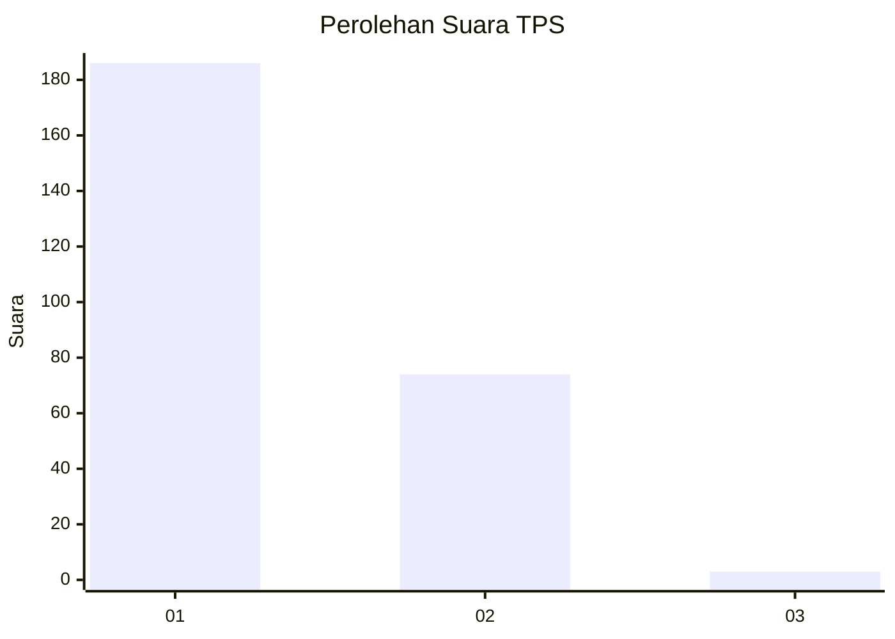
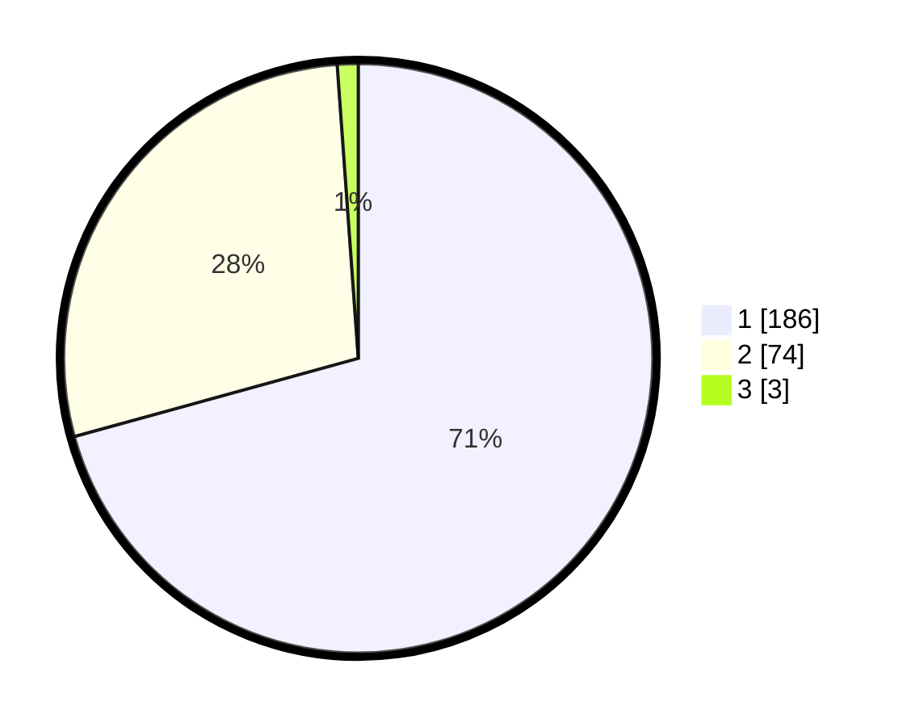

# Hasil

## Grafik

## Tabel

| No. | Nama Paslon    | Suara | Suara (raw) | Persentase |
|:--- |:-------------- | -----:| -----------:| ----------:|
| 1   | ANIES MUHAIMIN | 186   | [186][p-1]  | 70,72      |
| 2   | PRABOWO GIBRAN | 74    | [74][p-2]   | 28,14      |
| 3   | GANJAR MAHFUD  | 3     | [3][p-3]    | 1,14       |

[p-1]: https://github.com/gigit-pemilu/pemilu-2024-11-aceh/blob/main/pilpres/hitung-suara/sub/11-aceh/sub/01-aceh-selatan/sub/08-tapaktuan/sub/2016-lhok-bengkuang-timur/sub/001-tps/sub/paslon-1.txt
[p-2]: https://github.com/gigit-pemilu/pemilu-2024-11-aceh/blob/main/pilpres/hitung-suara/sub/11-aceh/sub/01-aceh-selatan/sub/08-tapaktuan/sub/2016-lhok-bengkuang-timur/sub/001-tps/sub/paslon-2.txt
[p-3]: https://github.com/gigit-pemilu/pemilu-2024-11-aceh/blob/main/pilpres/hitung-suara/sub/11-aceh/sub/01-aceh-selatan/sub/08-tapaktuan/sub/2016-lhok-bengkuang-timur/sub/001-tps/sub/paslon-3.txt

## Foto C Plano

https://sirekap-obj-formc.kpu.go.id/efb0/pemilu/ppwp/11/01/08/20/16/1101082016001-20240214-190305--e57d7f58-cc2f-40fa-a077-7a4b04d0d468.jpg

https://sirekap-obj-formc.kpu.go.id/efb0/pemilu/ppwp/11/01/08/20/16/1101082016001-20240216-144711--9435c17c-0c9a-43f5-85af-7951498c3aa5.jpg

https://sirekap-obj-formc.kpu.go.id/efb0/pemilu/ppwp/11/01/08/20/16/1101082016001-20240216-144710--21477827-201b-4e66-bf49-e7a5a739b51f.jpg

## Metadata

| Key        | Value               |
| ---------- | ------------------- |
| Time Stamp | 2024-02-16 21:01:00 |

## DATA PEMILIH TETAP

Jumlah pemilih dalam DPT: **295**.
 * L: **134**.
 * P: **161**.

## DATA PENGGUNA HAK PILIH

Jumlah pengguna hak pilih dalam DPT: **261**.
 * L: **119**.
 * P: **142**.

Jumlah pengguna hak pilih dalam DPTb: **4**.
 * L: **1**.
 * P: **3**.

Jumlah pengguna hak pilih dalam DPK: **1**.
 * L: **0**.
 * P: **1**.

Jumlah pengguna hak pilih: **266**.
 * L: **120**.
 * P: **146**.

## JUMLAH SUARA SAH DAN TIDAK SAH

JUMLAH SELURUH SUARA SAH: **263**.

JUMLAH SUARA TIDAK SAH: **3**.

JUMLAH SELURUH SUARA SAH DAN SUARA TIDAK SAH: **266**.

