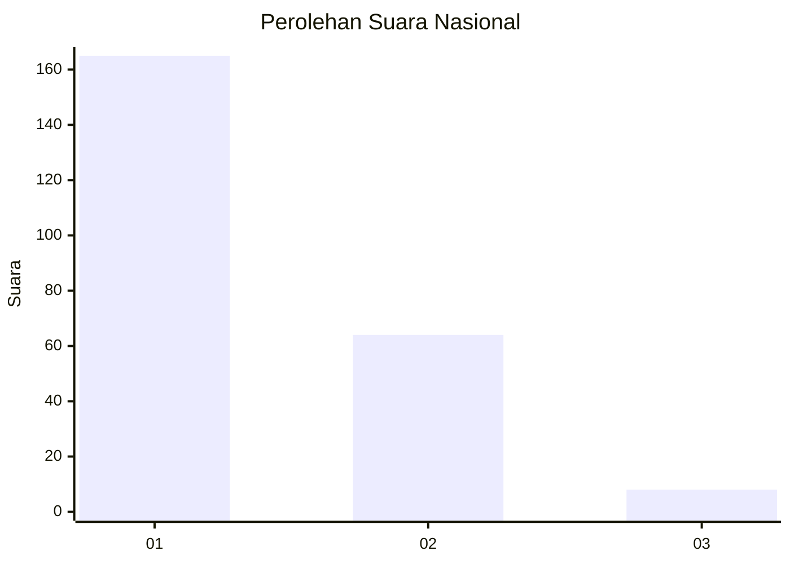
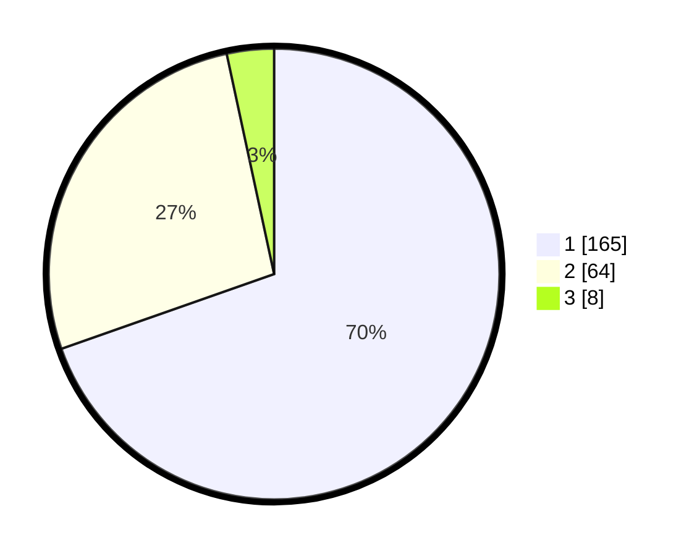

# Hasil

## Grafik

## Tabel

| No. | Nama Paslon    | Suara | Suara (raw) | Persentase |
|:--- |:-------------- | -----:| -----------:| ----------:|
| 1   | ANIES MUHAIMIN | 165   | [165][p-1]  | 69,62      |
| 2   | PRABOWO GIBRAN | 64    | [64][p-2]   | 27,00      |
| 3   | GANJAR MAHFUD  | 8     | [8][p-3]    | 3,38       |

[p-1]: https://github.com/gigit-pemilu/pemilu-2024/blob/main/pilpres/hitung-suara/sub/11-aceh/sub/01-aceh-selatan/sub/08-tapaktuan/sub/2016-lhok-bengkuang-timur/sub/004-tps/sub/paslon-1.txt
[p-2]: https://github.com/gigit-pemilu/pemilu-2024/blob/main/pilpres/hitung-suara/sub/11-aceh/sub/01-aceh-selatan/sub/08-tapaktuan/sub/2016-lhok-bengkuang-timur/sub/004-tps/sub/paslon-2.txt
[p-3]: https://github.com/gigit-pemilu/pemilu-2024/blob/main/pilpres/hitung-suara/sub/11-aceh/sub/01-aceh-selatan/sub/08-tapaktuan/sub/2016-lhok-bengkuang-timur/sub/004-tps/sub/paslon-3.txt

## Foto C Plano

https://sirekap-obj-formc.kpu.go.id/daf0/pemilu/ppwp/11/01/08/20/16/1101082016004-20240220-212900--56861303-a5c7-4c88-b061-fa47e461834b.jpg

https://sirekap-obj-formc.kpu.go.id/daf0/pemilu/ppwp/11/01/08/20/16/1101082016004-20240220-212902--58183681-5cbc-431a-8906-41d2dea8c797.jpg

https://sirekap-obj-formc.kpu.go.id/daf0/pemilu/ppwp/11/01/08/20/16/1101082016004-20240220-212901--566d9e9e-b6e2-4ea0-8d9a-c8c273b5b510.jpg

## Metadata

| Key        | Value               |
| ---------- | ------------------- |
| Time Stamp | 2024-02-22 17:00:00 |

## DATA PEMILIH TETAP

Jumlah pemilih dalam DPT: **290**.
 * L: **136**.
 * P: **154**.

## DATA PENGGUNA HAK PILIH

Jumlah pengguna hak pilih dalam DPT: **232**.
 * L: **107**.
 * P: **125**.

Jumlah pengguna hak pilih dalam DPTb: **5**.
 * L: **2**.
 * P: **3**.

Jumlah pengguna hak pilih dalam DPK: **5**.
 * L: **3**.
 * P: **2**.

Jumlah pengguna hak pilih: **242**.
 * L: **112**.
 * P: **130**.

## JUMLAH SUARA SAH DAN TIDAK SAH

JUMLAH SELURUH SUARA SAH: **237**.

JUMLAH SUARA TIDAK SAH: **5**.

JUMLAH SELURUH SUARA SAH DAN SUARA TIDAK SAH: **242**.

