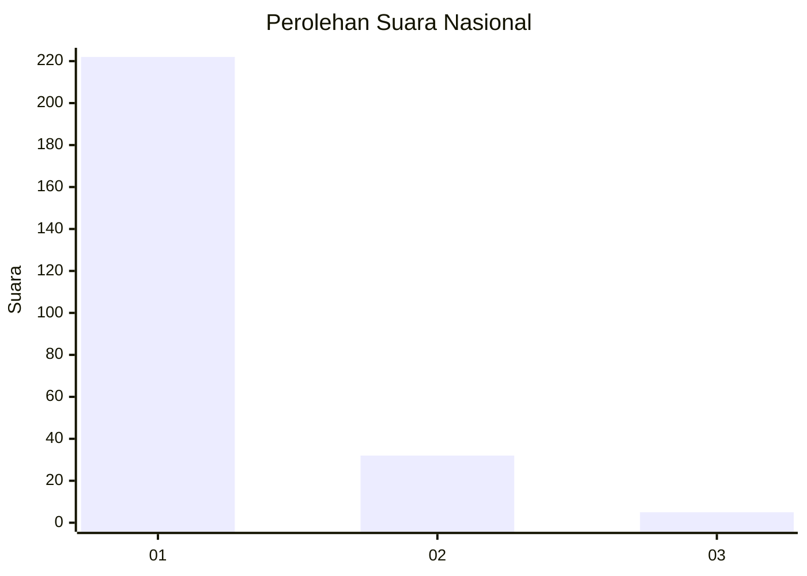
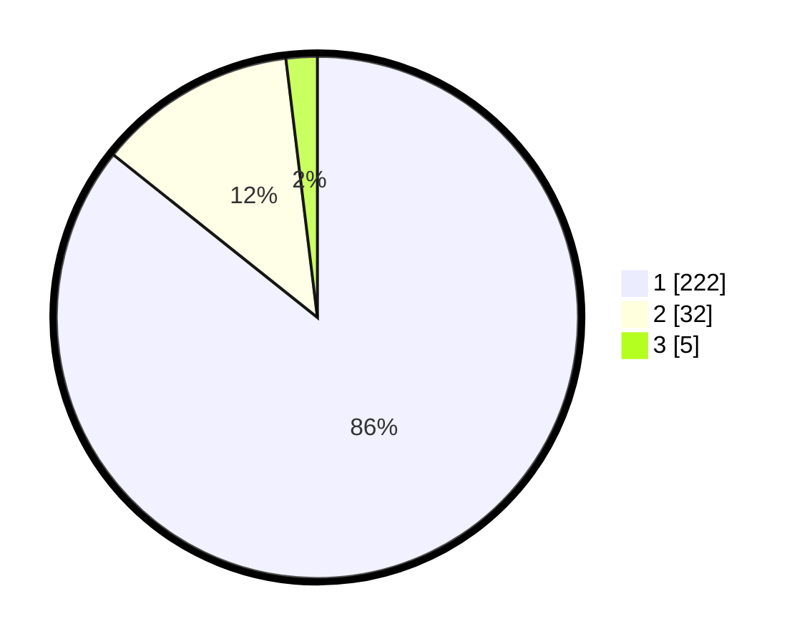

# Hasil

## Grafik

## Tabel

| No. | Nama Paslon    | Suara | Suara (raw) | Persentase |
|:--- |:-------------- | -----:| -----------:| ----------:|
| 1   | ANIES MUHAIMIN | 222   | [222][p-1]  | 85,71      |
| 2   | PRABOWO GIBRAN | 32    | [32][p-2]   | 12,36      |
| 3   | GANJAR MAHFUD  | 5     | [5][p-3]    | 1,93       |

[p-1]: https://github.com/gigit-pemilu/pemilu-2024/blob/main/pilpres/hitung-suara/sub/11-aceh/sub/01-aceh-selatan/sub/09-trumon/sub/2001-keude-trumon/sub/001-tps/sub/paslon-1.txt
[p-2]: https://github.com/gigit-pemilu/pemilu-2024/blob/main/pilpres/hitung-suara/sub/11-aceh/sub/01-aceh-selatan/sub/09-trumon/sub/2001-keude-trumon/sub/001-tps/sub/paslon-2.txt
[p-3]: https://github.com/gigit-pemilu/pemilu-2024/blob/main/pilpres/hitung-suara/sub/11-aceh/sub/01-aceh-selatan/sub/09-trumon/sub/2001-keude-trumon/sub/001-tps/sub/paslon-3.txt

## Foto C Plano

https://sirekap-obj-formc.kpu.go.id/52d5/pemilu/ppwp/11/01/09/20/01/1101092001001-20240214-204223--1dfa0372-9f88-4d06-833d-b9c9fb1a1ad6.jpg

https://sirekap-obj-formc.kpu.go.id/52d5/pemilu/ppwp/11/01/09/20/01/1101092001001-20240214-204330--b816dfb8-8ef2-4702-8eab-9f45e3c66594.jpg

https://sirekap-obj-formc.kpu.go.id/52d5/pemilu/ppwp/11/01/09/20/01/1101092001001-20240214-204913--bdec2fb2-1d7b-4f7a-9507-a48f2056be80.jpg

## Metadata

| Key        | Value               |
| ---------- | ------------------- |
| Time Stamp | 2024-02-17 10:00:02 |

## DATA PEMILIH TETAP

Jumlah pemilih dalam DPT: **296**.
 * L: **140**.
 * P: **156**.

## DATA PENGGUNA HAK PILIH

Jumlah pengguna hak pilih dalam DPT: **258**.
 * L: **127**.
 * P: **131**.

Jumlah pengguna hak pilih dalam DPTb: **7**.
 * L: **3**.
 * P: **4**.

Jumlah pengguna hak pilih dalam DPK: **0**.
 * L: **0**.
 * P: **0**.

Jumlah pengguna hak pilih: **265**.
 * L: **130**.
 * P: **135**.

## JUMLAH SUARA SAH DAN TIDAK SAH

JUMLAH SELURUH SUARA SAH: **259**.

JUMLAH SUARA TIDAK SAH: **6**.

JUMLAH SELURUH SUARA SAH DAN SUARA TIDAK SAH: **265**.

