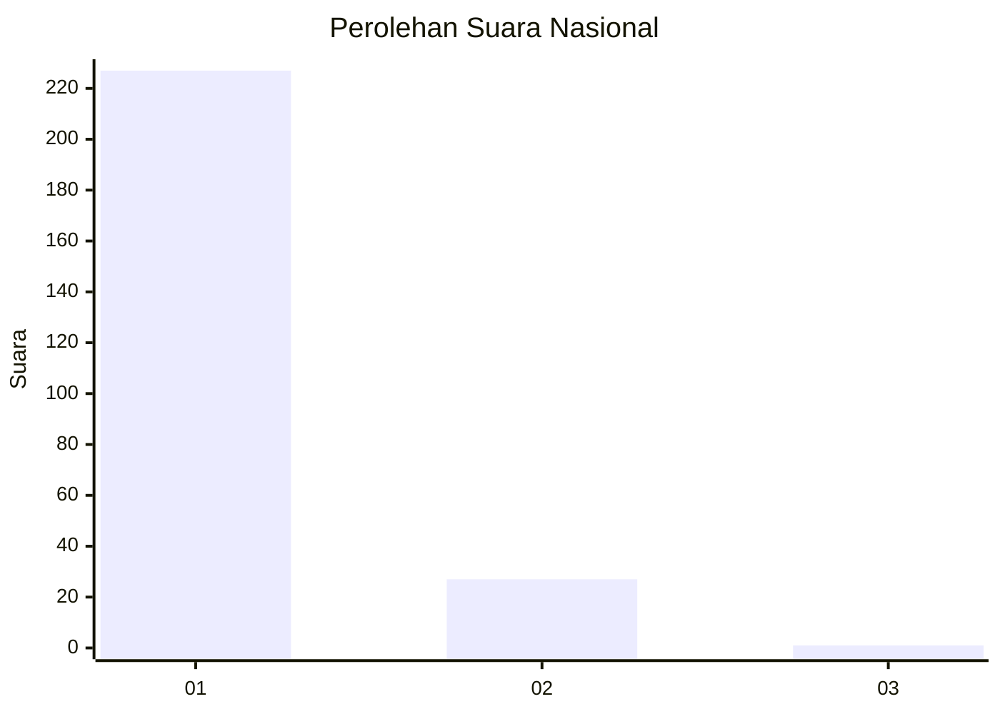
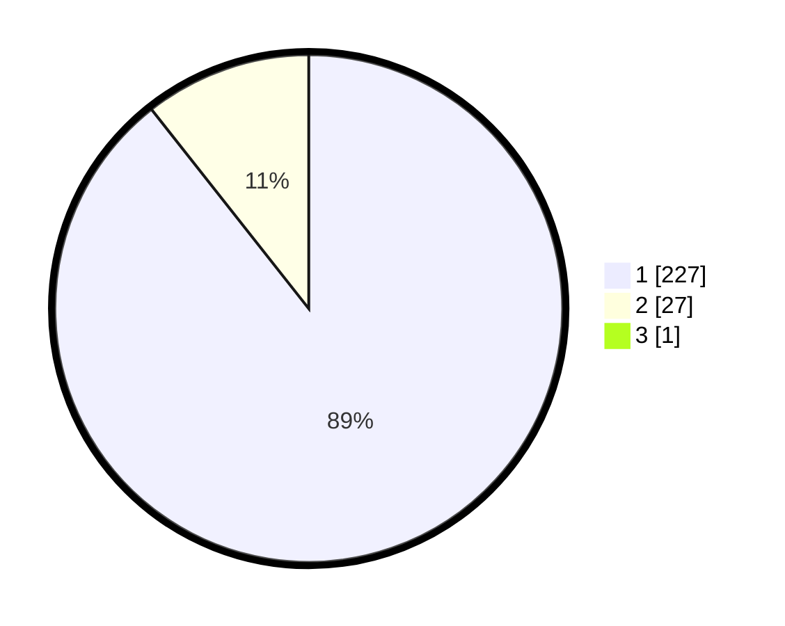

# Hasil

## Grafik

## Tabel

| No. | Nama Paslon    | Suara | Suara (raw) | Persentase |
|:--- |:-------------- | -----:| -----------:| ----------:|
| 1   | ANIES MUHAIMIN | 227   | [227][p-1]  | 89,02      |
| 2   | PRABOWO GIBRAN | 27    | [27][p-2]   | 10,59      |
| 3   | GANJAR MAHFUD  | 1     | [1][p-3]    | 0,39       |

[p-1]: https://github.com/gigit-pemilu/pemilu-2024/blob/main/pilpres/hitung-suara/sub/11-aceh/sub/01-aceh-selatan/sub/09-trumon/sub/2001-keude-trumon/sub/002-tps/sub/paslon-1.txt
[p-2]: https://github.com/gigit-pemilu/pemilu-2024/blob/main/pilpres/hitung-suara/sub/11-aceh/sub/01-aceh-selatan/sub/09-trumon/sub/2001-keude-trumon/sub/002-tps/sub/paslon-2.txt
[p-3]: https://github.com/gigit-pemilu/pemilu-2024/blob/main/pilpres/hitung-suara/sub/11-aceh/sub/01-aceh-selatan/sub/09-trumon/sub/2001-keude-trumon/sub/002-tps/sub/paslon-3.txt

## Foto C Plano

https://sirekap-obj-formc.kpu.go.id/ac9d/pemilu/ppwp/11/01/09/20/01/1101092001002-20240215-183230--af11a250-fca0-48c9-a6f9-28307dc3121a.jpg

https://sirekap-obj-formc.kpu.go.id/ac9d/pemilu/ppwp/11/01/09/20/01/1101092001002-20240215-183401--885baa57-bdc6-4048-ad5d-c8aad1a8d974.jpg

https://sirekap-obj-formc.kpu.go.id/ac9d/pemilu/ppwp/11/01/09/20/01/1101092001002-20240215-183647--31e0f7bb-fb5c-4812-840f-eb3aee1a4348.jpg

## Metadata

| Key        | Value               |
| ---------- | ------------------- |
| Time Stamp | 2024-02-17 10:00:02 |

## DATA PEMILIH TETAP

Jumlah pemilih dalam DPT: **297**.
 * L: **142**.
 * P: **155**.

## DATA PENGGUNA HAK PILIH

Jumlah pengguna hak pilih dalam DPT: **255**.
 * L: **120**.
 * P: **135**.

Jumlah pengguna hak pilih dalam DPTb: **4**.
 * L: **3**.
 * P: **1**.

Jumlah pengguna hak pilih dalam DPK: **0**.
 * L: **0**.
 * P: **0**.

Jumlah pengguna hak pilih: **259**.
 * L: **123**.
 * P: **136**.

## JUMLAH SUARA SAH DAN TIDAK SAH

JUMLAH SELURUH SUARA SAH: **255**.

JUMLAH SUARA TIDAK SAH: **4**.

JUMLAH SELURUH SUARA SAH DAN SUARA TIDAK SAH: **259**.

