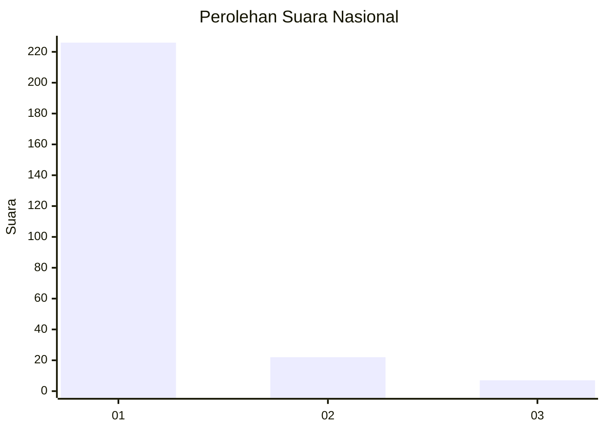
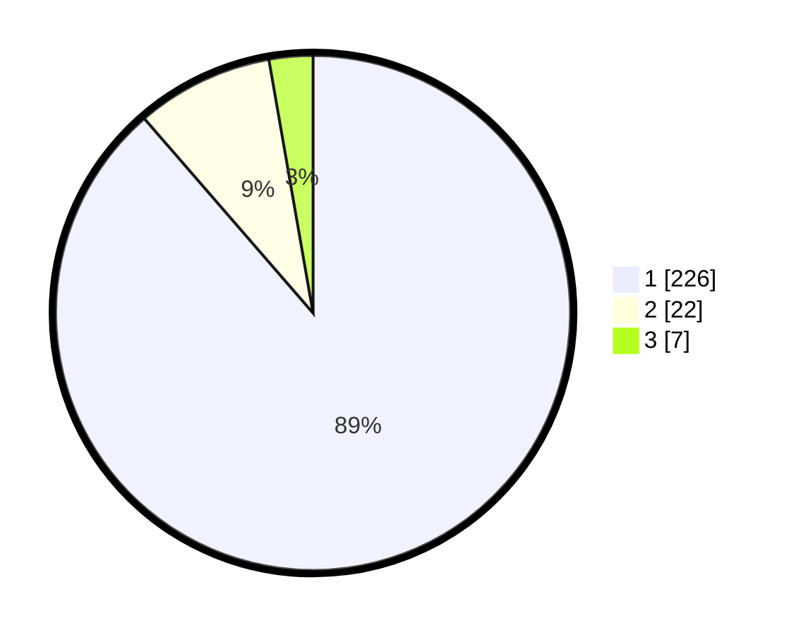

# Hasil

## Grafik

## Tabel

| No. | Nama Paslon    | Suara | Suara (raw) | Persentase |
|:--- |:-------------- | -----:| -----------:| ----------:|
| 1   | ANIES MUHAIMIN | 226   | [226][p-1]  | 88,63      |
| 2   | PRABOWO GIBRAN | 22    | [22][p-2]   | 8,63       |
| 3   | GANJAR MAHFUD  | 7     | [7][p-3]    | 2,75       |

[p-1]: https://github.com/gigit-pemilu/pemilu-2024/blob/main/pilpres/hitung-suara/sub/11-aceh/sub/01-aceh-selatan/sub/09-trumon/sub/2001-keude-trumon/sub/003-tps/sub/paslon-1.txt
[p-2]: https://github.com/gigit-pemilu/pemilu-2024/blob/main/pilpres/hitung-suara/sub/11-aceh/sub/01-aceh-selatan/sub/09-trumon/sub/2001-keude-trumon/sub/003-tps/sub/paslon-2.txt
[p-3]: https://github.com/gigit-pemilu/pemilu-2024/blob/main/pilpres/hitung-suara/sub/11-aceh/sub/01-aceh-selatan/sub/09-trumon/sub/2001-keude-trumon/sub/003-tps/sub/paslon-3.txt

## Foto C Plano

https://sirekap-obj-formc.kpu.go.id/c056/pemilu/ppwp/11/01/09/20/01/1101092001003-20240215-131414--971d1cb4-99a8-4260-8fc1-c45abcf2c7d4.jpg

https://sirekap-obj-formc.kpu.go.id/c056/pemilu/ppwp/11/01/09/20/01/1101092001003-20240215-131600--d7d6c090-161d-4a1e-a5a6-81565fba3f42.jpg

https://sirekap-obj-formc.kpu.go.id/c056/pemilu/ppwp/11/01/09/20/01/1101092001003-20240215-131722--f5ea7004-2d02-4e06-8ae8-f29c5cfa6de0.jpg

## Metadata

| Key        | Value               |
| ---------- | ------------------- |
| Time Stamp | 2024-02-15 17:00:25 |

## DATA PEMILIH TETAP

Jumlah pemilih dalam DPT: **294**.
 * L: **140**.
 * P: **154**.

## DATA PENGGUNA HAK PILIH

Jumlah pengguna hak pilih dalam DPT: **255**.
 * L: **122**.
 * P: **133**.

Jumlah pengguna hak pilih dalam DPTb: **8**.
 * L: **5**.
 * P: **3**.

Jumlah pengguna hak pilih dalam DPK: **0**.
 * L: **0**.
 * P: **0**.

Jumlah pengguna hak pilih: **263**.
 * L: **127**.
 * P: **136**.

## JUMLAH SUARA SAH DAN TIDAK SAH

JUMLAH SELURUH SUARA SAH: **255**.

JUMLAH SUARA TIDAK SAH: **8**.

JUMLAH SELURUH SUARA SAH DAN SUARA TIDAK SAH: **263**.

