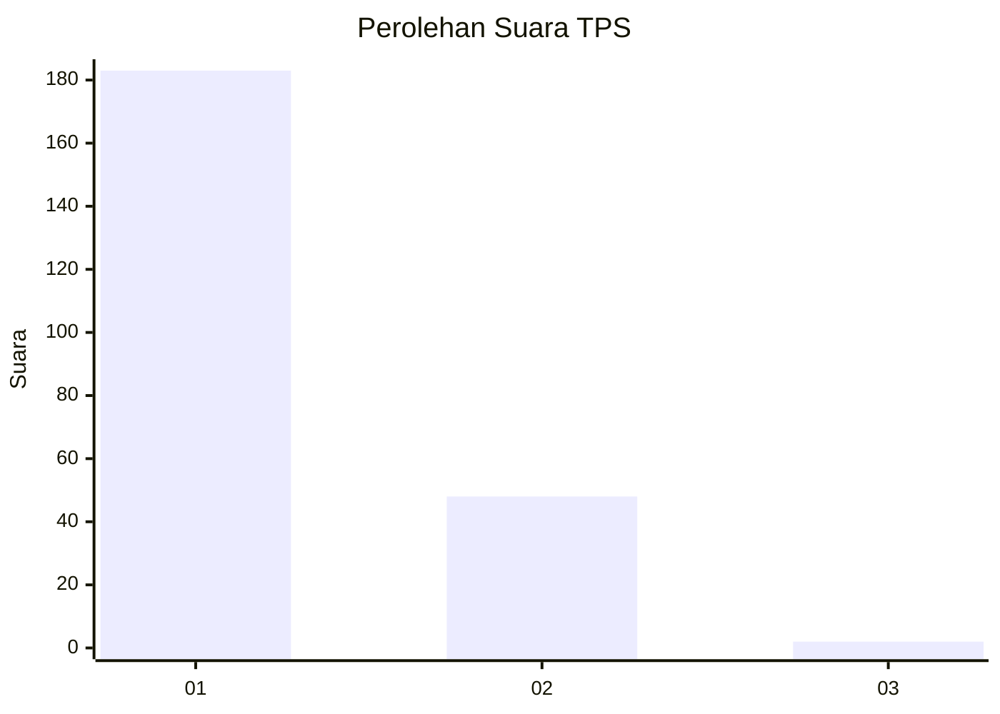
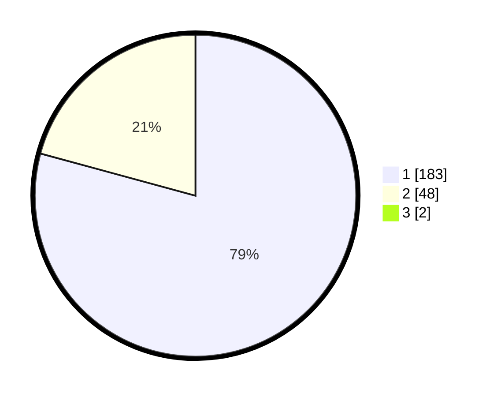

# Hasil

## Grafik

## Tabel

| No. | Nama Paslon    | Suara | Suara (raw) | Persentase |
|:--- |:-------------- | -----:| -----------:| ----------:|
| 1   | ANIES MUHAIMIN | 183   | [183][p-1]  | 78,54      |
| 2   | PRABOWO GIBRAN | 48    | [48][p-2]   | 20,60      |
| 3   | GANJAR MAHFUD  | 2     | [2][p-3]    | 0,86       |

[p-1]: https://github.com/gigit-pemilu/pemilu-2024-11-aceh/blob/main/pilpres/hitung-suara/sub/11-aceh/sub/01-aceh-selatan/sub/09-trumon/sub/2002-ujong-tanoh/sub/002-tps/sub/paslon-1.txt
[p-2]: https://github.com/gigit-pemilu/pemilu-2024-11-aceh/blob/main/pilpres/hitung-suara/sub/11-aceh/sub/01-aceh-selatan/sub/09-trumon/sub/2002-ujong-tanoh/sub/002-tps/sub/paslon-2.txt
[p-3]: https://github.com/gigit-pemilu/pemilu-2024-11-aceh/blob/main/pilpres/hitung-suara/sub/11-aceh/sub/01-aceh-selatan/sub/09-trumon/sub/2002-ujong-tanoh/sub/002-tps/sub/paslon-3.txt

## Foto C Plano

https://sirekap-obj-formc.kpu.go.id/5d4c/pemilu/ppwp/11/01/09/20/02/1101092002002-20240215-143123--d1e5ef82-c893-47e3-9c59-8b8354170799.jpg

https://sirekap-obj-formc.kpu.go.id/5d4c/pemilu/ppwp/11/01/09/20/02/1101092002002-20240215-143249--cf6c2bed-c6b6-4fdd-b24d-08419b1f9383.jpg

https://sirekap-obj-formc.kpu.go.id/5d4c/pemilu/ppwp/11/01/09/20/02/1101092002002-20240215-143404--f966c04a-4c15-4258-8570-12e3c37ea93a.jpg

## Metadata

| Key        | Value               |
| ---------- | ------------------- |
| Time Stamp | 2024-02-17 10:00:02 |

## DATA PEMILIH TETAP

Jumlah pemilih dalam DPT: **261**.
 * L: **122**.
 * P: **139**.

## DATA PENGGUNA HAK PILIH

Jumlah pengguna hak pilih dalam DPT: **225**.
 * L: **109**.
 * P: **116**.

Jumlah pengguna hak pilih dalam DPTb: **11**.
 * L: **3**.
 * P: **8**.

Jumlah pengguna hak pilih dalam DPK: **1**.
 * L: **1**.
 * P: **0**.

Jumlah pengguna hak pilih: **237**.
 * L: **113**.
 * P: **124**.

## JUMLAH SUARA SAH DAN TIDAK SAH

JUMLAH SELURUH SUARA SAH: **233**.

JUMLAH SUARA TIDAK SAH: **4**.

JUMLAH SELURUH SUARA SAH DAN SUARA TIDAK SAH: **237**.

