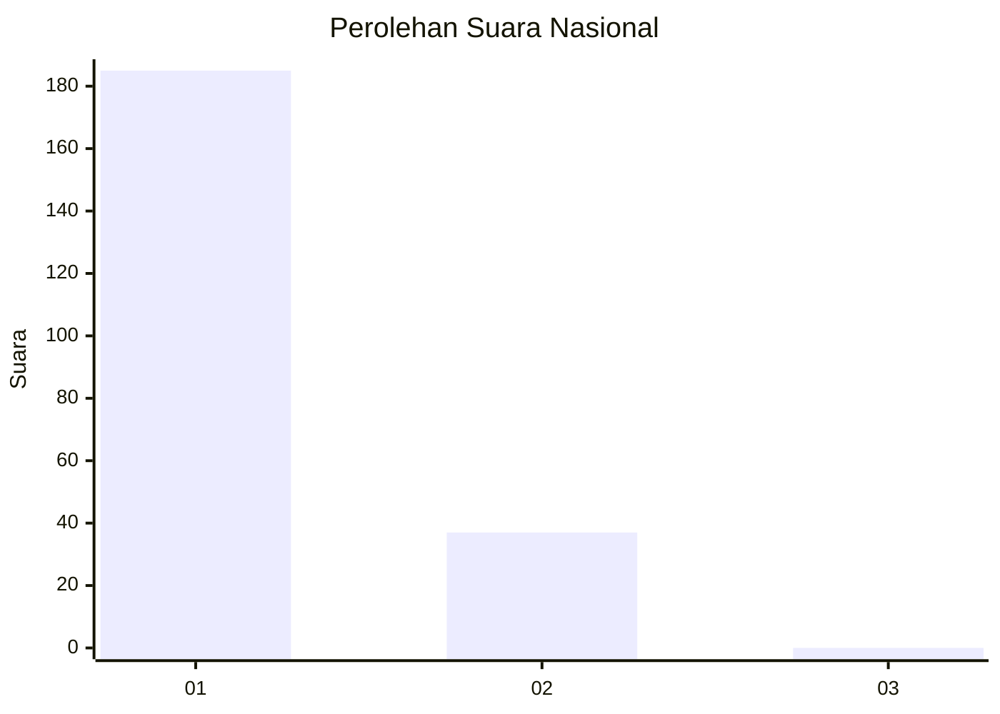
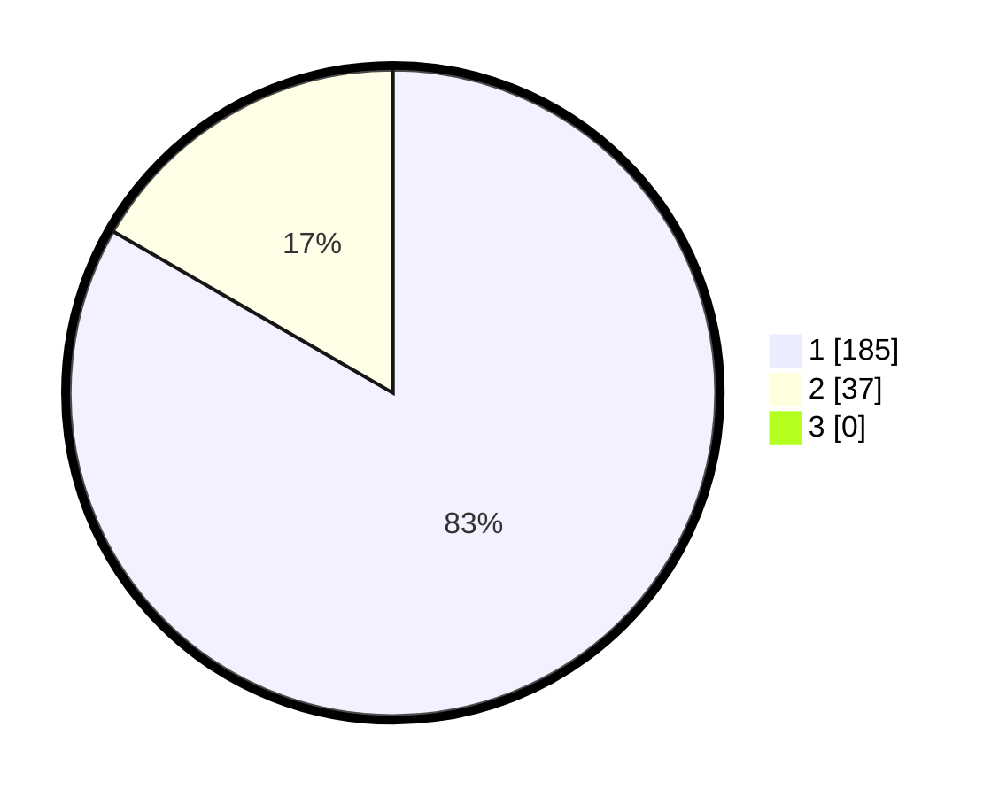

# Hasil

## Grafik

## Tabel

| No. | Nama Paslon    | Suara | Suara (raw) | Persentase |
|:--- |:-------------- | -----:| -----------:| ----------:|
| 1   | ANIES MUHAIMIN | 185   | [185][p-1]  | 83,33      |
| 2   | PRABOWO GIBRAN | 37    | [37][p-2]   | 16,67      |
| 3   | GANJAR MAHFUD  | 0     | [0][p-3]    | 0,00       |

[p-1]: https://github.com/gigit-pemilu/pemilu-2024/blob/main/pilpres/hitung-suara/sub/11-aceh/sub/01-aceh-selatan/sub/09-trumon/sub/2003-sigleng/sub/001-tps/sub/paslon-1.txt
[p-2]: https://github.com/gigit-pemilu/pemilu-2024/blob/main/pilpres/hitung-suara/sub/11-aceh/sub/01-aceh-selatan/sub/09-trumon/sub/2003-sigleng/sub/001-tps/sub/paslon-2.txt
[p-3]: https://github.com/gigit-pemilu/pemilu-2024/blob/main/pilpres/hitung-suara/sub/11-aceh/sub/01-aceh-selatan/sub/09-trumon/sub/2003-sigleng/sub/001-tps/sub/paslon-3.txt

## Foto C Plano

https://sirekap-obj-formc.kpu.go.id/f195/pemilu/ppwp/11/01/09/20/03/1101092003001-20240214-205844--31800b79-e9de-4e9d-9aee-79fd76cb4931.jpg

https://sirekap-obj-formc.kpu.go.id/f195/pemilu/ppwp/11/01/09/20/03/1101092003001-20240214-194519--f96c5bd6-a5cb-438f-a5c5-9f0da5be78cf.jpg

https://sirekap-obj-formc.kpu.go.id/f195/pemilu/ppwp/11/01/09/20/03/1101092003001-20240214-205628--dc49992d-c6fc-41de-947b-c1d79e69968a.jpg

## Metadata

| Key        | Value               |
| ---------- | ------------------- |
| Time Stamp | 2024-02-15 12:00:28 |

