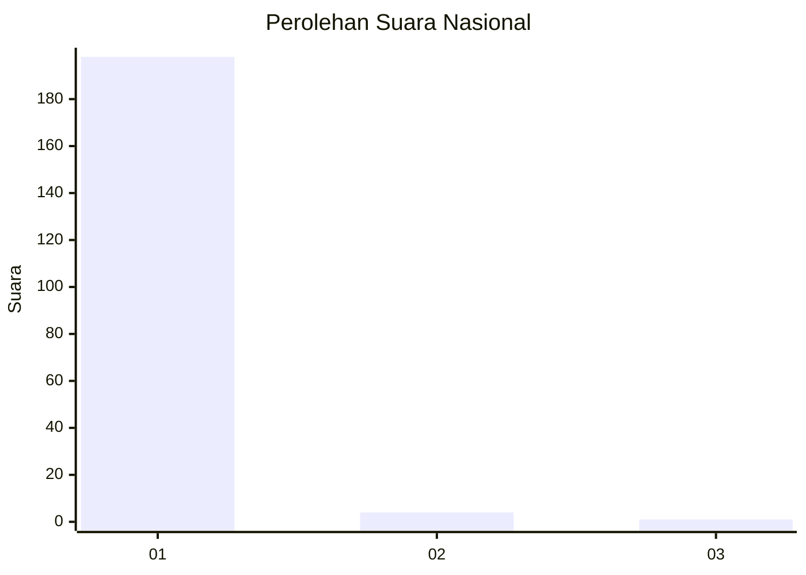
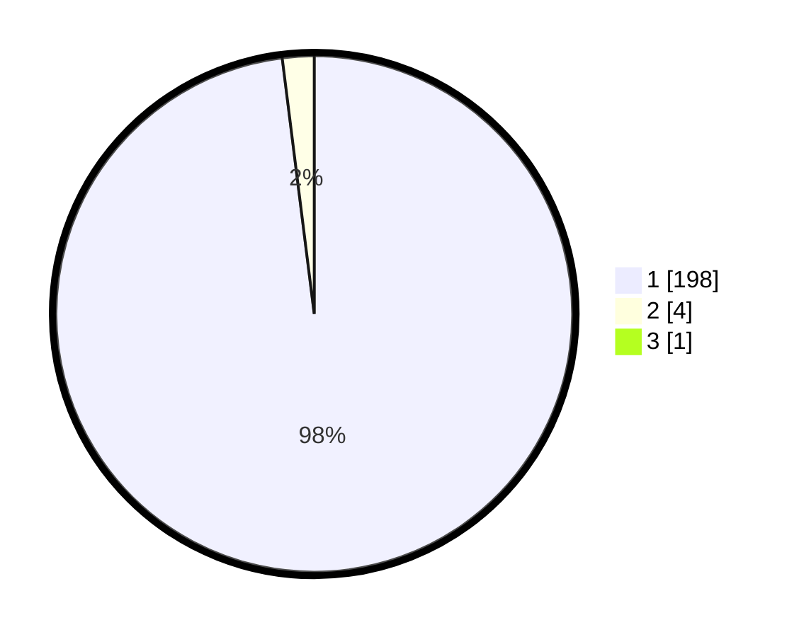

# Hasil

## Grafik

## Tabel

| No. | Nama Paslon    | Suara | Suara (raw) | Persentase |
|:--- |:-------------- | -----:| -----------:| ----------:|
| 1   | ANIES MUHAIMIN | 198   | [198][p-1]  | 97,54      |
| 2   | PRABOWO GIBRAN | 4     | [4][p-2]    | 1,97       |
| 3   | GANJAR MAHFUD  | 1     | [1][p-3]    | 0,49       |

[p-1]: https://github.com/gigit-pemilu/pemilu-2024/blob/main/pilpres/hitung-suara/sub/11-aceh/sub/01-aceh-selatan/sub/09-trumon/sub/2005-teupin-tinggi/sub/002-tps/sub/paslon-1.txt
[p-2]: https://github.com/gigit-pemilu/pemilu-2024/blob/main/pilpres/hitung-suara/sub/11-aceh/sub/01-aceh-selatan/sub/09-trumon/sub/2005-teupin-tinggi/sub/002-tps/sub/paslon-2.txt
[p-3]: https://github.com/gigit-pemilu/pemilu-2024/blob/main/pilpres/hitung-suara/sub/11-aceh/sub/01-aceh-selatan/sub/09-trumon/sub/2005-teupin-tinggi/sub/002-tps/sub/paslon-3.txt

## Foto C Plano

https://sirekap-obj-formc.kpu.go.id/f5a0/pemilu/ppwp/11/01/09/20/05/1101092005002-20240214-193450--37800cae-427b-4938-8c5d-592451b53e74.jpg

https://sirekap-obj-formc.kpu.go.id/f5a0/pemilu/ppwp/11/01/09/20/05/1101092005002-20240214-193343--f032f62c-3523-4f7d-9d01-4dc56b1039e3.jpg

https://sirekap-obj-formc.kpu.go.id/f5a0/pemilu/ppwp/11/01/09/20/05/1101092005002-20240214-192325--cb7bea33-1272-4d2e-85a4-f2d9a9233336.jpg

## Metadata

| Key        | Value               |
| ---------- | ------------------- |
| Time Stamp | 2024-02-16 12:51:22 |

## DATA PEMILIH TETAP

Jumlah pemilih dalam DPT: **218**.
 * L: **105**.
 * P: **113**.

## DATA PENGGUNA HAK PILIH

Jumlah pengguna hak pilih dalam DPT: **203**.
 * L: **97**.
 * P: **106**.

Jumlah pengguna hak pilih dalam DPTb: **0**.
 * L: **0**.
 * P: **0**.

Jumlah pengguna hak pilih dalam DPK: **0**.
 * L: **0**.
 * P: **0**.

Jumlah pengguna hak pilih: **203**.
 * L: **97**.
 * P: **106**.

## JUMLAH SUARA SAH DAN TIDAK SAH

JUMLAH SELURUH SUARA SAH: **203**.

JUMLAH SUARA TIDAK SAH: **0**.

JUMLAH SELURUH SUARA SAH DAN SUARA TIDAK SAH: **203**.

