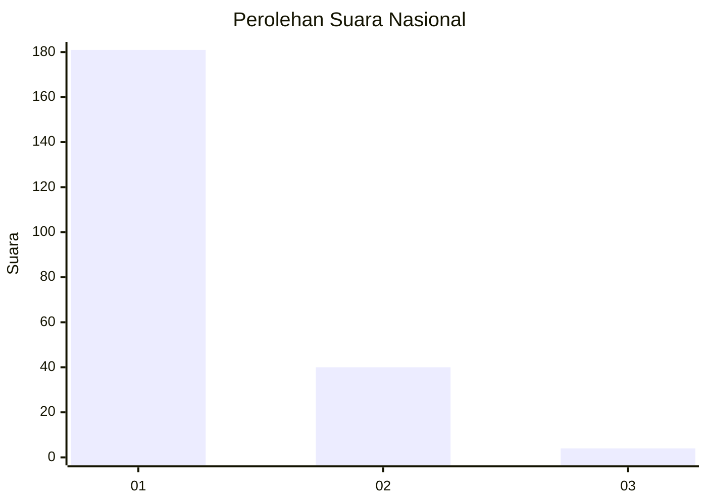
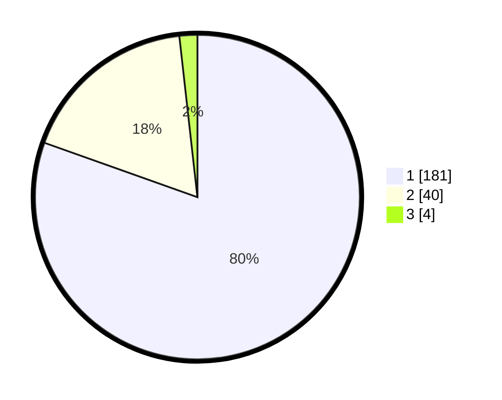

# Hasil

## Grafik

## Tabel

| No. | Nama Paslon    | Suara | Suara (raw) | Persentase |
|:--- |:-------------- | -----:| -----------:| ----------:|
| 1   | ANIES MUHAIMIN | 181   | [181][p-1]  | 80,44      |
| 2   | PRABOWO GIBRAN | 40    | [40][p-2]   | 17,78      |
| 3   | GANJAR MAHFUD  | 4     | [4][p-3]    | 1,78       |

[p-1]: https://github.com/gigit-pemilu/pemilu-2024/blob/main/pilpres/hitung-suara/sub/11-aceh/sub/01-aceh-selatan/sub/09-trumon/sub/2007-panton-bilie/sub/001-tps/sub/paslon-1.txt
[p-2]: https://github.com/gigit-pemilu/pemilu-2024/blob/main/pilpres/hitung-suara/sub/11-aceh/sub/01-aceh-selatan/sub/09-trumon/sub/2007-panton-bilie/sub/001-tps/sub/paslon-2.txt
[p-3]: https://github.com/gigit-pemilu/pemilu-2024/blob/main/pilpres/hitung-suara/sub/11-aceh/sub/01-aceh-selatan/sub/09-trumon/sub/2007-panton-bilie/sub/001-tps/sub/paslon-3.txt

## Foto C Plano

https://sirekap-obj-formc.kpu.go.id/9618/pemilu/ppwp/11/01/09/20/07/1101092007001-20240215-142044--f4b39af1-d55c-44be-8401-c5e27cc25a45.jpg

https://sirekap-obj-formc.kpu.go.id/9618/pemilu/ppwp/11/01/09/20/07/1101092007001-20240215-134310--940419e9-39bc-4500-93c0-d0af3e7d1932.jpg

https://sirekap-obj-formc.kpu.go.id/9618/pemilu/ppwp/11/01/09/20/07/1101092007001-20240215-141932--cbc14975-ba25-44e9-a06d-7b687c666e1d.jpg

## Metadata

| Key        | Value               |
| ---------- | ------------------- |
| Time Stamp | 2024-02-15 16:00:26 |

