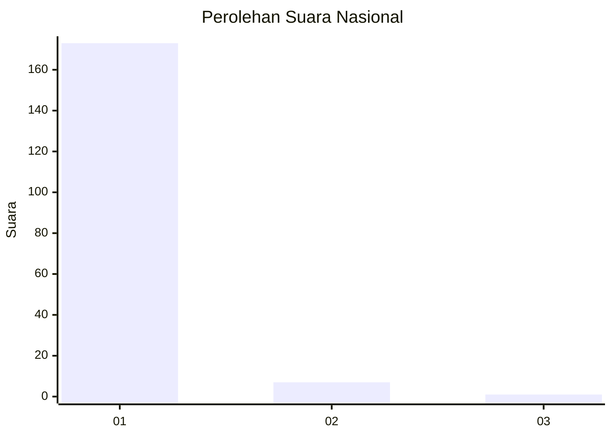
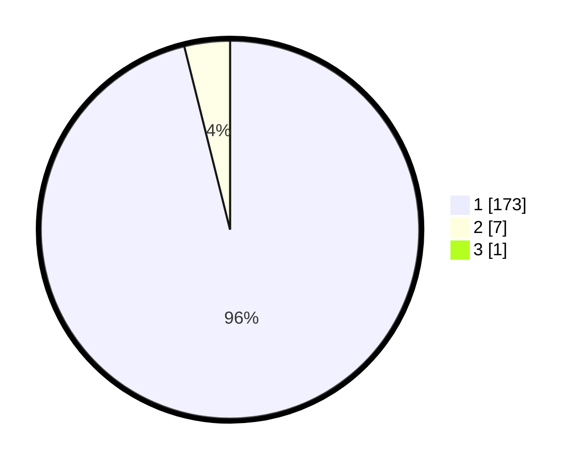

# Hasil

## Grafik

## Tabel

| No. | Nama Paslon    | Suara | Suara (raw) | Persentase |
|:--- |:-------------- | -----:| -----------:| ----------:|
| 1   | ANIES MUHAIMIN | 173   | [173][p-1]  | 95,58      |
| 2   | PRABOWO GIBRAN | 7     | [7][p-2]    | 3,87       |
| 3   | GANJAR MAHFUD  | 1     | [1][p-3]    | 0,55       |

[p-1]: https://github.com/gigit-pemilu/pemilu-2024/blob/main/pilpres/hitung-suara/sub/11-aceh/sub/01-aceh-selatan/sub/09-trumon/sub/2012-kuta-padang/sub/001-tps/sub/paslon-1.txt
[p-2]: https://github.com/gigit-pemilu/pemilu-2024/blob/main/pilpres/hitung-suara/sub/11-aceh/sub/01-aceh-selatan/sub/09-trumon/sub/2012-kuta-padang/sub/001-tps/sub/paslon-2.txt
[p-3]: https://github.com/gigit-pemilu/pemilu-2024/blob/main/pilpres/hitung-suara/sub/11-aceh/sub/01-aceh-selatan/sub/09-trumon/sub/2012-kuta-padang/sub/001-tps/sub/paslon-3.txt

## Foto C Plano

https://sirekap-obj-formc.kpu.go.id/d6c3/pemilu/ppwp/11/01/09/20/12/1101092012001-20240216-195500--7575ce80-013e-42b1-a3db-3e52f003c8ac.jpg

https://sirekap-obj-formc.kpu.go.id/d6c3/pemilu/ppwp/11/01/09/20/12/1101092012001-20240216-210112--1fe96967-15e8-4114-a3eb-fa1b0c659e3b.jpg

https://sirekap-obj-formc.kpu.go.id/d6c3/pemilu/ppwp/11/01/09/20/12/1101092012001-20240216-210112--2fcaea57-cd83-47f3-804c-0ba88d2ee81d.jpg

## Metadata

| Key        | Value               |
| ---------- | ------------------- |
| Time Stamp | 2024-02-17 14:56:33 |

## DATA PEMILIH TETAP

Jumlah pemilih dalam DPT: **186**.
 * L: **97**.
 * P: **89**.

## DATA PENGGUNA HAK PILIH

Jumlah pengguna hak pilih dalam DPT: **181**.
 * L: **95**.
 * P: **86**.

Jumlah pengguna hak pilih dalam DPTb: **2**.
 * L: **1**.
 * P: **1**.

Jumlah pengguna hak pilih dalam DPK: **1**.
 * L: **0**.
 * P: **1**.

Jumlah pengguna hak pilih: **184**.
 * L: **96**.
 * P: **88**.

## JUMLAH SUARA SAH DAN TIDAK SAH

JUMLAH SELURUH SUARA SAH: **181**.

JUMLAH SUARA TIDAK SAH: **3**.

JUMLAH SELURUH SUARA SAH DAN SUARA TIDAK SAH: **184**.

