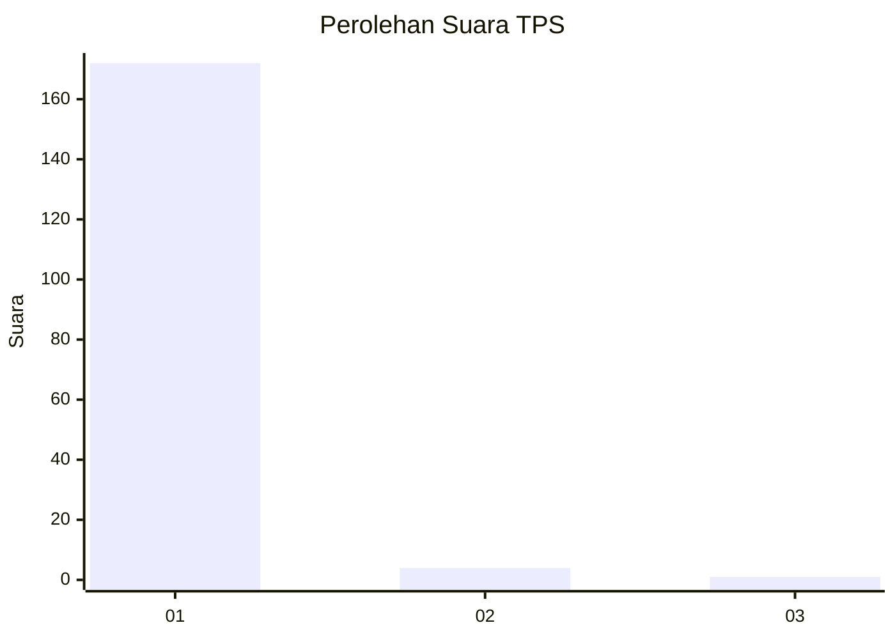
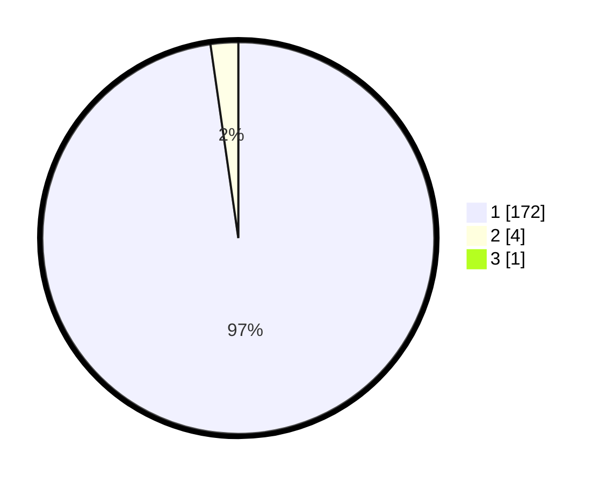

# Hasil

## Grafik

## Tabel

| No. | Nama Paslon    | Suara | Suara (raw) | Persentase |
|:--- |:-------------- | -----:| -----------:| ----------:|
| 1   | ANIES MUHAIMIN | 172   | [172][p-1]  | 97,18      |
| 2   | PRABOWO GIBRAN | 4     | [4][p-2]    | 2,26       |
| 3   | GANJAR MAHFUD  | 1     | [1][p-3]    | 0,56       |

[p-1]: https://github.com/gigit-pemilu/pemilu-2024-11-aceh/blob/main/pilpres/hitung-suara/sub/11-aceh/sub/01-aceh-selatan/sub/09-trumon/sub/2012-kuta-padang/sub/002-tps/sub/paslon-1.txt
[p-2]: https://github.com/gigit-pemilu/pemilu-2024-11-aceh/blob/main/pilpres/hitung-suara/sub/11-aceh/sub/01-aceh-selatan/sub/09-trumon/sub/2012-kuta-padang/sub/002-tps/sub/paslon-2.txt
[p-3]: https://github.com/gigit-pemilu/pemilu-2024-11-aceh/blob/main/pilpres/hitung-suara/sub/11-aceh/sub/01-aceh-selatan/sub/09-trumon/sub/2012-kuta-padang/sub/002-tps/sub/paslon-3.txt

## Foto C Plano

https://sirekap-obj-formc.kpu.go.id/2291/pemilu/ppwp/11/01/09/20/12/1101092012002-20240216-172206--ce8b4cfa-426a-430d-b023-e9da3b03f55a.jpg

https://sirekap-obj-formc.kpu.go.id/2291/pemilu/ppwp/11/01/09/20/12/1101092012002-20240216-172012--3feb4d2d-5b51-4248-871f-f38b76112c58.jpg

https://sirekap-obj-formc.kpu.go.id/2291/pemilu/ppwp/11/01/09/20/12/1101092012002-20240216-172207--9d167765-7e94-432c-a894-4f28031d494e.jpg

## Metadata

| Key        | Value               |
| ---------- | ------------------- |
| Time Stamp | 2024-02-16 21:01:00 |

## DATA PEMILIH TETAP

Jumlah pemilih dalam DPT: **184**.
 * L: **93**.
 * P: **91**.

## DATA PENGGUNA HAK PILIH

Jumlah pengguna hak pilih dalam DPT: **174**.
 * L: **92**.
 * P: **85**.

Jumlah pengguna hak pilih dalam DPTb: **2**.
 * L: **2**.
 * P: **0**.

Jumlah pengguna hak pilih dalam DPK: **1**.
 * L: **1**.
 * P: **0**.

Jumlah pengguna hak pilih: **177**.
 * L: **95**.
 * P: **85**.

## JUMLAH SUARA SAH DAN TIDAK SAH

JUMLAH SELURUH SUARA SAH: **177**.

JUMLAH SUARA TIDAK SAH: **0**.

JUMLAH SELURUH SUARA SAH DAN SUARA TIDAK SAH: **177**.

