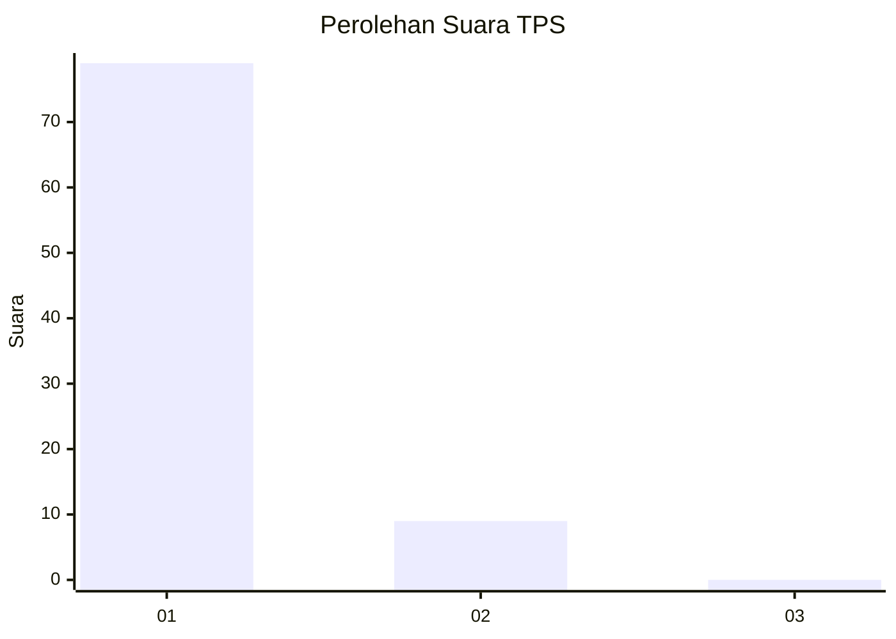
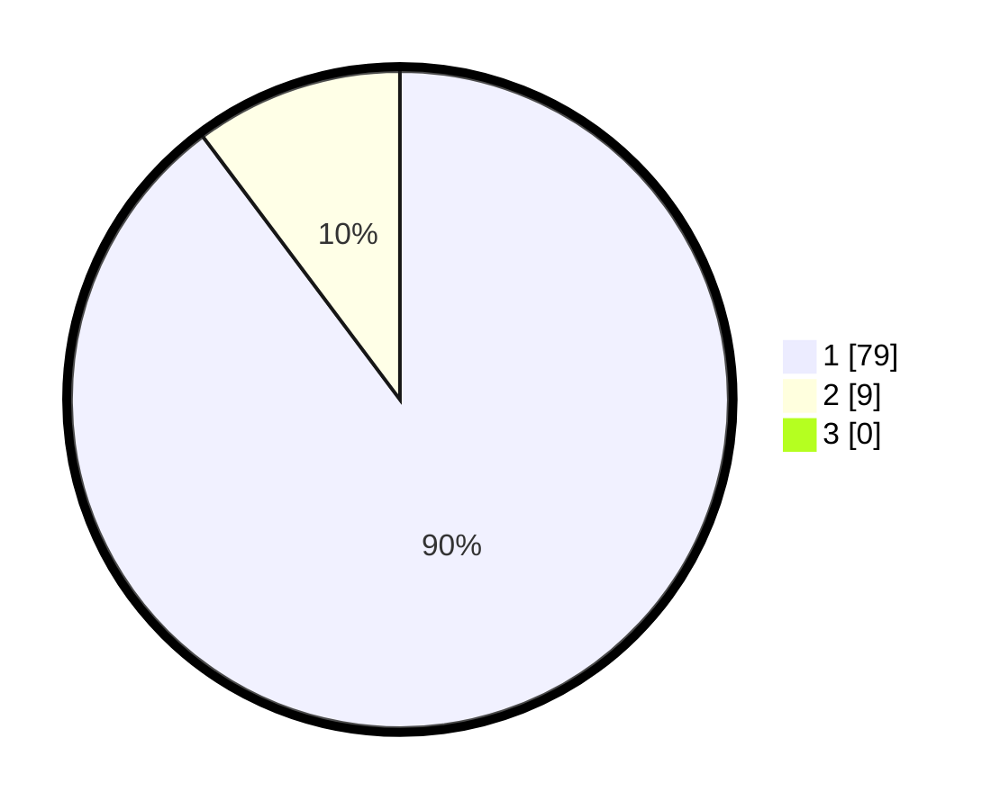

# Hasil

## Grafik

## Tabel

| No. | Nama Paslon    | Suara | Suara (raw) | Persentase |
|:--- |:-------------- | -----:| -----------:| ----------:|
| 1   | ANIES MUHAIMIN | 79    | [79][p-1]   | 89,77      |
| 2   | PRABOWO GIBRAN | 9     | [9][p-2]    | 10,23      |
| 3   | GANJAR MAHFUD  | 0     | [0][p-3]    | 0,00       |

[p-1]: https://github.com/gigit-pemilu/pemilu-2024-11-aceh/blob/main/pilpres/hitung-suara/sub/11-aceh/sub/01-aceh-selatan/sub/09-trumon/sub/2014-gampong-teungoh/sub/001-tps/sub/paslon-1.txt
[p-2]: https://github.com/gigit-pemilu/pemilu-2024-11-aceh/blob/main/pilpres/hitung-suara/sub/11-aceh/sub/01-aceh-selatan/sub/09-trumon/sub/2014-gampong-teungoh/sub/001-tps/sub/paslon-2.txt
[p-3]: https://github.com/gigit-pemilu/pemilu-2024-11-aceh/blob/main/pilpres/hitung-suara/sub/11-aceh/sub/01-aceh-selatan/sub/09-trumon/sub/2014-gampong-teungoh/sub/001-tps/sub/paslon-3.txt

## Foto C Plano

https://sirekap-obj-formc.kpu.go.id/1174/pemilu/ppwp/11/01/09/20/14/1101092014001-20240214-155643--8ec516ba-8e54-4b3e-859b-589f6ea27716.jpg

https://sirekap-obj-formc.kpu.go.id/1174/pemilu/ppwp/11/01/09/20/14/1101092014001-20240214-155821--b9d8e483-c170-4842-b5f8-39b6dca81935.jpg

https://sirekap-obj-formc.kpu.go.id/1174/pemilu/ppwp/11/01/09/20/14/1101092014001-20240215-151430--29a45d5e-fa0b-4513-8529-3422937e5766.jpg

## Metadata

| Key        | Value               |
| ---------- | ------------------- |
| Time Stamp | 2024-02-15 19:30:26 |

## DATA PEMILIH TETAP

Jumlah pemilih dalam DPT: **90**.
 * L: **46**.
 * P: **44**.

## DATA PENGGUNA HAK PILIH

Jumlah pengguna hak pilih dalam DPT: **88**.
 * L: **44**.
 * P: **44**.

Jumlah pengguna hak pilih dalam DPTb: **0**.
 * L: **0**.
 * P: **0**.

Jumlah pengguna hak pilih dalam DPK: **0**.
 * L: **0**.
 * P: **0**.

Jumlah pengguna hak pilih: **88**.
 * L: **44**.
 * P: **44**.

## JUMLAH SUARA SAH DAN TIDAK SAH

JUMLAH SELURUH SUARA SAH: **88**.

JUMLAH SUARA TIDAK SAH: **0**.

JUMLAH SELURUH SUARA SAH DAN SUARA TIDAK SAH: **88**.

