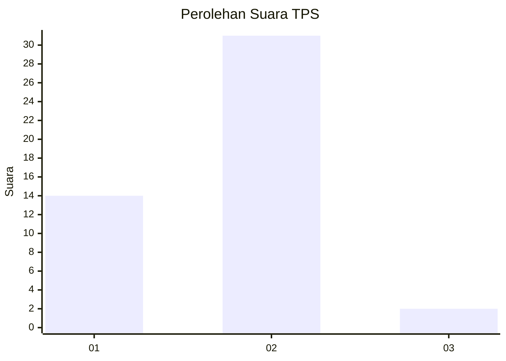
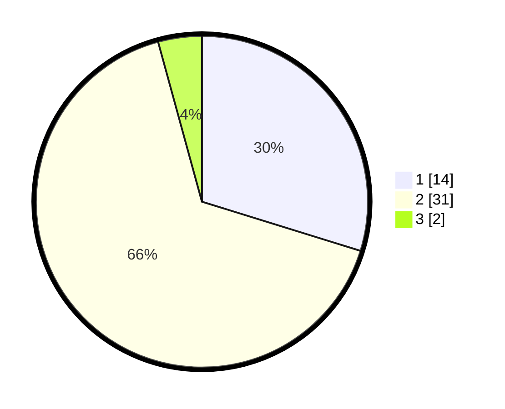

# Hasil

## Grafik

## Tabel

| No. | Nama Paslon    | Suara | Suara (raw) | Persentase |
|:--- |:-------------- | -----:| -----------:| ----------:|
| 1   | ANIES MUHAIMIN | 14    | [14][p-1]   | 29,79      |
| 2   | PRABOWO GIBRAN | 31    | [31][p-2]   | 65,96      |
| 3   | GANJAR MAHFUD  | 2     | [2][p-3]    | 4,26       |

[p-1]: https://github.com/gigit-pemilu/pemilu-2024-11-aceh/blob/main/pilpres/hitung-suara/sub/11-aceh/sub/01-aceh-selatan/sub/09-trumon/sub/2015-seuneubok-jaya/sub/002-tps/sub/paslon-1.txt
[p-2]: https://github.com/gigit-pemilu/pemilu-2024-11-aceh/blob/main/pilpres/hitung-suara/sub/11-aceh/sub/01-aceh-selatan/sub/09-trumon/sub/2015-seuneubok-jaya/sub/002-tps/sub/paslon-2.txt
[p-3]: https://github.com/gigit-pemilu/pemilu-2024-11-aceh/blob/main/pilpres/hitung-suara/sub/11-aceh/sub/01-aceh-selatan/sub/09-trumon/sub/2015-seuneubok-jaya/sub/002-tps/sub/paslon-3.txt

## Foto C Plano

https://sirekap-obj-formc.kpu.go.id/d470/pemilu/ppwp/11/01/09/20/15/1101092015002-20240218-185503--fadd7612-276f-45c0-ae9e-5504a2eaacea.jpg

https://sirekap-obj-formc.kpu.go.id/d470/pemilu/ppwp/11/01/09/20/15/1101092015002-20240218-185504--5c45cf5d-287d-45bc-b76f-25f0d8472384.jpg

https://sirekap-obj-formc.kpu.go.id/d470/pemilu/ppwp/11/01/09/20/15/1101092015002-20240218-185503--b52fffd7-9ab2-4a64-9f02-c4bc805a4e69.jpg

## Metadata

| Key        | Value               |
| ---------- | ------------------- |
| Time Stamp | 2024-02-22 17:00:00 |

## DATA PEMILIH TETAP

Jumlah pemilih dalam DPT: **156**.
 * L: **82**.
 * P: **74**.

## DATA PENGGUNA HAK PILIH

Jumlah pengguna hak pilih dalam DPT: **36**.
 * L: **19**.
 * P: **17**.

Jumlah pengguna hak pilih dalam DPTb: **6**.
 * L: **3**.
 * P: **3**.

Jumlah pengguna hak pilih dalam DPK: **5**.
 * L: **2**.
 * P: **3**.

Jumlah pengguna hak pilih: **47**.
 * L: **24**.
 * P: **23**.

## JUMLAH SUARA SAH DAN TIDAK SAH

JUMLAH SELURUH SUARA SAH: **47**.

JUMLAH SUARA TIDAK SAH: **0**.

JUMLAH SELURUH SUARA SAH DAN SUARA TIDAK SAH: **47**.

