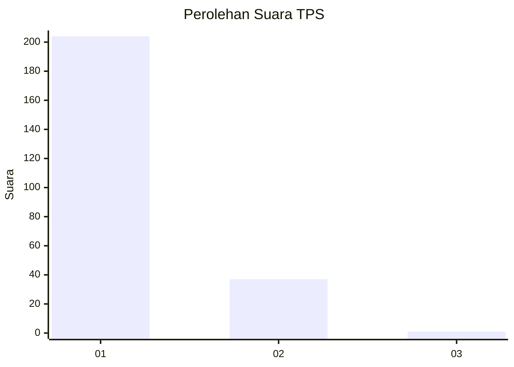
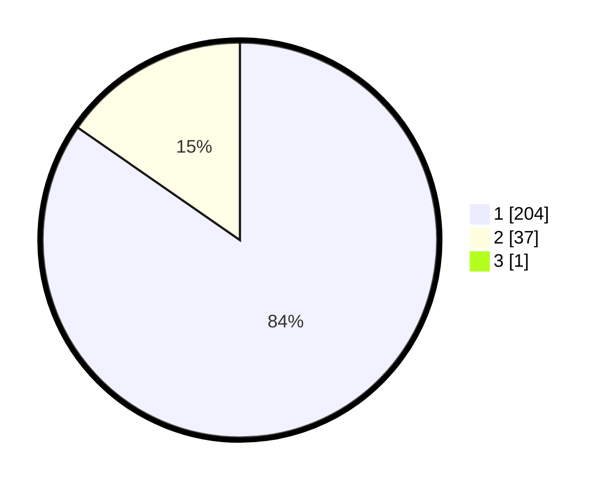

# Hasil

## Grafik

## Tabel

| No. | Nama Paslon    | Suara | Suara (raw) | Persentase |
|:--- |:-------------- | -----:| -----------:| ----------:|
| 1   | ANIES MUHAIMIN | 204   | [204][p-1]  | 84,30      |
| 2   | PRABOWO GIBRAN | 37    | [37][p-2]   | 15,29      |
| 3   | GANJAR MAHFUD  | 1     | [1][p-3]    | 0,41       |

[p-1]: https://github.com/gigit-pemilu/pemilu-2024-11-aceh/blob/main/pilpres/hitung-suara/sub/11-aceh/sub/01-aceh-selatan/sub/10-pasi-raja/sub/2001-ladang-teungoh/sub/002-tps/sub/paslon-1.txt
[p-2]: https://github.com/gigit-pemilu/pemilu-2024-11-aceh/blob/main/pilpres/hitung-suara/sub/11-aceh/sub/01-aceh-selatan/sub/10-pasi-raja/sub/2001-ladang-teungoh/sub/002-tps/sub/paslon-2.txt
[p-3]: https://github.com/gigit-pemilu/pemilu-2024-11-aceh/blob/main/pilpres/hitung-suara/sub/11-aceh/sub/01-aceh-selatan/sub/10-pasi-raja/sub/2001-ladang-teungoh/sub/002-tps/sub/paslon-3.txt

## Foto C Plano

https://sirekap-obj-formc.kpu.go.id/8670/pemilu/ppwp/11/01/10/20/01/1101102001002-20240216-153905--fe8ac783-c130-47b9-a919-3e1e91a8c71f.jpg

https://sirekap-obj-formc.kpu.go.id/8670/pemilu/ppwp/11/01/10/20/01/1101102001002-20240216-153906--48ef025c-4df7-49bb-ab29-0499d426f230.jpg

https://sirekap-obj-formc.kpu.go.id/8670/pemilu/ppwp/11/01/10/20/01/1101102001002-20240216-153905--2160b8f1-3228-4a94-9c90-ebf6f715e717.jpg

## Metadata

| Key        | Value               |
| ---------- | ------------------- |
| Time Stamp | 2024-02-16 21:01:00 |

## DATA PEMILIH TETAP

Jumlah pemilih dalam DPT: **282**.
 * L: **140**.
 * P: **142**.

## DATA PENGGUNA HAK PILIH

Jumlah pengguna hak pilih dalam DPT: **245**.
 * L: **119**.
 * P: **126**.

Jumlah pengguna hak pilih dalam DPTb: **2**.
 * L: **1**.
 * P: **1**.

Jumlah pengguna hak pilih dalam DPK: **0**.
 * L: **0**.
 * P: **0**.

Jumlah pengguna hak pilih: **247**.
 * L: **120**.
 * P: **127**.

## JUMLAH SUARA SAH DAN TIDAK SAH

JUMLAH SELURUH SUARA SAH: **242**.

JUMLAH SUARA TIDAK SAH: **5**.

JUMLAH SELURUH SUARA SAH DAN SUARA TIDAK SAH: **247**.

