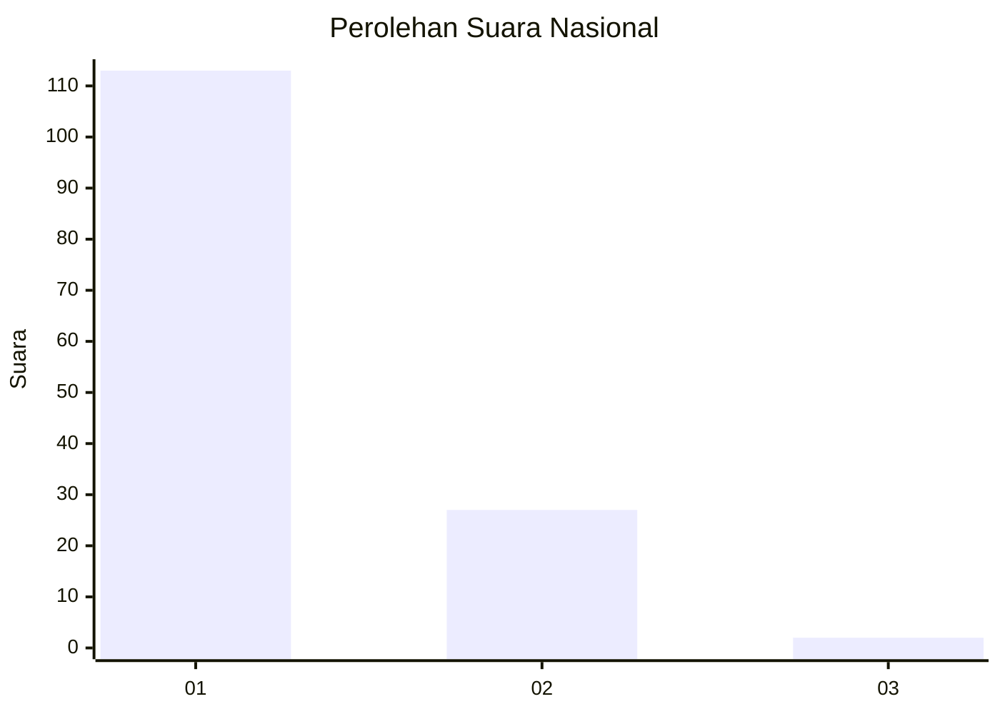
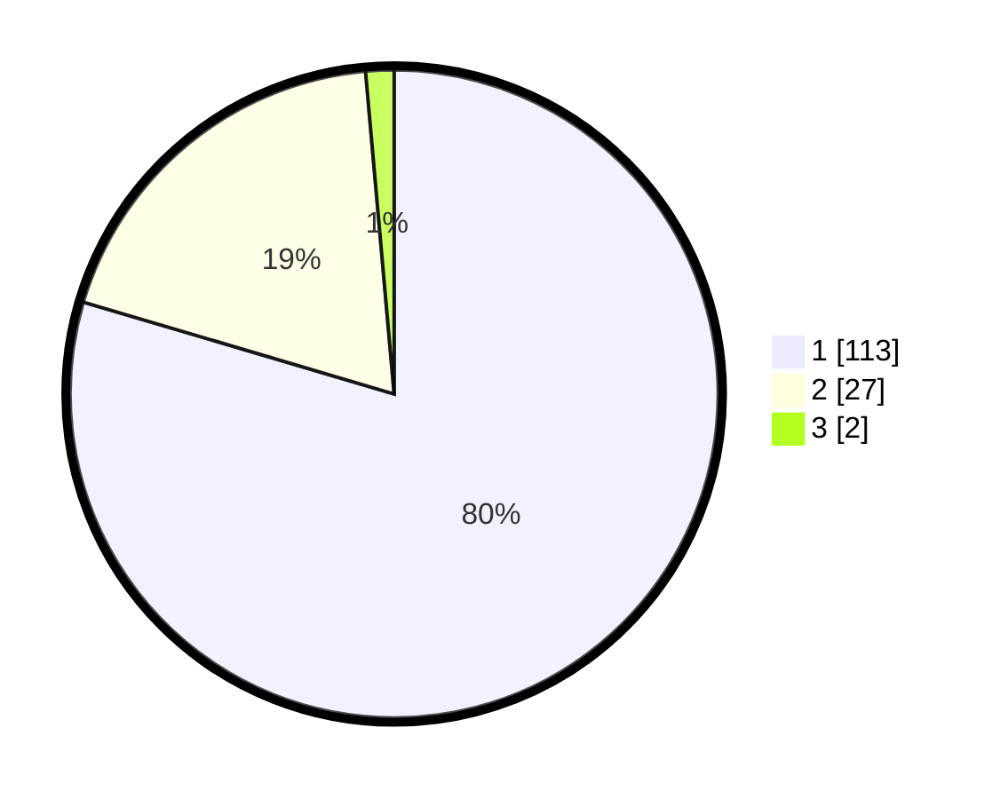

# Hasil

## Grafik

## Tabel

| No. | Nama Paslon    | Suara | Suara (raw) | Persentase |
|:--- |:-------------- | -----:| -----------:| ----------:|
| 1   | ANIES MUHAIMIN | 113   | [113][p-1]  | 79,58      |
| 2   | PRABOWO GIBRAN | 27    | [27][p-2]   | 19,01      |
| 3   | GANJAR MAHFUD  | 2     | [2][p-3]    | 1,41       |

[p-1]: https://github.com/gigit-pemilu/pemilu-2024/blob/main/pilpres/hitung-suara/sub/11-aceh/sub/01-aceh-selatan/sub/10-pasi-raja/sub/2002-pucok-krueng/sub/001-tps/sub/paslon-1.txt
[p-2]: https://github.com/gigit-pemilu/pemilu-2024/blob/main/pilpres/hitung-suara/sub/11-aceh/sub/01-aceh-selatan/sub/10-pasi-raja/sub/2002-pucok-krueng/sub/001-tps/sub/paslon-2.txt
[p-3]: https://github.com/gigit-pemilu/pemilu-2024/blob/main/pilpres/hitung-suara/sub/11-aceh/sub/01-aceh-selatan/sub/10-pasi-raja/sub/2002-pucok-krueng/sub/001-tps/sub/paslon-3.txt

## Foto C Plano

https://sirekap-obj-formc.kpu.go.id/4e3b/pemilu/ppwp/11/01/10/20/02/1101102002001-20240215-084215--ae04cfe5-bb4a-4e4b-85c7-9923de5115c3.jpg

https://sirekap-obj-formc.kpu.go.id/4e3b/pemilu/ppwp/11/01/10/20/02/1101102002001-20240215-021135--c0f4cebb-7ed8-4647-bcb7-378d6c92101d.jpg

https://sirekap-obj-formc.kpu.go.id/4e3b/pemilu/ppwp/11/01/10/20/02/1101102002001-20240215-084710--efcfeb99-8e42-4a4f-ab04-ebfb7c1c2094.jpg

## Metadata

| Key        | Value               |
| ---------- | ------------------- |
| Time Stamp | 2024-02-17 10:30:03 |

## DATA PEMILIH TETAP

Jumlah pemilih dalam DPT: **160**.
 * L: **73**.
 * P: **87**.

## DATA PENGGUNA HAK PILIH

Jumlah pengguna hak pilih dalam DPT: **143**.
 * L: **62**.
 * P: **81**.

Jumlah pengguna hak pilih dalam DPTb: **0**.
 * L: **0**.
 * P: **0**.

Jumlah pengguna hak pilih dalam DPK: **1**.
 * L: **1**.
 * P: **0**.

Jumlah pengguna hak pilih: **144**.
 * L: **63**.
 * P: **81**.

## JUMLAH SUARA SAH DAN TIDAK SAH

JUMLAH SELURUH SUARA SAH: **142**.

JUMLAH SUARA TIDAK SAH: **2**.

JUMLAH SELURUH SUARA SAH DAN SUARA TIDAK SAH: **144**.

