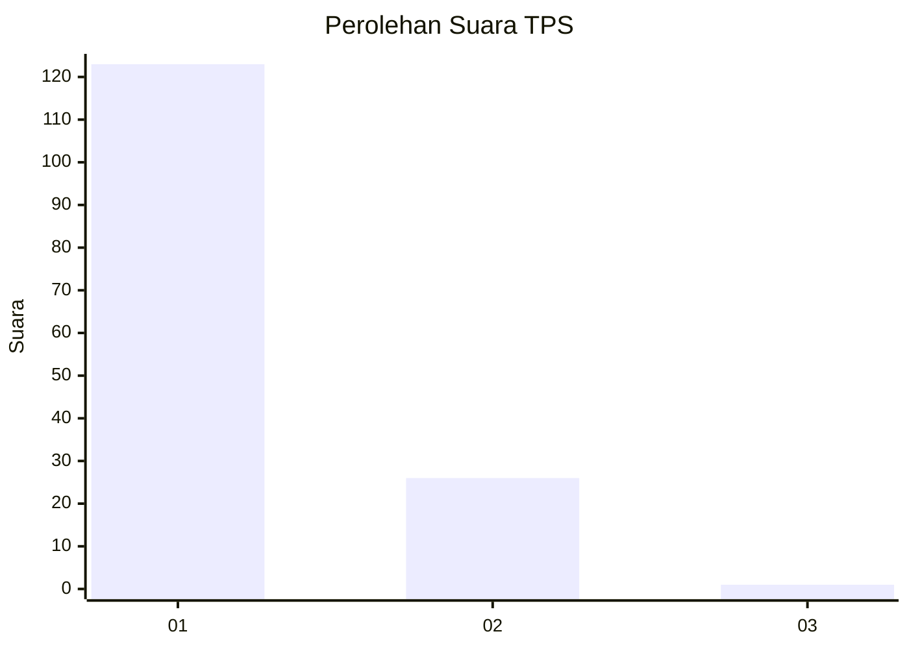
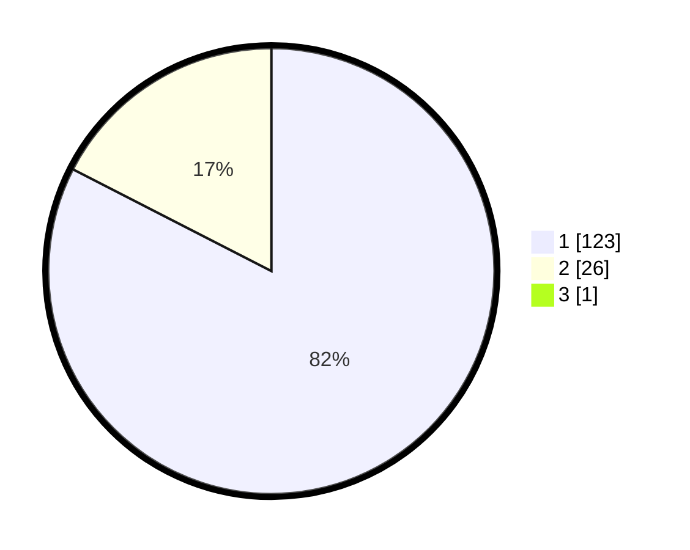

# Hasil

## Grafik

## Tabel

| No. | Nama Paslon    | Suara | Suara (raw) | Persentase |
|:--- |:-------------- | -----:| -----------:| ----------:|
| 1   | ANIES MUHAIMIN | 123   | [123][p-1]  | 82,00      |
| 2   | PRABOWO GIBRAN | 26    | [26][p-2]   | 17,33      |
| 3   | GANJAR MAHFUD  | 1     | [1][p-3]    | 0,67       |

[p-1]: https://github.com/gigit-pemilu/pemilu-2024-11-aceh/blob/main/pilpres/hitung-suara/sub/11-aceh/sub/01-aceh-selatan/sub/10-pasi-raja/sub/2002-pucok-krueng/sub/002-tps/sub/paslon-1.txt
[p-2]: https://github.com/gigit-pemilu/pemilu-2024-11-aceh/blob/main/pilpres/hitung-suara/sub/11-aceh/sub/01-aceh-selatan/sub/10-pasi-raja/sub/2002-pucok-krueng/sub/002-tps/sub/paslon-2.txt
[p-3]: https://github.com/gigit-pemilu/pemilu-2024-11-aceh/blob/main/pilpres/hitung-suara/sub/11-aceh/sub/01-aceh-selatan/sub/10-pasi-raja/sub/2002-pucok-krueng/sub/002-tps/sub/paslon-3.txt

## Foto C Plano

https://sirekap-obj-formc.kpu.go.id/284a/pemilu/ppwp/11/01/10/20/02/1101102002002-20240215-014515--942947eb-d0eb-45e7-b9c8-847d187a7601.jpg

https://sirekap-obj-formc.kpu.go.id/284a/pemilu/ppwp/11/01/10/20/02/1101102002002-20240215-014833--d0a13d40-2c91-444c-94fe-8142553bb78d.jpg

https://sirekap-obj-formc.kpu.go.id/284a/pemilu/ppwp/11/01/10/20/02/1101102002002-20240216-135300--6a1cf2e5-d4b2-466e-80bf-26fcf199d35c.jpg

## Metadata

| Key        | Value               |
| ---------- | ------------------- |
| Time Stamp | 2024-02-16 14:00:34 |

## DATA PEMILIH TETAP

Jumlah pemilih dalam DPT: **170**.
 * L: **88**.
 * P: **82**.

## DATA PENGGUNA HAK PILIH

Jumlah pengguna hak pilih dalam DPT: **153**.
 * L: **78**.
 * P: **75**.

Jumlah pengguna hak pilih dalam DPTb: **0**.
 * L: **0**.
 * P: **0**.

Jumlah pengguna hak pilih dalam DPK: **0**.
 * L: **0**.
 * P: **0**.

Jumlah pengguna hak pilih: **153**.
 * L: **78**.
 * P: **75**.

## JUMLAH SUARA SAH DAN TIDAK SAH

JUMLAH SELURUH SUARA SAH: **150**.

JUMLAH SUARA TIDAK SAH: **3**.

JUMLAH SELURUH SUARA SAH DAN SUARA TIDAK SAH: **153**.

