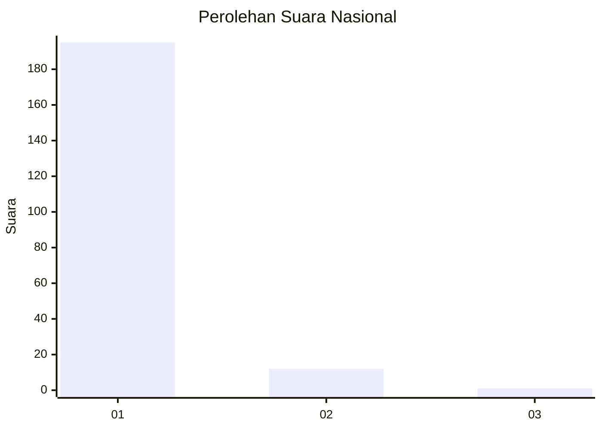
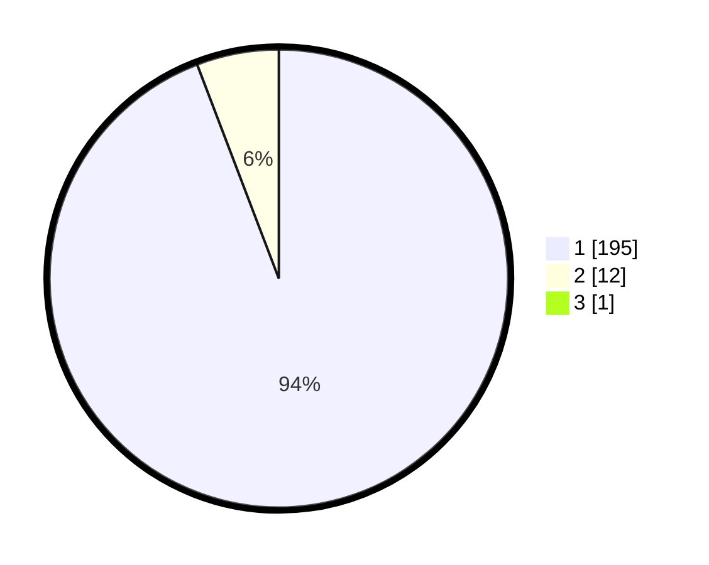

# Hasil

## Grafik

## Tabel

| No. | Nama Paslon    | Suara | Suara (raw) | Persentase |
|:--- |:-------------- | -----:| -----------:| ----------:|
| 1   | ANIES MUHAIMIN | 195   | [195][p-1]  | 93,75      |
| 2   | PRABOWO GIBRAN | 12    | [12][p-2]   | 5,77       |
| 3   | GANJAR MAHFUD  | 1     | [1][p-3]    | 0,48       |

[p-1]: https://github.com/gigit-pemilu/pemilu-2024/blob/main/pilpres/hitung-suara/sub/11-aceh/sub/01-aceh-selatan/sub/10-pasi-raja/sub/2003-silolo/sub/001-tps/sub/paslon-1.txt
[p-2]: https://github.com/gigit-pemilu/pemilu-2024/blob/main/pilpres/hitung-suara/sub/11-aceh/sub/01-aceh-selatan/sub/10-pasi-raja/sub/2003-silolo/sub/001-tps/sub/paslon-2.txt
[p-3]: https://github.com/gigit-pemilu/pemilu-2024/blob/main/pilpres/hitung-suara/sub/11-aceh/sub/01-aceh-selatan/sub/10-pasi-raja/sub/2003-silolo/sub/001-tps/sub/paslon-3.txt

## Foto C Plano

https://sirekap-obj-formc.kpu.go.id/9a82/pemilu/ppwp/11/01/10/20/03/1101102003001-20240216-140121--58730afd-348f-4605-a523-79afa39b4790.jpg

https://sirekap-obj-formc.kpu.go.id/9a82/pemilu/ppwp/11/01/10/20/03/1101102003001-20240216-140122--fa6d6f6f-66c8-4e97-81dd-1aa69f6cd68e.jpg

https://sirekap-obj-formc.kpu.go.id/9a82/pemilu/ppwp/11/01/10/20/03/1101102003001-20240216-140122--50a05f99-cf61-4916-8a7b-cba820e36dbf.jpg

## Metadata

| Key        | Value               |
| ---------- | ------------------- |
| Time Stamp | 2024-02-16 21:01:00 |

## DATA PEMILIH TETAP

Jumlah pemilih dalam DPT: **265**.
 * L: **130**.
 * P: **135**.

## DATA PENGGUNA HAK PILIH

Jumlah pengguna hak pilih dalam DPT: **215**.
 * L: **101**.
 * P: **114**.

Jumlah pengguna hak pilih dalam DPTb: **0**.
 * L: **0**.
 * P: **0**.

Jumlah pengguna hak pilih dalam DPK: **0**.
 * L: **0**.
 * P: **0**.

Jumlah pengguna hak pilih: **215**.
 * L: **101**.
 * P: **114**.

## JUMLAH SUARA SAH DAN TIDAK SAH

JUMLAH SELURUH SUARA SAH: **207**.

JUMLAH SUARA TIDAK SAH: **8**.

JUMLAH SELURUH SUARA SAH DAN SUARA TIDAK SAH: **215**.

