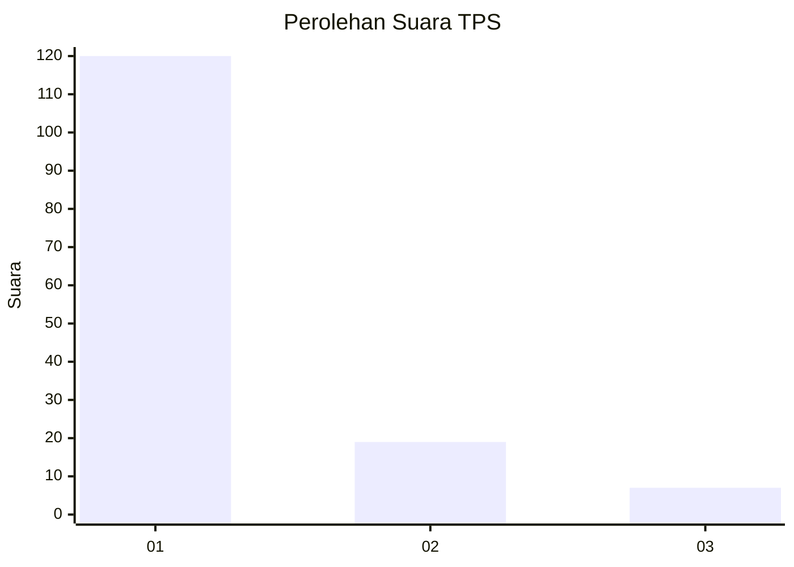
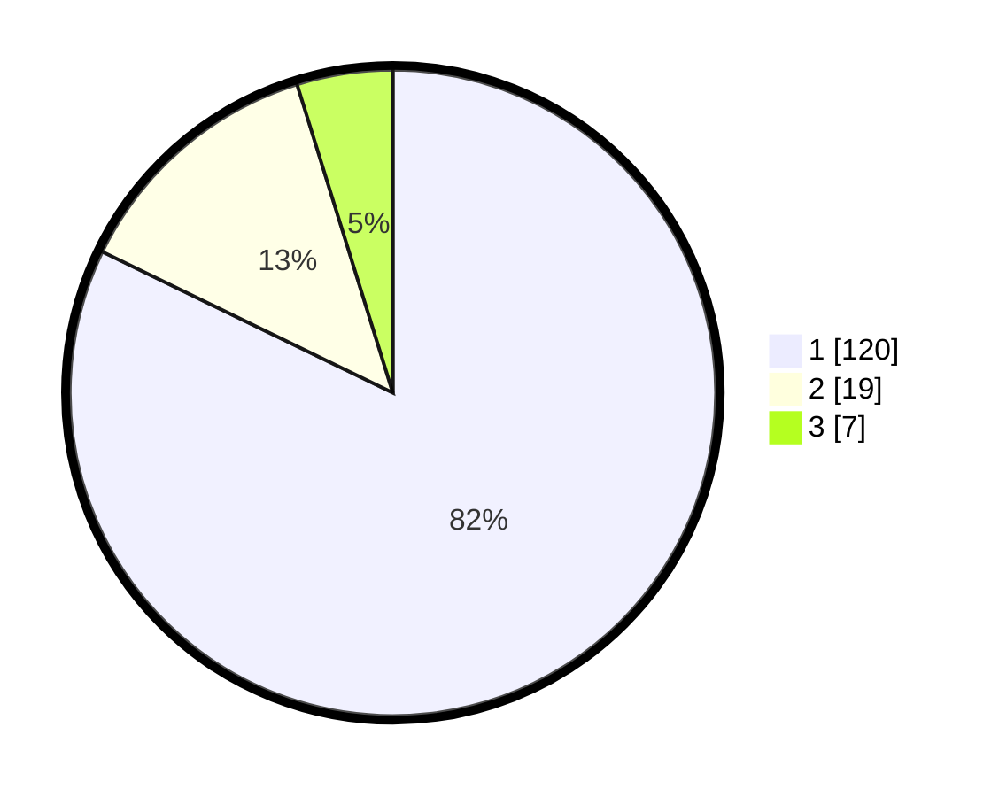

# Hasil

## Grafik

## Tabel

| No. | Nama Paslon    | Suara | Suara (raw) | Persentase |
|:--- |:-------------- | -----:| -----------:| ----------:|
| 1   | ANIES MUHAIMIN | 120   | [120][p-1]  | 82,19      |
| 2   | PRABOWO GIBRAN | 19    | [19][p-2]   | 13,01      |
| 3   | GANJAR MAHFUD  | 7     | [7][p-3]    | 4,79       |

[p-1]: https://github.com/gigit-pemilu/pemilu-2024-11-aceh/blob/main/pilpres/hitung-suara/sub/11-aceh/sub/01-aceh-selatan/sub/10-pasi-raja/sub/2004-kampung-baru/sub/001-tps/sub/paslon-1.txt
[p-2]: https://github.com/gigit-pemilu/pemilu-2024-11-aceh/blob/main/pilpres/hitung-suara/sub/11-aceh/sub/01-aceh-selatan/sub/10-pasi-raja/sub/2004-kampung-baru/sub/001-tps/sub/paslon-2.txt
[p-3]: https://github.com/gigit-pemilu/pemilu-2024-11-aceh/blob/main/pilpres/hitung-suara/sub/11-aceh/sub/01-aceh-selatan/sub/10-pasi-raja/sub/2004-kampung-baru/sub/001-tps/sub/paslon-3.txt

## Foto C Plano

https://sirekap-obj-formc.kpu.go.id/56d4/pemilu/ppwp/11/01/10/20/04/1101102004001-20240214-155528--adc6d20e-4191-43c0-b6c0-307aa746c52c.jpg

https://sirekap-obj-formc.kpu.go.id/56d4/pemilu/ppwp/11/01/10/20/04/1101102004001-20240214-155718--760267a6-e2f7-45cb-816c-72293eb052c7.jpg

## Metadata

| Key        | Value               |
| ---------- | ------------------- |
| Time Stamp | 2024-02-24 22:31:28 |

