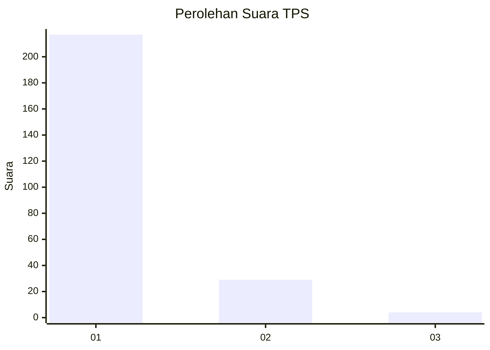
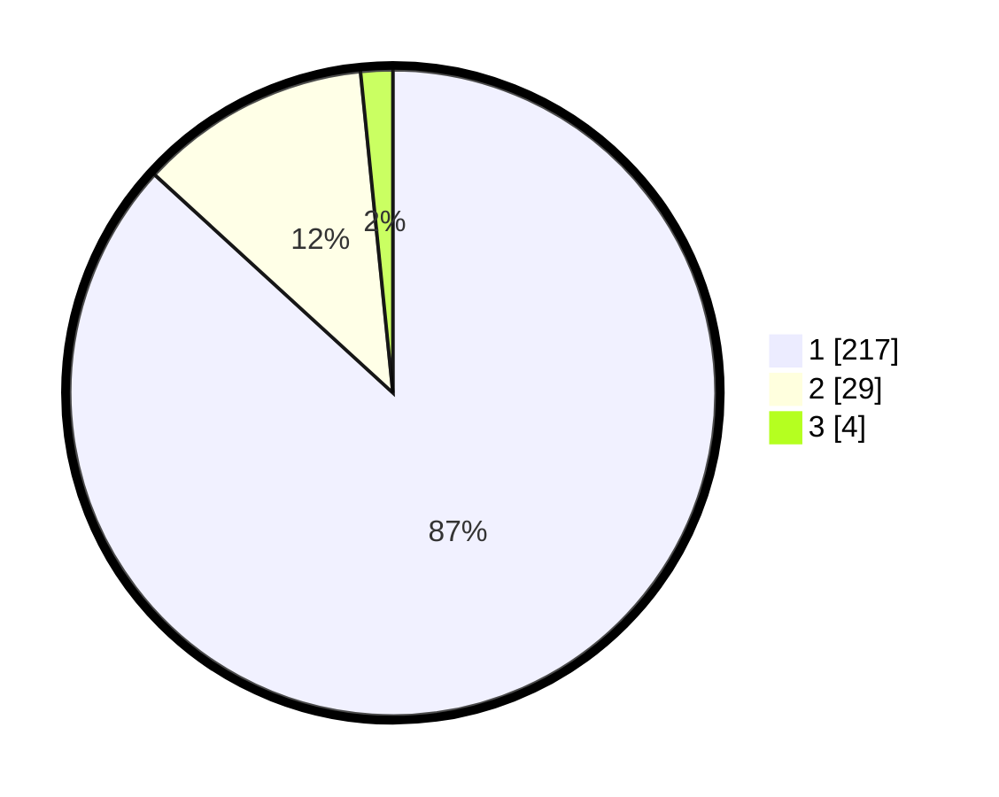

# Hasil

## Grafik

## Tabel

| No. | Nama Paslon    | Suara | Suara (raw) | Persentase |
|:--- |:-------------- | -----:| -----------:| ----------:|
| 1   | ANIES MUHAIMIN | 217   | [217][p-1]  | 86,80      |
| 2   | PRABOWO GIBRAN | 29    | [29][p-2]   | 11,60      |
| 3   | GANJAR MAHFUD  | 4     | [4][p-3]    | 1,60       |

[p-1]: https://github.com/gigit-pemilu/pemilu-2024-11-aceh/blob/main/pilpres/hitung-suara/sub/11-aceh/sub/01-aceh-selatan/sub/10-pasi-raja/sub/2007-ladang-tuha/sub/001-tps/sub/paslon-1.txt
[p-2]: https://github.com/gigit-pemilu/pemilu-2024-11-aceh/blob/main/pilpres/hitung-suara/sub/11-aceh/sub/01-aceh-selatan/sub/10-pasi-raja/sub/2007-ladang-tuha/sub/001-tps/sub/paslon-2.txt
[p-3]: https://github.com/gigit-pemilu/pemilu-2024-11-aceh/blob/main/pilpres/hitung-suara/sub/11-aceh/sub/01-aceh-selatan/sub/10-pasi-raja/sub/2007-ladang-tuha/sub/001-tps/sub/paslon-3.txt

## Foto C Plano

https://sirekap-obj-formc.kpu.go.id/1088/pemilu/ppwp/11/01/10/20/07/1101102007001-20240215-014447--d26d15d0-04bf-4184-b079-db1287513b3e.jpg

https://sirekap-obj-formc.kpu.go.id/1088/pemilu/ppwp/11/01/10/20/07/1101102007001-20240215-014734--21e28248-34c9-434c-9c60-dc1b90d70c5b.jpg

https://sirekap-obj-formc.kpu.go.id/1088/pemilu/ppwp/11/01/10/20/07/1101102007001-20240215-015011--c1b69f18-2cda-4b14-a140-a34a4b61c934.jpg

## Metadata

| Key        | Value               |
| ---------- | ------------------- |
| Time Stamp | 2024-02-24 22:31:28 |

