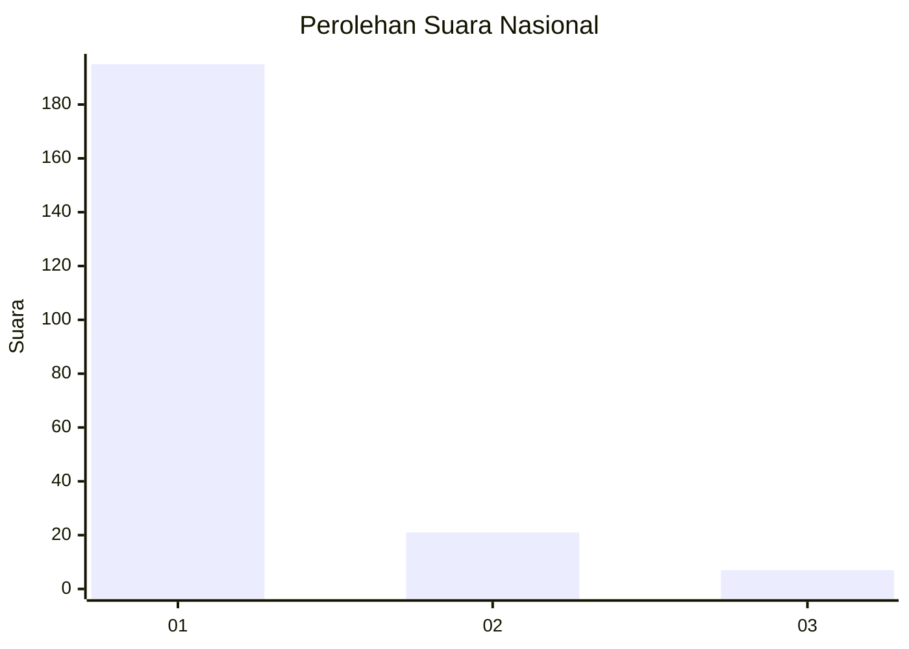
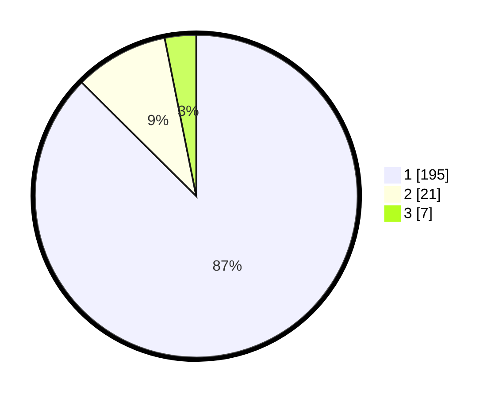

# Hasil

## Grafik

## Tabel

| No. | Nama Paslon    | Suara | Suara (raw) | Persentase |
|:--- |:-------------- | -----:| -----------:| ----------:|
| 1   | ANIES MUHAIMIN | 195   | [195][p-1]  | 87,44      |
| 2   | PRABOWO GIBRAN | 21    | [21][p-2]   | 9,42       |
| 3   | GANJAR MAHFUD  | 7     | [7][p-3]    | 3,14       |

[p-1]: https://github.com/gigit-pemilu/pemilu-2024/blob/main/pilpres/hitung-suara/sub/11-aceh/sub/01-aceh-selatan/sub/10-pasi-raja/sub/2008-mata-ie/sub/002-tps/sub/paslon-1.txt
[p-2]: https://github.com/gigit-pemilu/pemilu-2024/blob/main/pilpres/hitung-suara/sub/11-aceh/sub/01-aceh-selatan/sub/10-pasi-raja/sub/2008-mata-ie/sub/002-tps/sub/paslon-2.txt
[p-3]: https://github.com/gigit-pemilu/pemilu-2024/blob/main/pilpres/hitung-suara/sub/11-aceh/sub/01-aceh-selatan/sub/10-pasi-raja/sub/2008-mata-ie/sub/002-tps/sub/paslon-3.txt

## Foto C Plano

https://sirekap-obj-formc.kpu.go.id/3425/pemilu/ppwp/11/01/10/20/08/1101102008002-20240216-114207--55883e06-caeb-402c-885c-6c1aaab645c6.jpg

https://sirekap-obj-formc.kpu.go.id/3425/pemilu/ppwp/11/01/10/20/08/1101102008002-20240215-193018--0e5064e4-ab8a-4e4e-a09c-abc81818ea2d.jpg

https://sirekap-obj-formc.kpu.go.id/3425/pemilu/ppwp/11/01/10/20/08/1101102008002-20240215-194950--7ff30e8b-ba4a-4de8-ae2e-9a3d77736b3b.jpg

## Metadata

| Key        | Value               |
| ---------- | ------------------- |
| Time Stamp | 2024-02-24 22:31:28 |

