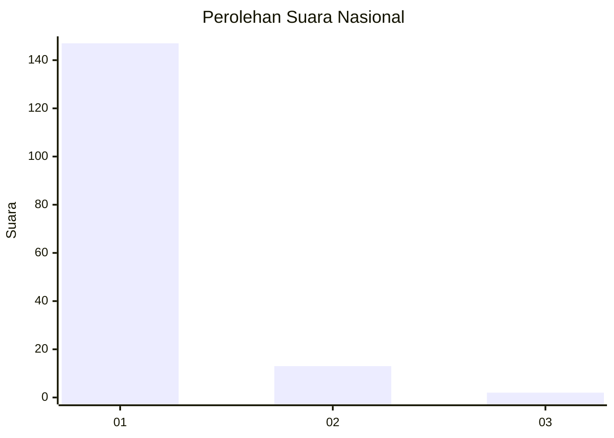
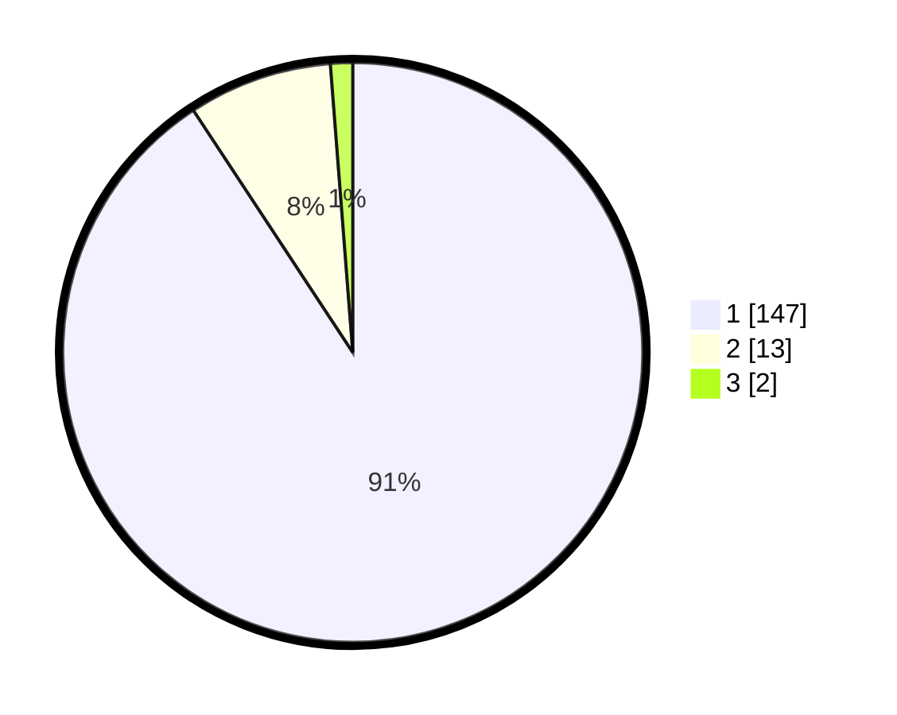

# Hasil

## Grafik

## Tabel

| No. | Nama Paslon    | Suara | Suara (raw) | Persentase |
|:--- |:-------------- | -----:| -----------:| ----------:|
| 1   | ANIES MUHAIMIN | 147   | [147][p-1]  | 90,74      |
| 2   | PRABOWO GIBRAN | 13    | [13][p-2]   | 8,02       |
| 3   | GANJAR MAHFUD  | 2     | [2][p-3]    | 1,23       |

[p-1]: https://github.com/gigit-pemilu/pemilu-2024/blob/main/pilpres/hitung-suara/sub/11-aceh/sub/01-aceh-selatan/sub/10-pasi-raja/sub/2009-ujong-batee/sub/003-tps/sub/paslon-1.txt
[p-2]: https://github.com/gigit-pemilu/pemilu-2024/blob/main/pilpres/hitung-suara/sub/11-aceh/sub/01-aceh-selatan/sub/10-pasi-raja/sub/2009-ujong-batee/sub/003-tps/sub/paslon-2.txt
[p-3]: https://github.com/gigit-pemilu/pemilu-2024/blob/main/pilpres/hitung-suara/sub/11-aceh/sub/01-aceh-selatan/sub/10-pasi-raja/sub/2009-ujong-batee/sub/003-tps/sub/paslon-3.txt

## Foto C Plano

https://sirekap-obj-formc.kpu.go.id/0fc7/pemilu/ppwp/11/01/10/20/09/1101102009003-20240214-193401--c508cc8e-72e0-43e5-a8d4-16cee0f23cc2.jpg

https://sirekap-obj-formc.kpu.go.id/0fc7/pemilu/ppwp/11/01/10/20/09/1101102009003-20240214-193425--de491f20-a1d9-4a03-bd99-30ef195b0efb.jpg

https://sirekap-obj-formc.kpu.go.id/0fc7/pemilu/ppwp/11/01/10/20/09/1101102009003-20240214-193433--3f22f1ad-ba24-4955-8b29-338213f61f78.jpg

## Metadata

| Key        | Value               |
| ---------- | ------------------- |
| Time Stamp | 2024-02-14 21:46:01 |

## DATA PEMILIH TETAP

Jumlah pemilih dalam DPT: **206**.
 * L: **103**.
 * P: **103**.

## DATA PENGGUNA HAK PILIH

Jumlah pengguna hak pilih dalam DPT: **165**.
 * L: **79**.
 * P: **86**.

Jumlah pengguna hak pilih dalam DPTb: **0**.
 * L: **0**.
 * P: **0**.

Jumlah pengguna hak pilih dalam DPK: **0**.
 * L: **0**.
 * P: **0**.

Jumlah pengguna hak pilih: **165**.
 * L: **79**.
 * P: **86**.

## JUMLAH SUARA SAH DAN TIDAK SAH

JUMLAH SELURUH SUARA SAH: **162**.

JUMLAH SUARA TIDAK SAH: **3**.

JUMLAH SELURUH SUARA SAH DAN SUARA TIDAK SAH: **165**.

