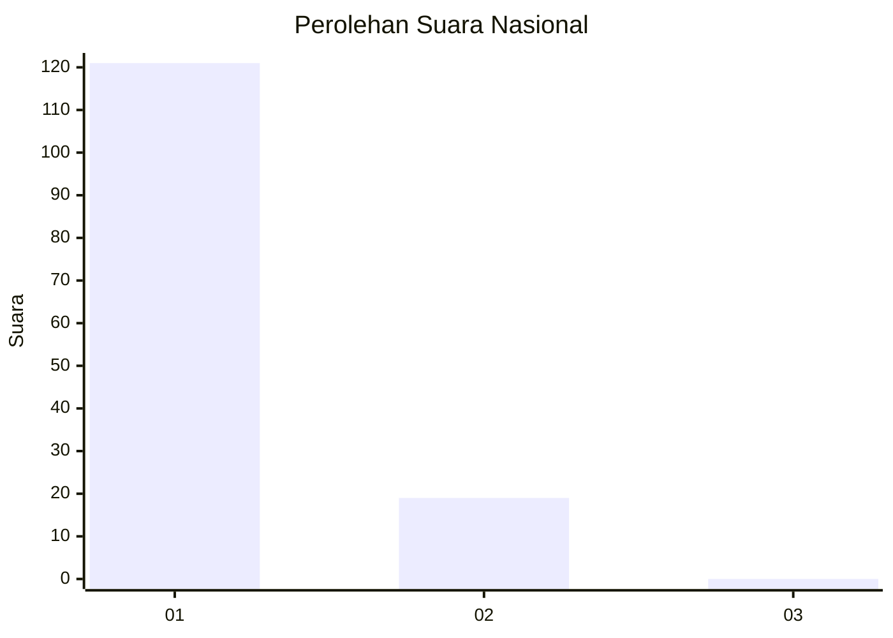
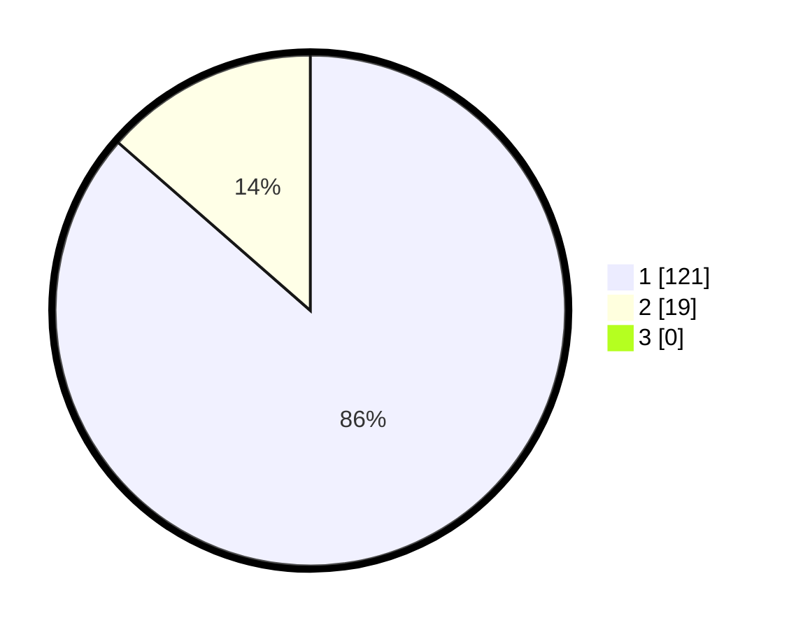

# Hasil

## Grafik

## Tabel

| No. | Nama Paslon    | Suara | Suara (raw) | Persentase |
|:--- |:-------------- | -----:| -----------:| ----------:|
| 1   | ANIES MUHAIMIN | 121   | [121][p-1]  | 86,43      |
| 2   | PRABOWO GIBRAN | 19    | [19][p-2]   | 13,57      |
| 3   | GANJAR MAHFUD  | 0     | [0][p-3]    | 0,00       |

[p-1]: https://github.com/gigit-pemilu/pemilu-2024/blob/main/pilpres/hitung-suara/sub/11-aceh/sub/01-aceh-selatan/sub/10-pasi-raja/sub/2010-lhok-sialang-cut/sub/002-tps/sub/paslon-1.txt
[p-2]: https://github.com/gigit-pemilu/pemilu-2024/blob/main/pilpres/hitung-suara/sub/11-aceh/sub/01-aceh-selatan/sub/10-pasi-raja/sub/2010-lhok-sialang-cut/sub/002-tps/sub/paslon-2.txt
[p-3]: https://github.com/gigit-pemilu/pemilu-2024/blob/main/pilpres/hitung-suara/sub/11-aceh/sub/01-aceh-selatan/sub/10-pasi-raja/sub/2010-lhok-sialang-cut/sub/002-tps/sub/paslon-3.txt

## Foto C Plano

https://sirekap-obj-formc.kpu.go.id/adea/pemilu/ppwp/11/01/10/20/10/1101102010002-20240215-164402--58afab47-ac2f-4af6-a14a-182e3165f654.jpg

https://sirekap-obj-formc.kpu.go.id/adea/pemilu/ppwp/11/01/10/20/10/1101102010002-20240215-164513--7f10ec1d-e436-476f-ab04-513e506757ca.jpg

https://sirekap-obj-formc.kpu.go.id/adea/pemilu/ppwp/11/01/10/20/10/1101102010002-20240215-023908--9a4aa055-a9aa-41a7-9db7-cc2c4053e540.jpg

## Metadata

| Key        | Value               |
| ---------- | ------------------- |
| Time Stamp | 2024-02-24 22:31:28 |

