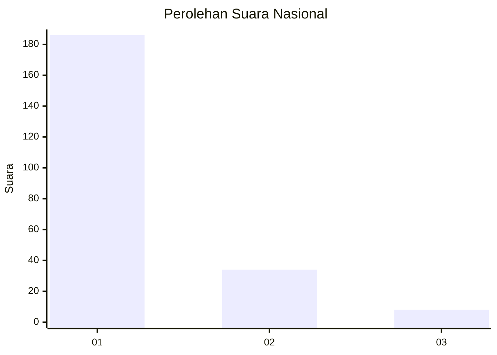
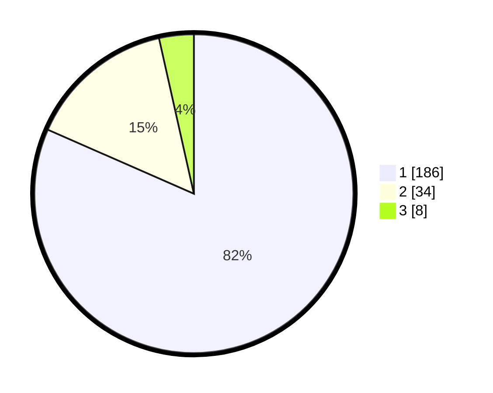

# Hasil

## Grafik

## Tabel

| No. | Nama Paslon    | Suara | Suara (raw) | Persentase |
|:--- |:-------------- | -----:| -----------:| ----------:|
| 1   | ANIES MUHAIMIN | 186   | [186][p-1]  | 81,58      |
| 2   | PRABOWO GIBRAN | 34    | [34][p-2]   | 14,91      |
| 3   | GANJAR MAHFUD  | 8     | [8][p-3]    | 3,51       |

[p-1]: https://github.com/gigit-pemilu/pemilu-2024/blob/main/pilpres/hitung-suara/sub/11-aceh/sub/01-aceh-selatan/sub/10-pasi-raja/sub/2014-ujung-padang-rasian/sub/001-tps/sub/paslon-1.txt
[p-2]: https://github.com/gigit-pemilu/pemilu-2024/blob/main/pilpres/hitung-suara/sub/11-aceh/sub/01-aceh-selatan/sub/10-pasi-raja/sub/2014-ujung-padang-rasian/sub/001-tps/sub/paslon-2.txt
[p-3]: https://github.com/gigit-pemilu/pemilu-2024/blob/main/pilpres/hitung-suara/sub/11-aceh/sub/01-aceh-selatan/sub/10-pasi-raja/sub/2014-ujung-padang-rasian/sub/001-tps/sub/paslon-3.txt

## Foto C Plano

https://sirekap-obj-formc.kpu.go.id/9289/pemilu/ppwp/11/01/10/20/14/1101102014001-20240215-213103--4f5b91af-e02a-4fd9-aaa9-23f8d6bfce36.jpg

https://sirekap-obj-formc.kpu.go.id/9289/pemilu/ppwp/11/01/10/20/14/1101102014001-20240215-214006--593ff688-8d77-4a40-a7a7-224fcf9359f8.jpg

https://sirekap-obj-formc.kpu.go.id/9289/pemilu/ppwp/11/01/10/20/14/1101102014001-20240215-214220--b619dcbb-e85a-48e9-9cd5-0d763928678b.jpg

## Metadata

| Key        | Value               |
| ---------- | ------------------- |
| Time Stamp | 2024-02-16 21:01:00 |

