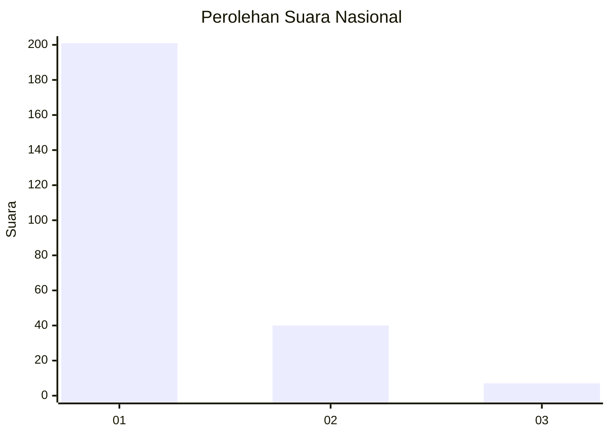
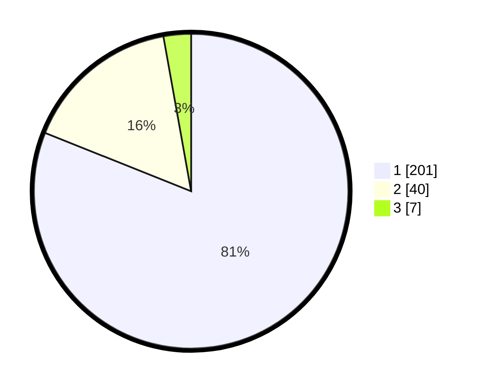

# Hasil

## Grafik

## Tabel

| No. | Nama Paslon    | Suara | Suara (raw) | Persentase |
|:--- |:-------------- | -----:| -----------:| ----------:|
| 1   | ANIES MUHAIMIN | 201   | [201][p-1]  | 81,05      |
| 2   | PRABOWO GIBRAN | 40    | [40][p-2]   | 16,13      |
| 3   | GANJAR MAHFUD  | 7     | [7][p-3]    | 2,82       |

[p-1]: https://github.com/gigit-pemilu/pemilu-2024/blob/main/pilpres/hitung-suara/sub/11-aceh/sub/01-aceh-selatan/sub/10-pasi-raja/sub/2014-ujung-padang-rasian/sub/002-tps/sub/paslon-1.txt
[p-2]: https://github.com/gigit-pemilu/pemilu-2024/blob/main/pilpres/hitung-suara/sub/11-aceh/sub/01-aceh-selatan/sub/10-pasi-raja/sub/2014-ujung-padang-rasian/sub/002-tps/sub/paslon-2.txt
[p-3]: https://github.com/gigit-pemilu/pemilu-2024/blob/main/pilpres/hitung-suara/sub/11-aceh/sub/01-aceh-selatan/sub/10-pasi-raja/sub/2014-ujung-padang-rasian/sub/002-tps/sub/paslon-3.txt

## Foto C Plano

https://sirekap-obj-formc.kpu.go.id/0ac9/pemilu/ppwp/11/01/10/20/14/1101102014002-20240215-105949--cf1a1e09-7c54-41fc-bea6-55b7b6bbe969.jpg

https://sirekap-obj-formc.kpu.go.id/0ac9/pemilu/ppwp/11/01/10/20/14/1101102014002-20240215-105130--64d9e565-c6ab-4004-bc6b-20d6559799ea.jpg

https://sirekap-obj-formc.kpu.go.id/0ac9/pemilu/ppwp/11/01/10/20/14/1101102014002-20240215-152052--9af350c6-ce07-41c2-9e0e-d738f1e62ab1.jpg

## Metadata

| Key        | Value               |
| ---------- | ------------------- |
| Time Stamp | 2024-02-17 10:30:03 |

## DATA PEMILIH TETAP

Jumlah pemilih dalam DPT: **289**.
 * L: **143**.
 * P: **146**.

## DATA PENGGUNA HAK PILIH

Jumlah pengguna hak pilih dalam DPT: **245**.
 * L: **121**.
 * P: **124**.

Jumlah pengguna hak pilih dalam DPTb: **4**.
 * L: **2**.
 * P: **2**.

Jumlah pengguna hak pilih dalam DPK: **1**.
 * L: **0**.
 * P: **1**.

Jumlah pengguna hak pilih: **250**.
 * L: **123**.
 * P: **127**.

## JUMLAH SUARA SAH DAN TIDAK SAH

JUMLAH SELURUH SUARA SAH: **248**.

JUMLAH SUARA TIDAK SAH: **2**.

JUMLAH SELURUH SUARA SAH DAN SUARA TIDAK SAH: **250**.

