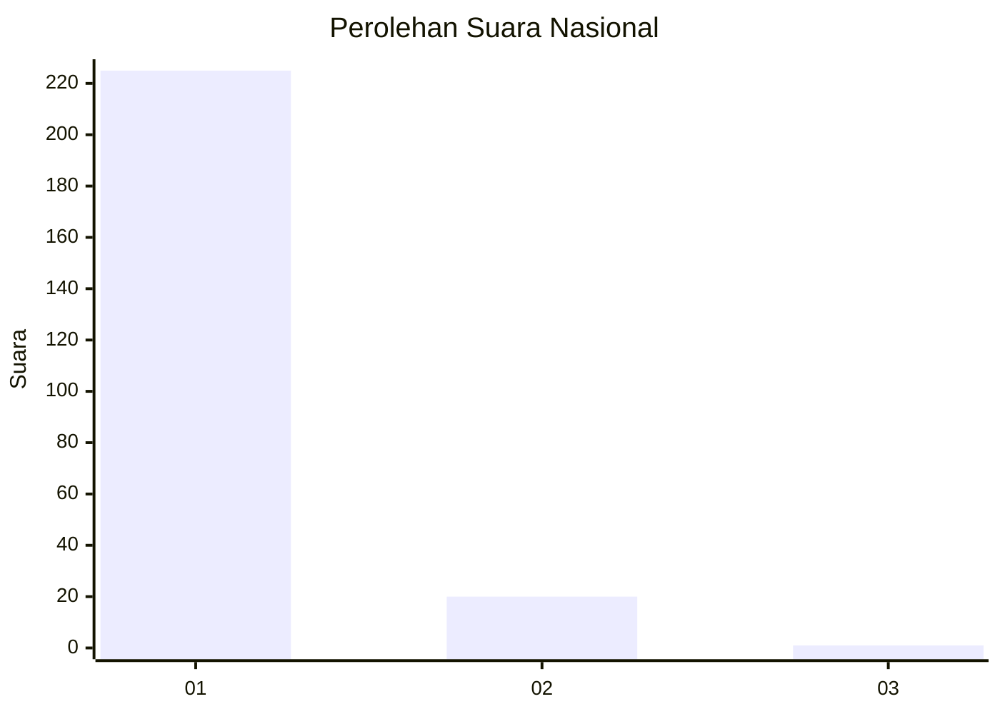
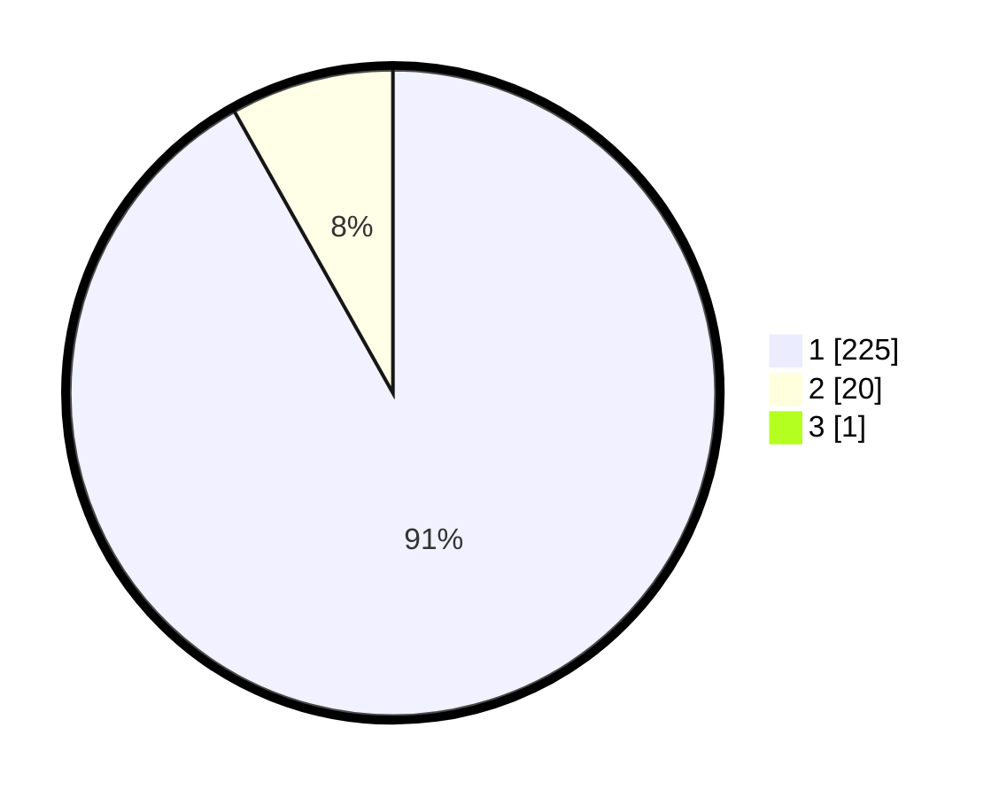

# Hasil

## Grafik

## Tabel

| No. | Nama Paslon    | Suara | Suara (raw) | Persentase |
|:--- |:-------------- | -----:| -----------:| ----------:|
| 1   | ANIES MUHAIMIN | 225   | [225][p-1]  | 91,46      |
| 2   | PRABOWO GIBRAN | 20    | [20][p-2]   | 8,13       |
| 3   | GANJAR MAHFUD  | 1     | [1][p-3]    | 0,41       |

[p-1]: https://github.com/gigit-pemilu/pemilu-2024/blob/main/pilpres/hitung-suara/sub/11-aceh/sub/01-aceh-selatan/sub/10-pasi-raja/sub/2015-krueng-kalee/sub/001-tps/sub/paslon-1.txt
[p-2]: https://github.com/gigit-pemilu/pemilu-2024/blob/main/pilpres/hitung-suara/sub/11-aceh/sub/01-aceh-selatan/sub/10-pasi-raja/sub/2015-krueng-kalee/sub/001-tps/sub/paslon-2.txt
[p-3]: https://github.com/gigit-pemilu/pemilu-2024/blob/main/pilpres/hitung-suara/sub/11-aceh/sub/01-aceh-selatan/sub/10-pasi-raja/sub/2015-krueng-kalee/sub/001-tps/sub/paslon-3.txt

## Foto C Plano

https://sirekap-obj-formc.kpu.go.id/d2f8/pemilu/ppwp/11/01/10/20/15/1101102015001-20240214-212249--5cd02b14-2046-44be-8fd9-5a5640ede388.jpg

https://sirekap-obj-formc.kpu.go.id/d2f8/pemilu/ppwp/11/01/10/20/15/1101102015001-20240214-212417--9696aea4-1aac-477d-99c1-fab26d99cd80.jpg

https://sirekap-obj-formc.kpu.go.id/d2f8/pemilu/ppwp/11/01/10/20/15/1101102015001-20240214-212607--69c4229b-2fcf-4217-8c2f-c40eaa72ff6c.jpg

## Metadata

| Key        | Value               |
| ---------- | ------------------- |
| Time Stamp | 2024-02-17 10:30:03 |

## DATA PEMILIH TETAP

Jumlah pemilih dalam DPT: **273**.
 * L: **146**.
 * P: **127**.

## DATA PENGGUNA HAK PILIH

Jumlah pengguna hak pilih dalam DPT: **246**.
 * L: **126**.
 * P: **120**.

Jumlah pengguna hak pilih dalam DPTb: **3**.
 * L: **1**.
 * P: **2**.

Jumlah pengguna hak pilih dalam DPK: **2**.
 * L: **0**.
 * P: **2**.

Jumlah pengguna hak pilih: **251**.
 * L: **127**.
 * P: **124**.

## JUMLAH SUARA SAH DAN TIDAK SAH

JUMLAH SELURUH SUARA SAH: **246**.

JUMLAH SUARA TIDAK SAH: **5**.

JUMLAH SELURUH SUARA SAH DAN SUARA TIDAK SAH: **251**.

