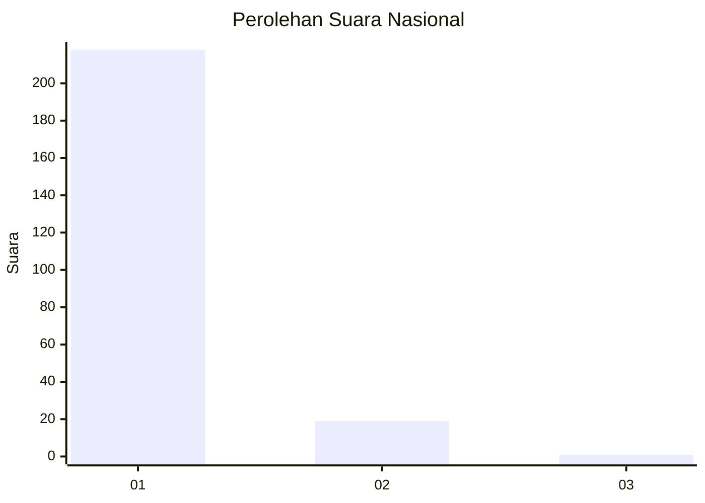
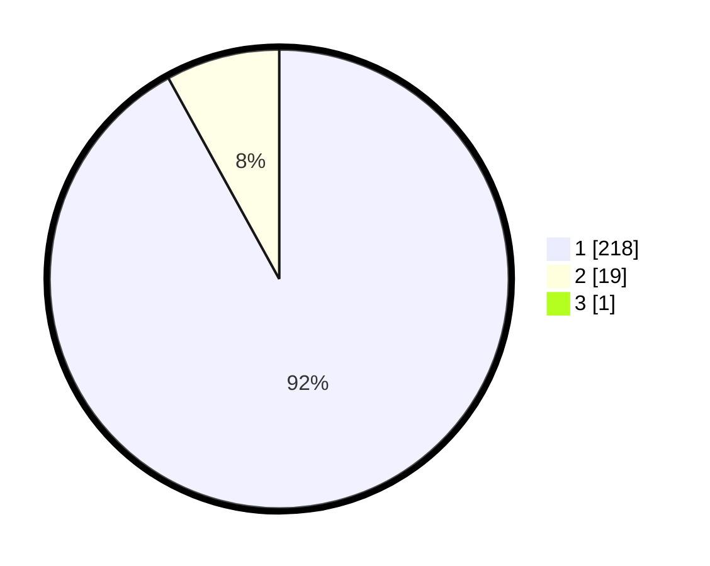

# Hasil

## Grafik

## Tabel

| No. | Nama Paslon    | Suara | Suara (raw) | Persentase |
|:--- |:-------------- | -----:| -----------:| ----------:|
| 1   | ANIES MUHAIMIN | 218   | [218][p-1]  | 91,60      |
| 2   | PRABOWO GIBRAN | 19    | [19][p-2]   | 7,98       |
| 3   | GANJAR MAHFUD  | 1     | [1][p-3]    | 0,42       |

[p-1]: https://github.com/gigit-pemilu/pemilu-2024/blob/main/pilpres/hitung-suara/sub/11-aceh/sub/01-aceh-selatan/sub/10-pasi-raja/sub/2018-teupin-gajah/sub/001-tps/sub/paslon-1.txt
[p-2]: https://github.com/gigit-pemilu/pemilu-2024/blob/main/pilpres/hitung-suara/sub/11-aceh/sub/01-aceh-selatan/sub/10-pasi-raja/sub/2018-teupin-gajah/sub/001-tps/sub/paslon-2.txt
[p-3]: https://github.com/gigit-pemilu/pemilu-2024/blob/main/pilpres/hitung-suara/sub/11-aceh/sub/01-aceh-selatan/sub/10-pasi-raja/sub/2018-teupin-gajah/sub/001-tps/sub/paslon-3.txt

## Foto C Plano

https://sirekap-obj-formc.kpu.go.id/f6c9/pemilu/ppwp/11/01/10/20/18/1101102018001-20240215-180834--9470aad8-416c-441a-86d9-c262468e3996.jpg

https://sirekap-obj-formc.kpu.go.id/f6c9/pemilu/ppwp/11/01/10/20/18/1101102018001-20240215-181029--ecf348ad-a987-4301-88c4-cedcf80cdde8.jpg

https://sirekap-obj-formc.kpu.go.id/f6c9/pemilu/ppwp/11/01/10/20/18/1101102018001-20240215-181235--54ec41c2-8372-4889-bc63-58b63a14634a.jpg

## Metadata

| Key        | Value               |
| ---------- | ------------------- |
| Time Stamp | 2024-02-16 21:01:00 |

