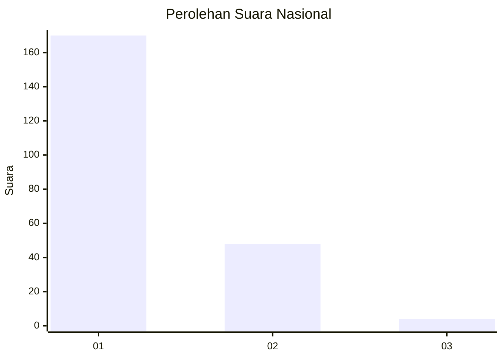
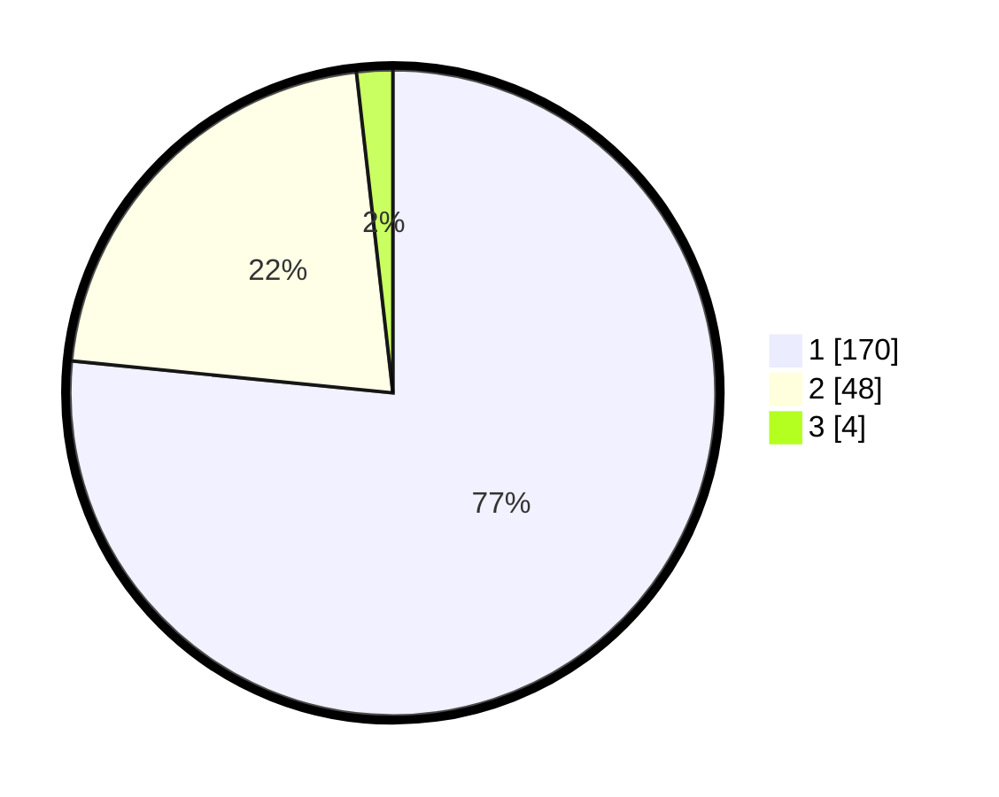

# Hasil

## Grafik

## Tabel

| No. | Nama Paslon    | Suara | Suara (raw) | Persentase |
|:--- |:-------------- | -----:| -----------:| ----------:|
| 1   | ANIES MUHAIMIN | 170   | [170][p-1]  | 76,58      |
| 2   | PRABOWO GIBRAN | 48    | [48][p-2]   | 21,62      |
| 3   | GANJAR MAHFUD  | 4     | [4][p-3]    | 1,80       |

[p-1]: https://github.com/gigit-pemilu/pemilu-2024/blob/main/pilpres/hitung-suara/sub/11-aceh/sub/01-aceh-selatan/sub/10-pasi-raja/sub/2019-ujung-padang-asahan/sub/001-tps/sub/paslon-1.txt
[p-2]: https://github.com/gigit-pemilu/pemilu-2024/blob/main/pilpres/hitung-suara/sub/11-aceh/sub/01-aceh-selatan/sub/10-pasi-raja/sub/2019-ujung-padang-asahan/sub/001-tps/sub/paslon-2.txt
[p-3]: https://github.com/gigit-pemilu/pemilu-2024/blob/main/pilpres/hitung-suara/sub/11-aceh/sub/01-aceh-selatan/sub/10-pasi-raja/sub/2019-ujung-padang-asahan/sub/001-tps/sub/paslon-3.txt

## Foto C Plano

https://sirekap-obj-formc.kpu.go.id/2cdc/pemilu/ppwp/11/01/10/20/19/1101102019001-20240215-145742--f207f32a-0b3a-4d72-87e6-e451a6621d9a.jpg

https://sirekap-obj-formc.kpu.go.id/2cdc/pemilu/ppwp/11/01/10/20/19/1101102019001-20240215-150047--9db57a87-5363-43ae-83d7-1f4b4140f5ed.jpg

https://sirekap-obj-formc.kpu.go.id/2cdc/pemilu/ppwp/11/01/10/20/19/1101102019001-20240215-150209--0e1ff5fe-e13c-410f-b0d9-8dd7b75abcf4.jpg

## Metadata

| Key        | Value               |
| ---------- | ------------------- |
| Time Stamp | 2024-02-15 18:30:25 |

## DATA PEMILIH TETAP

Jumlah pemilih dalam DPT: **272**.
 * L: **110**.
 * P: **162**.

## DATA PENGGUNA HAK PILIH

Jumlah pengguna hak pilih dalam DPT: **223**.
 * L: **92**.
 * P: **131**.

Jumlah pengguna hak pilih dalam DPTb: **3**.
 * L: **1**.
 * P: **2**.

Jumlah pengguna hak pilih dalam DPK: **1**.
 * L: **0**.
 * P: **1**.

Jumlah pengguna hak pilih: **227**.
 * L: **93**.
 * P: **134**.

## JUMLAH SUARA SAH DAN TIDAK SAH

JUMLAH SELURUH SUARA SAH: **222**.

JUMLAH SUARA TIDAK SAH: **5**.

JUMLAH SELURUH SUARA SAH DAN SUARA TIDAK SAH: **227**.

