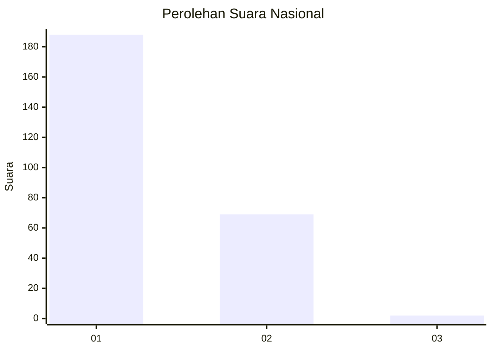
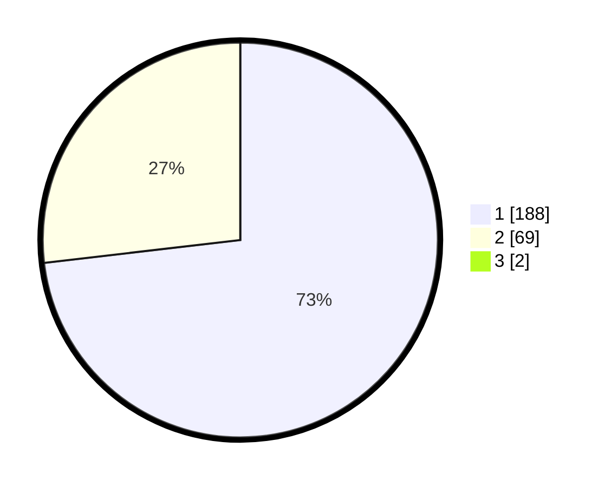

# Hasil

## Grafik

## Tabel

| No. | Nama Paslon    | Suara | Suara (raw) | Persentase |
|:--- |:-------------- | -----:| -----------:| ----------:|
| 1   | ANIES MUHAIMIN | 188   | [188][p-1]  | 72,59      |
| 2   | PRABOWO GIBRAN | 69    | [69][p-2]   | 26,64      |
| 3   | GANJAR MAHFUD  | 2     | [2][p-3]    | 0,77       |

[p-1]: https://github.com/gigit-pemilu/pemilu-2024/blob/main/pilpres/hitung-suara/sub/11-aceh/sub/01-aceh-selatan/sub/10-pasi-raja/sub/2019-ujung-padang-asahan/sub/003-tps/sub/paslon-1.txt
[p-2]: https://github.com/gigit-pemilu/pemilu-2024/blob/main/pilpres/hitung-suara/sub/11-aceh/sub/01-aceh-selatan/sub/10-pasi-raja/sub/2019-ujung-padang-asahan/sub/003-tps/sub/paslon-2.txt
[p-3]: https://github.com/gigit-pemilu/pemilu-2024/blob/main/pilpres/hitung-suara/sub/11-aceh/sub/01-aceh-selatan/sub/10-pasi-raja/sub/2019-ujung-padang-asahan/sub/003-tps/sub/paslon-3.txt

## Foto C Plano

https://sirekap-obj-formc.kpu.go.id/0553/pemilu/ppwp/11/01/10/20/19/1101102019003-20240215-105411--ebc4e72c-d25f-44d7-acd8-8bee14799ec4.jpg

https://sirekap-obj-formc.kpu.go.id/0553/pemilu/ppwp/11/01/10/20/19/1101102019003-20240215-232534--acbdd6a5-ec75-417d-a37a-332ad67b616c.jpg

https://sirekap-obj-formc.kpu.go.id/0553/pemilu/ppwp/11/01/10/20/19/1101102019003-20240215-111541--078054fd-671e-4cdd-be59-2d240a59efe0.jpg

## Metadata

| Key        | Value               |
| ---------- | ------------------- |
| Time Stamp | 2024-02-15 23:29:50 |

## DATA PEMILIH TETAP

Jumlah pemilih dalam DPT: **266**.
 * L: **92**.
 * P: **174**.

## DATA PENGGUNA HAK PILIH

Jumlah pengguna hak pilih dalam DPT: **258**.
 * L: **89**.
 * P: **169**.

Jumlah pengguna hak pilih dalam DPTb: **2**.
 * L: **2**.
 * P: **0**.

Jumlah pengguna hak pilih dalam DPK: **2**.
 * L: **1**.
 * P: **1**.

Jumlah pengguna hak pilih: **262**.
 * L: **92**.
 * P: **170**.

## JUMLAH SUARA SAH DAN TIDAK SAH

JUMLAH SELURUH SUARA SAH: **259**.

JUMLAH SUARA TIDAK SAH: **3**.

JUMLAH SELURUH SUARA SAH DAN SUARA TIDAK SAH: **262**.

