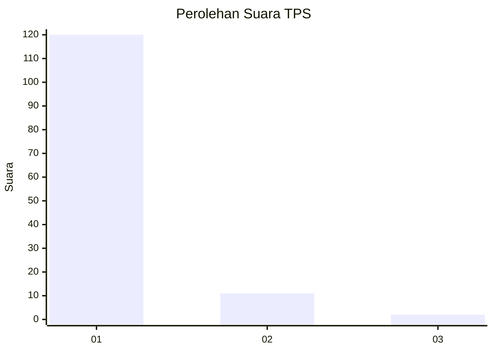
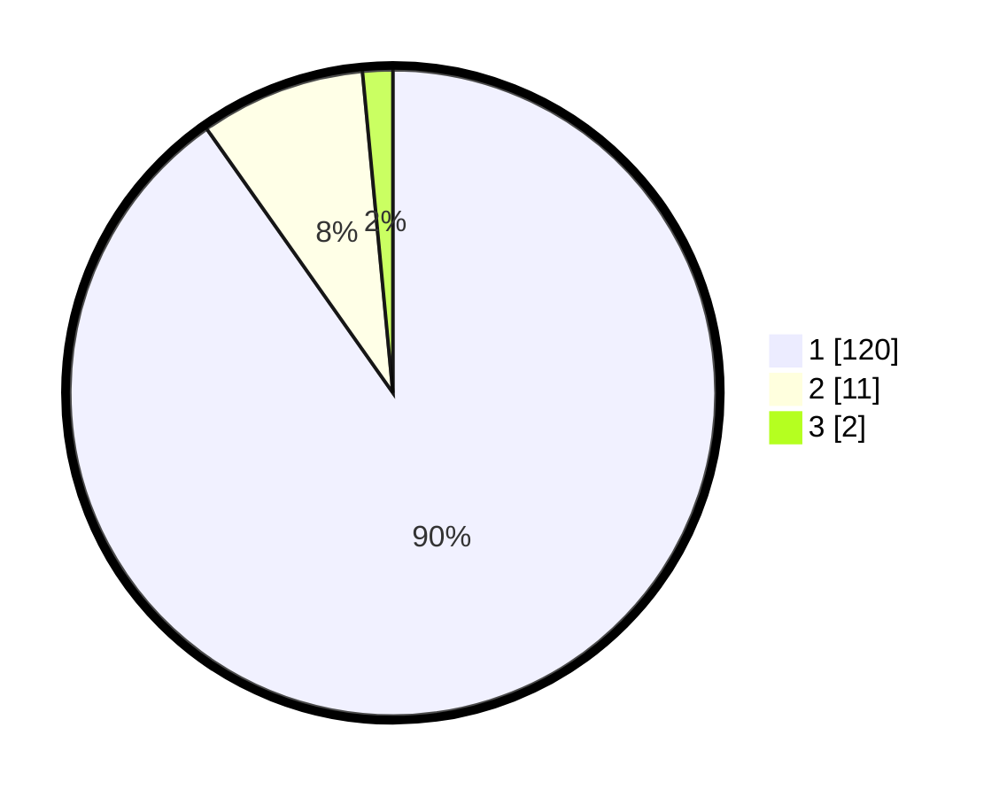

# Hasil

## Grafik

## Tabel

| No. | Nama Paslon    | Suara | Suara (raw) | Persentase |
|:--- |:-------------- | -----:| -----------:| ----------:|
| 1   | ANIES MUHAIMIN | 120   | [120][p-1]  | 90,23      |
| 2   | PRABOWO GIBRAN | 11    | [11][p-2]   | 8,27       |
| 3   | GANJAR MAHFUD  | 2     | [2][p-3]    | 1,50       |

[p-1]: https://github.com/gigit-pemilu/pemilu-2024-11-aceh/blob/main/pilpres/hitung-suara/sub/11-aceh/sub/01-aceh-selatan/sub/10-pasi-raja/sub/2020-pulo-ie-ii/sub/001-tps/sub/paslon-1.txt
[p-2]: https://github.com/gigit-pemilu/pemilu-2024-11-aceh/blob/main/pilpres/hitung-suara/sub/11-aceh/sub/01-aceh-selatan/sub/10-pasi-raja/sub/2020-pulo-ie-ii/sub/001-tps/sub/paslon-2.txt
[p-3]: https://github.com/gigit-pemilu/pemilu-2024-11-aceh/blob/main/pilpres/hitung-suara/sub/11-aceh/sub/01-aceh-selatan/sub/10-pasi-raja/sub/2020-pulo-ie-ii/sub/001-tps/sub/paslon-3.txt

## Foto C Plano

https://sirekap-obj-formc.kpu.go.id/089c/pemilu/ppwp/11/01/10/20/20/1101102020001-20240215-092000--8ff0e5dd-3457-47a3-8647-4300a57bb544.jpg

https://sirekap-obj-formc.kpu.go.id/089c/pemilu/ppwp/11/01/10/20/20/1101102020001-20240215-092208--144d97a9-3cac-44c6-a856-684346a16a37.jpg

https://sirekap-obj-formc.kpu.go.id/089c/pemilu/ppwp/11/01/10/20/20/1101102020001-20240215-092446--6969832b-798e-42a3-8aa9-a72b52da49ef.jpg

## Metadata

| Key        | Value               |
| ---------- | ------------------- |
| Time Stamp | 2024-02-16 21:01:00 |

