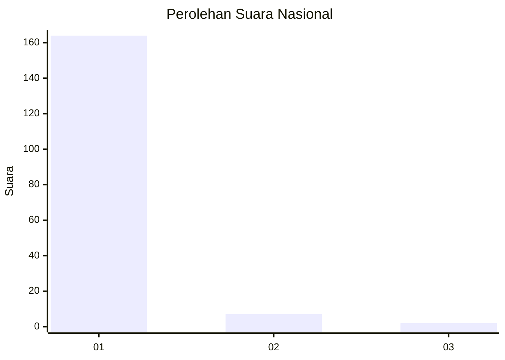
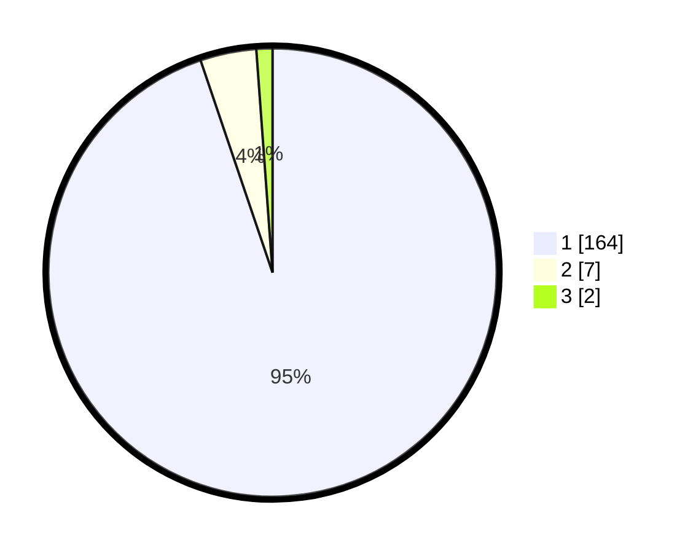

# Hasil

## Grafik

## Tabel

| No. | Nama Paslon    | Suara | Suara (raw) | Persentase |
|:--- |:-------------- | -----:| -----------:| ----------:|
| 1   | ANIES MUHAIMIN | 164   | [164][p-1]  | 94,80      |
| 2   | PRABOWO GIBRAN | 7     | [7][p-2]    | 4,05       |
| 3   | GANJAR MAHFUD  | 2     | [2][p-3]    | 1,16       |

[p-1]: https://github.com/gigit-pemilu/pemilu-2024/blob/main/pilpres/hitung-suara/sub/11-aceh/sub/01-aceh-selatan/sub/10-pasi-raja/sub/2021-pante-raja/sub/002-tps/sub/paslon-1.txt
[p-2]: https://github.com/gigit-pemilu/pemilu-2024/blob/main/pilpres/hitung-suara/sub/11-aceh/sub/01-aceh-selatan/sub/10-pasi-raja/sub/2021-pante-raja/sub/002-tps/sub/paslon-2.txt
[p-3]: https://github.com/gigit-pemilu/pemilu-2024/blob/main/pilpres/hitung-suara/sub/11-aceh/sub/01-aceh-selatan/sub/10-pasi-raja/sub/2021-pante-raja/sub/002-tps/sub/paslon-3.txt

## Foto C Plano

https://sirekap-obj-formc.kpu.go.id/92e1/pemilu/ppwp/11/01/10/20/21/1101102021002-20240214-215810--75e4cd2e-b99d-417e-8d0b-2f1d16d2e642.jpg

https://sirekap-obj-formc.kpu.go.id/92e1/pemilu/ppwp/11/01/10/20/21/1101102021002-20240214-220008--e899b33a-21c6-435d-a858-816236ee356e.jpg

https://sirekap-obj-formc.kpu.go.id/92e1/pemilu/ppwp/11/01/10/20/21/1101102021002-20240214-220226--246bf440-4ed2-4231-b3dd-097e26b4cd07.jpg

## Metadata

| Key        | Value               |
| ---------- | ------------------- |
| Time Stamp | 2024-02-15 15:00:29 |

## DATA PEMILIH TETAP

Jumlah pemilih dalam DPT: **200**.
 * L: **106**.
 * P: **94**.

## DATA PENGGUNA HAK PILIH

Jumlah pengguna hak pilih dalam DPT: **175**.
 * L: **91**.
 * P: **84**.

Jumlah pengguna hak pilih dalam DPTb: **5**.
 * L: **2**.
 * P: **3**.

Jumlah pengguna hak pilih dalam DPK: **3**.
 * L: **2**.
 * P: **1**.

Jumlah pengguna hak pilih: **183**.
 * L: **95**.
 * P: **88**.

## JUMLAH SUARA SAH DAN TIDAK SAH

JUMLAH SELURUH SUARA SAH: **173**.

JUMLAH SUARA TIDAK SAH: **10**.

JUMLAH SELURUH SUARA SAH DAN SUARA TIDAK SAH: **183**.

