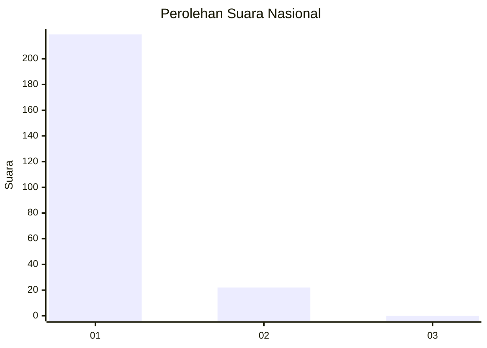
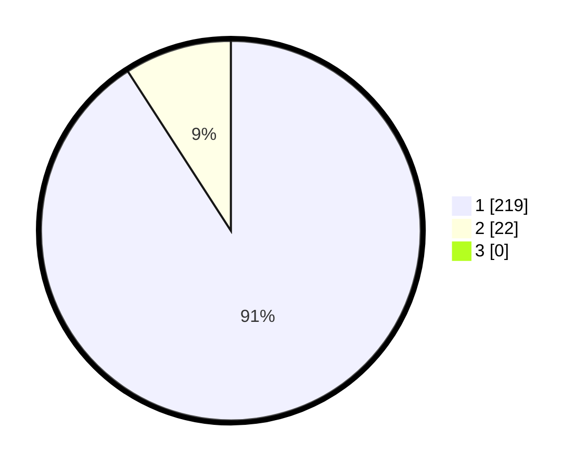

# Hasil

## Grafik

## Tabel

| No. | Nama Paslon    | Suara | Suara (raw) | Persentase |
|:--- |:-------------- | -----:| -----------:| ----------:|
| 1   | ANIES MUHAIMIN | 219   | [219][p-1]  | 90,87      |
| 2   | PRABOWO GIBRAN | 22    | [22][p-2]   | 9,13       |
| 3   | GANJAR MAHFUD  | 0     | [0][p-3]    | 0,00       |

[p-1]: https://github.com/gigit-pemilu/pemilu-2024/blob/main/pilpres/hitung-suara/sub/11-aceh/sub/01-aceh-selatan/sub/11-labuhan-haji-timur/sub/2001-tengah-peulumat/sub/002-tps/sub/paslon-1.txt
[p-2]: https://github.com/gigit-pemilu/pemilu-2024/blob/main/pilpres/hitung-suara/sub/11-aceh/sub/01-aceh-selatan/sub/11-labuhan-haji-timur/sub/2001-tengah-peulumat/sub/002-tps/sub/paslon-2.txt
[p-3]: https://github.com/gigit-pemilu/pemilu-2024/blob/main/pilpres/hitung-suara/sub/11-aceh/sub/01-aceh-selatan/sub/11-labuhan-haji-timur/sub/2001-tengah-peulumat/sub/002-tps/sub/paslon-3.txt

## Foto C Plano

https://sirekap-obj-formc.kpu.go.id/e2e6/pemilu/ppwp/11/01/11/20/01/1101112001002-20240223-230003--0329b52c-8115-40cc-86fc-24c648e2b2e2.jpg

https://sirekap-obj-formc.kpu.go.id/e2e6/pemilu/ppwp/11/01/11/20/01/1101112001002-20240223-230004--408210dd-ebc0-4a99-a7d9-1728a72b1c30.jpg

https://sirekap-obj-formc.kpu.go.id/e2e6/pemilu/ppwp/11/01/11/20/01/1101112001002-20240223-230003--c158b4ce-ad43-466f-93f1-22e2e942c9cb.jpg

## Metadata

| Key        | Value               |
| ---------- | ------------------- |
| Time Stamp | 2024-02-24 22:31:28 |

## DATA PEMILIH TETAP

Jumlah pemilih dalam DPT: **271**.
 * L: **133**.
 * P: **138**.

## DATA PENGGUNA HAK PILIH

Jumlah pengguna hak pilih dalam DPT: **244**.
 * L: **114**.
 * P: **130**.

Jumlah pengguna hak pilih dalam DPTb: **1**.
 * L: **1**.
 * P: **0**.

Jumlah pengguna hak pilih dalam DPK: **0**.
 * L: **0**.
 * P: **0**.

Jumlah pengguna hak pilih: **245**.
 * L: **115**.
 * P: **130**.

## JUMLAH SUARA SAH DAN TIDAK SAH

JUMLAH SELURUH SUARA SAH: **241**.

JUMLAH SUARA TIDAK SAH: **4**.

JUMLAH SELURUH SUARA SAH DAN SUARA TIDAK SAH: **245**.

