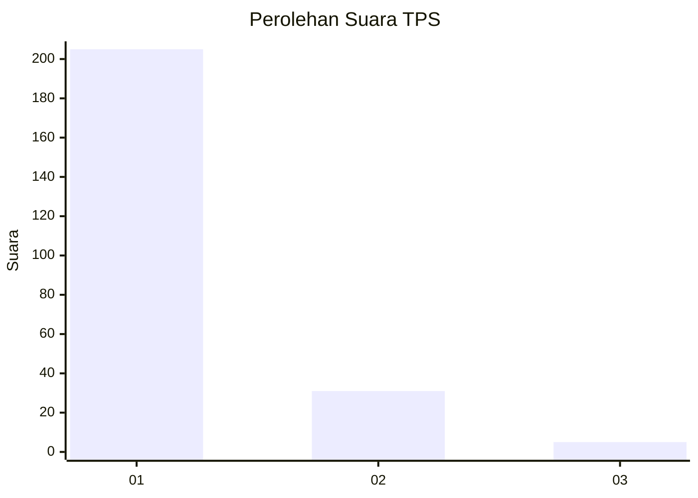
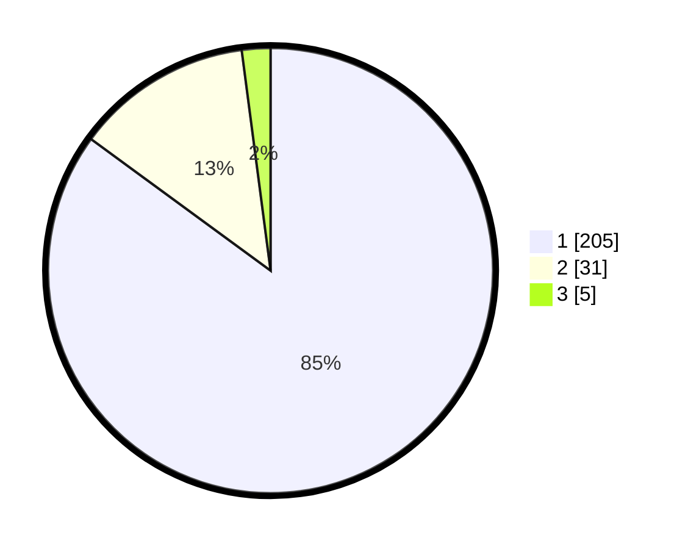

# Hasil

## Grafik

## Tabel

| No. | Nama Paslon    | Suara | Suara (raw) | Persentase |
|:--- |:-------------- | -----:| -----------:| ----------:|
| 1   | ANIES MUHAIMIN | 205   | [205][p-1]  | 85,06      |
| 2   | PRABOWO GIBRAN | 31    | [31][p-2]   | 12,86      |
| 3   | GANJAR MAHFUD  | 5     | [5][p-3]    | 2,07       |

[p-1]: https://github.com/gigit-pemilu/pemilu-2024-11-aceh/blob/main/pilpres/hitung-suara/sub/11-aceh/sub/01-aceh-selatan/sub/11-labuhan-haji-timur/sub/2001-tengah-peulumat/sub/003-tps/sub/paslon-1.txt
[p-2]: https://github.com/gigit-pemilu/pemilu-2024-11-aceh/blob/main/pilpres/hitung-suara/sub/11-aceh/sub/01-aceh-selatan/sub/11-labuhan-haji-timur/sub/2001-tengah-peulumat/sub/003-tps/sub/paslon-2.txt
[p-3]: https://github.com/gigit-pemilu/pemilu-2024-11-aceh/blob/main/pilpres/hitung-suara/sub/11-aceh/sub/01-aceh-selatan/sub/11-labuhan-haji-timur/sub/2001-tengah-peulumat/sub/003-tps/sub/paslon-3.txt

## Foto C Plano

https://sirekap-obj-formc.kpu.go.id/b688/pemilu/ppwp/11/01/11/20/01/1101112001003-20240223-180948--ad0eea7b-ff26-4ab2-b810-0a7e6f14a821.jpg

https://sirekap-obj-formc.kpu.go.id/b688/pemilu/ppwp/11/01/11/20/01/1101112001003-20240223-180949--05e9d5d0-ce24-4b97-aa83-869e5fb36bb8.jpg

https://sirekap-obj-formc.kpu.go.id/b688/pemilu/ppwp/11/01/11/20/01/1101112001003-20240223-180948--5f9d09b0-8279-4eab-968f-3163c5c86220.jpg

## Metadata

| Key        | Value               |
| ---------- | ------------------- |
| Time Stamp | 2024-02-24 22:31:28 |

## DATA PEMILIH TETAP

Jumlah pemilih dalam DPT: **274**.
 * L: **132**.
 * P: **142**.

## DATA PENGGUNA HAK PILIH

Jumlah pengguna hak pilih dalam DPT: **246**.
 * L: **107**.
 * P: **139**.

Jumlah pengguna hak pilih dalam DPTb: **0**.
 * L: **0**.
 * P: **0**.

Jumlah pengguna hak pilih dalam DPK: **1**.
 * L: **1**.
 * P: **0**.

Jumlah pengguna hak pilih: **247**.
 * L: **108**.
 * P: **139**.

## JUMLAH SUARA SAH DAN TIDAK SAH

JUMLAH SELURUH SUARA SAH: **241**.

JUMLAH SUARA TIDAK SAH: **6**.

JUMLAH SELURUH SUARA SAH DAN SUARA TIDAK SAH: **247**.

