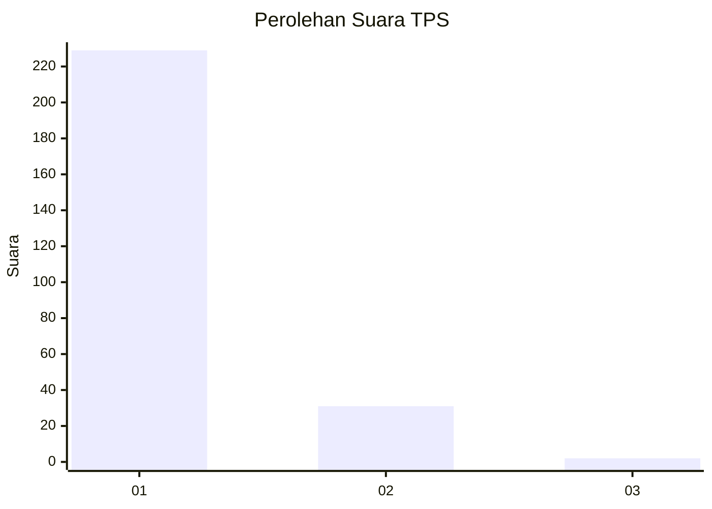
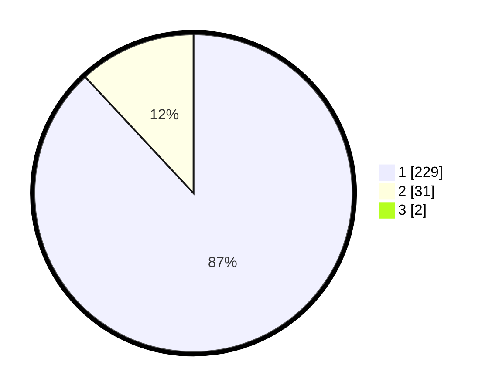

# Hasil

## Grafik

## Tabel

| No. | Nama Paslon    | Suara | Suara (raw) | Persentase |
|:--- |:-------------- | -----:| -----------:| ----------:|
| 1   | ANIES MUHAIMIN | 229   | [229][p-1]  | 87,40      |
| 2   | PRABOWO GIBRAN | 31    | [31][p-2]   | 11,83      |
| 3   | GANJAR MAHFUD  | 2     | [2][p-3]    | 0,76       |

[p-1]: https://github.com/gigit-pemilu/pemilu-2024-11-aceh/blob/main/pilpres/hitung-suara/sub/11-aceh/sub/01-aceh-selatan/sub/11-labuhan-haji-timur/sub/2002-paya-peulumat/sub/001-tps/sub/paslon-1.txt
[p-2]: https://github.com/gigit-pemilu/pemilu-2024-11-aceh/blob/main/pilpres/hitung-suara/sub/11-aceh/sub/01-aceh-selatan/sub/11-labuhan-haji-timur/sub/2002-paya-peulumat/sub/001-tps/sub/paslon-2.txt
[p-3]: https://github.com/gigit-pemilu/pemilu-2024-11-aceh/blob/main/pilpres/hitung-suara/sub/11-aceh/sub/01-aceh-selatan/sub/11-labuhan-haji-timur/sub/2002-paya-peulumat/sub/001-tps/sub/paslon-3.txt

## Foto C Plano

https://sirekap-obj-formc.kpu.go.id/46b1/pemilu/ppwp/11/01/11/20/02/1101112002001-20240223-232110--55f086d4-d9de-4a30-8987-3eee28d11d16.jpg

https://sirekap-obj-formc.kpu.go.id/46b1/pemilu/ppwp/11/01/11/20/02/1101112002001-20240223-232112--e301f8f3-caff-49ca-9a4b-7deaef985fac.jpg

https://sirekap-obj-formc.kpu.go.id/46b1/pemilu/ppwp/11/01/11/20/02/1101112002001-20240223-232111--9f075b4a-a29b-43ed-880c-61235b40f2af.jpg

## Metadata

| Key        | Value               |
| ---------- | ------------------- |
| Time Stamp | 2024-02-24 22:31:28 |

## DATA PEMILIH TETAP

Jumlah pemilih dalam DPT: **297**.
 * L: **147**.
 * P: **150**.

## DATA PENGGUNA HAK PILIH

Jumlah pengguna hak pilih dalam DPT: **260**.
 * L: **122**.
 * P: **138**.

Jumlah pengguna hak pilih dalam DPTb: **3**.
 * L: **2**.
 * P: **1**.

Jumlah pengguna hak pilih dalam DPK: **1**.
 * L: **0**.
 * P: **1**.

Jumlah pengguna hak pilih: **264**.
 * L: **124**.
 * P: **140**.

## JUMLAH SUARA SAH DAN TIDAK SAH

JUMLAH SELURUH SUARA SAH: **262**.

JUMLAH SUARA TIDAK SAH: **2**.

JUMLAH SELURUH SUARA SAH DAN SUARA TIDAK SAH: **264**.

