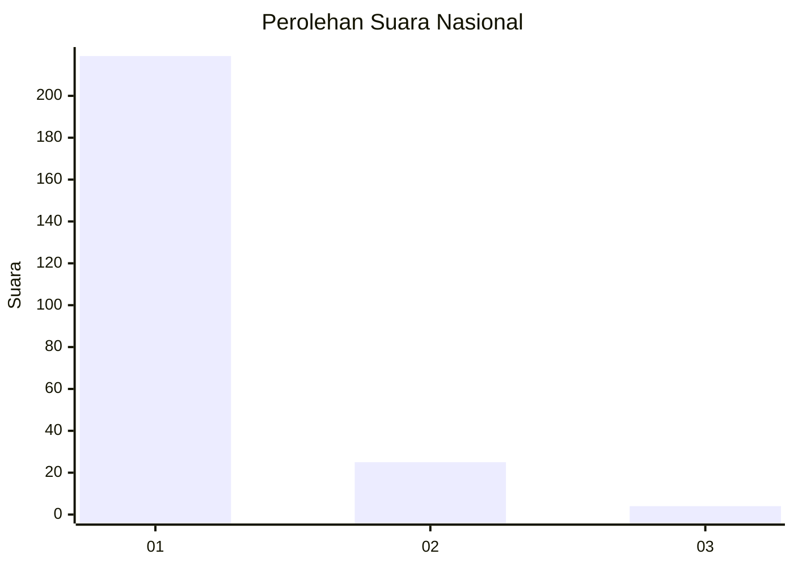
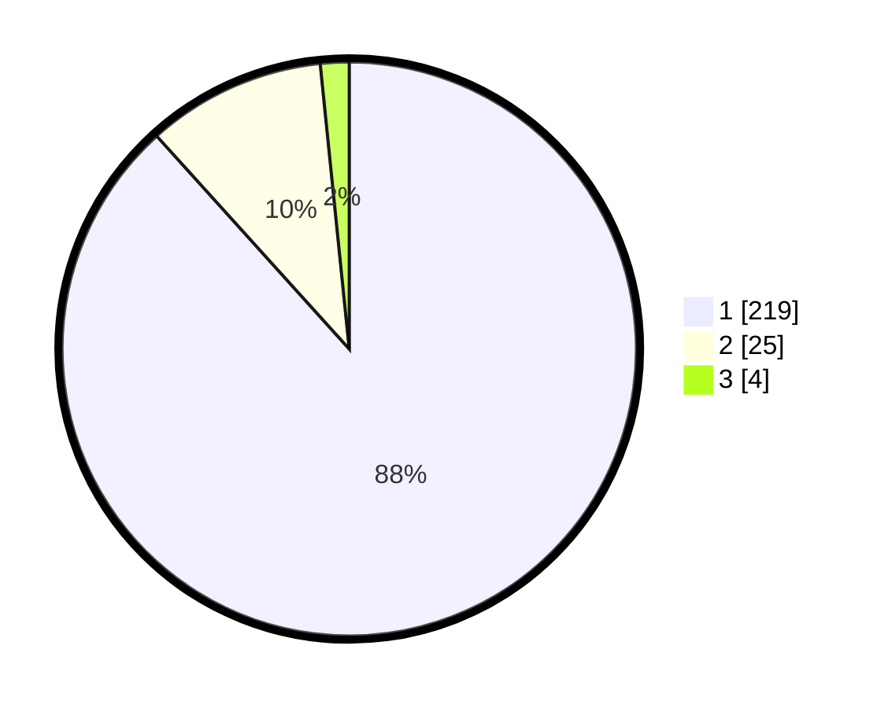

# Hasil

## Grafik

## Tabel

| No. | Nama Paslon    | Suara | Suara (raw) | Persentase |
|:--- |:-------------- | -----:| -----------:| ----------:|
| 1   | ANIES MUHAIMIN | 219   | [219][p-1]  | 88,31      |
| 2   | PRABOWO GIBRAN | 25    | [25][p-2]   | 10,08      |
| 3   | GANJAR MAHFUD  | 4     | [4][p-3]    | 1,61       |

[p-1]: https://github.com/gigit-pemilu/pemilu-2024/blob/main/pilpres/hitung-suara/sub/11-aceh/sub/01-aceh-selatan/sub/11-labuhan-haji-timur/sub/2002-paya-peulumat/sub/002-tps/sub/paslon-1.txt
[p-2]: https://github.com/gigit-pemilu/pemilu-2024/blob/main/pilpres/hitung-suara/sub/11-aceh/sub/01-aceh-selatan/sub/11-labuhan-haji-timur/sub/2002-paya-peulumat/sub/002-tps/sub/paslon-2.txt
[p-3]: https://github.com/gigit-pemilu/pemilu-2024/blob/main/pilpres/hitung-suara/sub/11-aceh/sub/01-aceh-selatan/sub/11-labuhan-haji-timur/sub/2002-paya-peulumat/sub/002-tps/sub/paslon-3.txt

## Foto C Plano

https://sirekap-obj-formc.kpu.go.id/3b1c/pemilu/ppwp/11/01/11/20/02/1101112002002-20240217-170131--587adb1f-0478-45f8-a8af-6fe1574b7b66.jpg

https://sirekap-obj-formc.kpu.go.id/3b1c/pemilu/ppwp/11/01/11/20/02/1101112002002-20240217-170132--37d04e2a-7c52-42f4-9b58-9d4993e0ad1b.jpg

https://sirekap-obj-formc.kpu.go.id/3b1c/pemilu/ppwp/11/01/11/20/02/1101112002002-20240217-170132--2c558927-a6ff-4884-8134-f52abcc773fe.jpg

## Metadata

| Key        | Value               |
| ---------- | ------------------- |
| Time Stamp | 2024-02-21 13:00:00 |

## DATA PEMILIH TETAP

Jumlah pemilih dalam DPT: **291**.
 * L: **139**.
 * P: **152**.

## DATA PENGGUNA HAK PILIH

Jumlah pengguna hak pilih dalam DPT: **243**.
 * L: **99**.
 * P: **144**.

Jumlah pengguna hak pilih dalam DPTb: **3**.
 * L: **1**.
 * P: **2**.

Jumlah pengguna hak pilih dalam DPK: **5**.
 * L: **4**.
 * P: **1**.

Jumlah pengguna hak pilih: **251**.
 * L: **104**.
 * P: **147**.

## JUMLAH SUARA SAH DAN TIDAK SAH

JUMLAH SELURUH SUARA SAH: **248**.

JUMLAH SUARA TIDAK SAH: **3**.

JUMLAH SELURUH SUARA SAH DAN SUARA TIDAK SAH: **251**.

